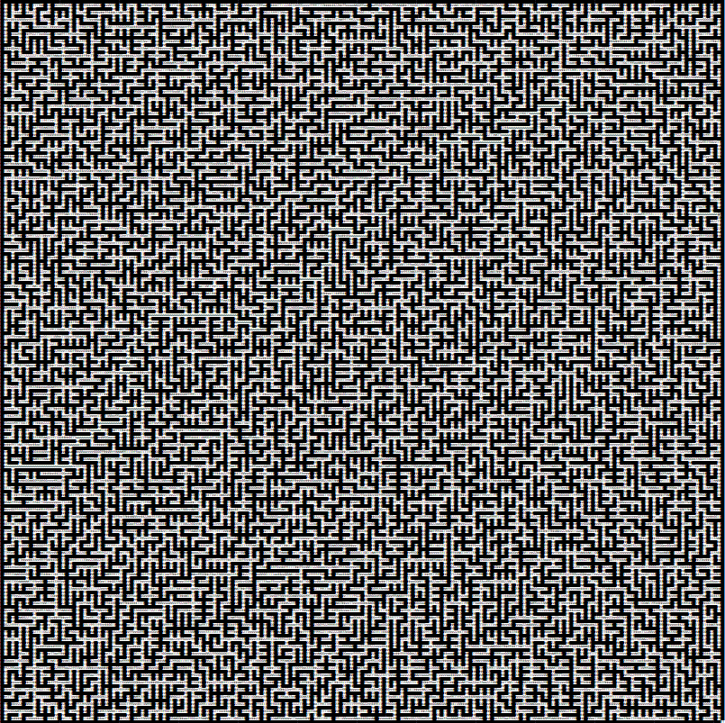
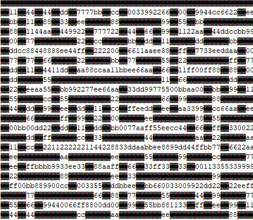

# 1337UP LIVE CTF 2023

## Smiley Maze

> Our friend trapped us inside this maze! can you help us get out of this hell of a place safely? 🎮
> 
> Author: Et3rnos, 0xM4hm0ud
> 
> Put the flag inside `INTIGRITI{}` and the format of the flag is hex.
> 
> [`smileymaze.zip`](smileymaze.zip)

Tags: _game_

## Solution
For this challenge we get a zip archive containing a `dockersetup` for a simple maze game. I didn't run the game at all and just statically reversed it. With the deployment we find the executable. After short inspection with `Ghidra` it became clear that the executable in fact is a `pyinstaller` binary. There are some [`pyinstaller extractor scripts`](https://github.com/extremecoders-re/pyinstxtractor) which can be used to get the python resources.

After extraction one file especially seems interesting `main.pyc`. Since it is compiled python bytecode we can try to decompile it with `pycdc`, but sadly the decompiler stumbled across various unsupported opcodes. So the is to just disassemble the file and try to reverse it from there.

The first two functions are very short

```python
# end
0       RESUME                        0
2       LOAD_GLOBAL                   1: NULL + print
14      LOAD_CONST                    1: 'Nice Job, You reached the end!'
16      PRECALL                       1
20      CALL                          1
30      POP_TOP                       
32      LOAD_CONST                    0: None
34      RETURN_VALUE                  

# checkfinish
0       RESUME                        0
2       LOAD_GLOBAL                   0: j
14      LOAD_CONST                    1: 125
16      COMPARE_OP                    2 (==)
22      POP_JUMP_FORWARD_IF_FALSE     13 (to 50)
24      LOAD_GLOBAL                   2: i
36      LOAD_CONST                    2: 1
38      COMPARE_OP                    2 (==)
44      POP_JUMP_FORWARD_IF_FALSE     4 (to 54)
46      LOAD_CONST                    3: True
48      RETURN_VALUE                  
50      LOAD_CONST                    0: None
52      RETURN_VALUE                  
54      LOAD_CONST                    0: None
56      RETURN_VALUE                  
```

The functions can be easily back translated to python and look something like this. The first function just prints a message, the second function returns true if variables `i` and `j` have a specific value. Both variables are global and, as it later turns out, are used to represent the players position.

```python
def end():
    print("Nice Job, You reached the end!")

def checkfinish():
    if j == 125 and i == 1:
        return True
```

Next comes the functions `print_board` and `on_press` which we skip for now, since we first want to make sense of the datastructure which is used to represent the maze. The loading code is in global scope and looks like this:

```python
0       RESUME                        0
2       LOAD_CONST                    0: 0
4       LOAD_CONST                    1: ('keyboard',)
6       IMPORT_NAME                   0: pynput
8       IMPORT_FROM                   1: keyboard
10      STORE_NAME                    1: keyboard
12      POP_TOP                       
14      LOAD_CONST                    0: 0
16      LOAD_CONST                    2: None
18      IMPORT_NAME                   2: os
20      STORE_NAME                    2: os
22      LOAD_CONST                    3: '...'
24      STORE_NAME                    3: m_string           m_string = '...'
26      LOAD_CONST                    4: '...'
28      STORE_NAME                    4: chars              chars = '...'
30      LOAD_CONST                    5: 201
32      STORE_NAME                    5: size               size = 201
34      BUILD_LIST                    0
36      STORE_NAME                    6: m                  m = []
38      PUSH_NULL                     
40      LOAD_NAME                     7: range
42      LOAD_CONST                    0: 0
44      LOAD_NAME                     5: size
46      LOAD_CONST                    6: 2
48      BINARY_OP                     8 (**)
52      PRECALL                       2
56      CALL                          2
66      GET_ITER                      
68      FOR_ITER                      108 (to 286)          for i in range(0, size**2)
70      STORE_GLOBAL                  8: i
72      LOAD_GLOBAL                   16: i
84      LOAD_NAME                     5: size
86      BINARY_OP                     6 (%)
90      LOAD_CONST                    0: 0
92      COMPARE_OP                    2 (==)
98      POP_JUMP_FORWARD_IF_FALSE     21 (to 142)               if i % size == 0

#  new empty row
100     LOAD_NAME                     6: m
102     LOAD_METHOD                   9: append
124     BUILD_LIST                    0
126     PRECALL                       1
130     CALL                          1                             m.append([])
140     POP_TOP                       

# get last row and fill
142     LOAD_NAME                     6: m
144     LOAD_CONST                    7: -1
146     BINARY_SUBSCR                                           row = m[-1]
156     LOAD_METHOD                   9: append
178     PUSH_NULL                     
180     LOAD_NAME                     10: ord
182     LOAD_NAME                     3: m_string
184     LOAD_GLOBAL                   16: i
196     LOAD_CONST                    8: 8
198     BINARY_OP                     2 (//)
202     BINARY_SUBSCR                                           m_string[i // 8]
212     PRECALL                       1
216     CALL                          1                         ord(m_string[i // 8])
226     LOAD_CONST                    9: 1
228     LOAD_CONST                    10: 7
230     LOAD_GLOBAL                   16: i
242     LOAD_CONST                    8: 8
244     BINARY_OP                     6 (%)                     i % 8
248     BINARY_OP                     10 (-)                    (i % 8) - 7
252     BINARY_OP                     3 (<<)                    ((i % 8) - 7) << 1
256     BINARY_OP                     1 (&)                     cell = ord(m_string[i // 8]) & ((i % 8) - 7) << 1
260     POP_JUMP_FORWARD_IF_FALSE     2 (to 266)                if cell == 1

#  cell was 1
262     LOAD_CONST                    9: 1                          cell_value = 1
264     JUMP_FORWARD                  1 (to 268)

# cell was 0
266     LOAD_CONST                    0: 0                          cell_value = 0
 
268     PRECALL                       1
272     CALL                          1                         row.append(cell_value)
282     POP_TOP                       
284     JUMP_BACKWARD                 109
```

Putthing the annotations together we get the following. The variables `m_string` and `chars` are initialized with some huge strings, also `size` is set to 201. Then an array `m` is created and filled with zero or one depending on a value computation with values from `m_string`. The array `m` describes then the full maze: rows and columns build a 2d grid and at each cell either 1 or 0 specifies if there is a wall or not.

```python
m_string = "..."
chars = "..."
size = 201

m = []

for i in range(0, size**2)
    if i % size == 0:
        m.append([])
    row = m[-1]
    cell = ord(m_string[i//8]) & (1 << (((i % 8) - 7)))
    if cell == 0:
        row.append(0)
    else:
        row.append(1)
```

After this the player position is set to `59, 199` and then reset to `127, 1`. The board is drawn and the keyboard listener is set to function `on_press`. Inbetween some functions are loaded and created. But since this doesn't really matters we skip this here.

```python
position = (59, 199)
j = position[0]
i = position[1]

j = 127
i = 1 

print_board()
keyboard.Listener(on_press)
listener.join()
```

Now we know how the data is loaded we can check out what happens when the board is drawn. First the screen is cleared. Then a nested loop is done over all the region surrounding the current player position, so that the player position is centered to this region. The player sprite is drawn at `0, 0` and a flag symbol is drawn if the visible region contains cell `1, 125`. This basically draws only a small visible region around where the player is located.

```python
# clear screen
0       RESUME                        0
2       LOAD_GLOBAL                   1: NULL + os
14      LOAD_ATTR                     1: system
24      LOAD_GLOBAL                   0: os
36      LOAD_ATTR                     2: name
46      LOAD_CONST                    1: 'nt'
48      COMPARE_OP                    2 (==)
54      POP_JUMP_FORWARD_IF_FALSE     2 (to 60)
56      LOAD_CONST                    2: 'cls'
58      JUMP_FORWARD                  1 (to 62)
60      LOAD_CONST                    3: 'clear'
62      PRECALL                       1
66      CALL                          1
76      POP_TOP                       

# start drawing map elements
78      LOAD_GLOBAL                   7: NULL + range
90      LOAD_CONST                    4: -2
92      LOAD_CONST                    5: 3
94      PRECALL                       2
98      CALL                          2
108     GET_ITER                      
110     FOR_ITER                      307 (to 728)          for y in range(-2, 3)
114     STORE_FAST                    0: y
116     LOAD_GLOBAL                   7: NULL + range
128     LOAD_CONST                    4: -2
130     LOAD_CONST                    5: 3
132     PRECALL                       2
136     CALL                          2
146     GET_ITER                      
148     FOR_ITER                      271 (to 694)          for x in range(-2, 3)
152     STORE_FAST                    1: x
154     LOAD_FAST                     1: x
156     LOAD_CONST                    6: 0
158     COMPARE_OP                    2 (==)

# draw player
164     POP_JUMP_FORWARD_IF_FALSE     24 (to 214)               if x == 0:
166     LOAD_FAST                     0: y
168     LOAD_CONST                    6: 0
170     COMPARE_OP                    2 (==)
176     POP_JUMP_FORWARD_IF_FALSE     18 (to 214)               if y == 0:
178     LOAD_GLOBAL                   9: NULL + print
190     LOAD_CONST                    7: '😀'
192     LOAD_CONST                    8: ''
194     KW_NAMES                      9
196     PRECALL                       2
200     CALL                          2
210     POP_TOP                       
212     JUMP_BACKWARD                 33

# draw flag
214     LOAD_GLOBAL                   10: j
226     LOAD_FAST                     0: y
228     BINARY_OP                     0 (+)
232     LOAD_CONST                    10: 125
234     COMPARE_OP                    2 (==)
240     POP_JUMP_FORWARD_IF_FALSE     32 (to 306)               if y+j == 125
242     LOAD_GLOBAL                   12: i
254     LOAD_FAST                     1: x
256     BINARY_OP                     0 (+)
260     LOAD_CONST                    11: 1
262     COMPARE_OP                    2 (==)
268     POP_JUMP_FORWARD_IF_FALSE     18 (to 306)               if x+i == 1
270     LOAD_GLOBAL                   9: NULL + print
282     LOAD_CONST                    12: '🚩'
284     LOAD_CONST                    8: ''
286     KW_NAMES                      9
288     PRECALL                       2
292     CALL                          2
302     POP_TOP                       
304     JUMP_BACKWARD                 79
```

Next the map values for the current cell are loaded and either a wall sprite is printed or, in empty space, some hex-values coming from `chars`.

```python
306     LOAD_GLOBAL                   9: NULL + print
318     LOAD_GLOBAL                   14: m
330     LOAD_GLOBAL                   10: j
342     LOAD_FAST                     0: y
344     BINARY_OP                     0 (+)                     j+y
348     LOAD_GLOBAL                   17: NULL + len
360     LOAD_GLOBAL                   14: m
372     PRECALL                       1
376     CALL                          1                         len(m)
386     BINARY_OP                     6 (%)                     (j+y) % len(m)
390     BINARY_SUBSCR                                           m[(j+y)%len(m)]

400     LOAD_GLOBAL                   12: i
412     LOAD_FAST                     1: x
414     BINARY_OP                     0 (+)                     i+x
418     LOAD_GLOBAL                   17: NULL + len
430     LOAD_GLOBAL                   14: m
442     LOAD_CONST                    6: 0
444     BINARY_SUBSCR                                           m[0]
454     PRECALL                       1
458     CALL                          1                         len(m[0])
468     BINARY_OP                     6 (%)                     (i+x) % len(m[0])
472     BINARY_SUBSCR                                           cell = m[(j+y)%len(m)][(i+x) % len(m[0])]
482     POP_JUMP_FORWARD_IF_FALSE     2 (to 488)                if cell == 1
484     LOAD_CONST                    13: '██'                      load wall
486     JUMP_FORWARD                  91 (to 670)

488     LOAD_GLOBAL                   18: chars                 if cell == 0
500     LOAD_GLOBAL                   10: j
512     LOAD_FAST                     0: y
514     BINARY_OP                     0 (+)                     j+y
518     LOAD_GLOBAL                   17: NULL + len
530     LOAD_GLOBAL                   14: m
542     PRECALL                       1
546     CALL                          1                         len(m)
556     BINARY_OP                     6 (%)                     (j+y)%len(m)
560     LOAD_GLOBAL                   20: size
572     BINARY_OP                     5 (*)                     ((j+y)%len(m))*size
576     LOAD_GLOBAL                   12: i
588     LOAD_FAST                     1: x
590     BINARY_OP                     0 (+)                     i+x
594     LOAD_GLOBAL                   17: NULL + len
606     LOAD_GLOBAL                   14: m
618     LOAD_CONST                    6: 0
620     BINARY_SUBSCR                                           m[0]
630     PRECALL                       1
634     CALL                          1                         len(m[0])
644     BINARY_OP                     6 (%)                     (i+x)%len(m[0])
648     BINARY_OP                     0 (+)                     ((j+y)%len(m))*size + ((i+x)%len(m[0]))
652     BINARY_SUBSCR                                           chars[((j+y)%len(m))*size + ((i+x)%len(m[0]))]
662     FORMAT_VALUE                  0
664     LOAD_CONST                    14: 2
666     BINARY_OP                     5 (*)

# draw cell sprite
670     LOAD_CONST                    8: ''
672     KW_NAMES                      9
674     PRECALL                       2
678     CALL                          2
688     POP_TOP                       
690     JUMP_BACKWARD                 273
694     LOAD_GLOBAL                   9: NULL + print
706     LOAD_CONST                    8: ''
708     PRECALL                       1
712     CALL                          1
722     POP_TOP                       
724     JUMP_BACKWARD                 309
728     LOAD_CONST                    0: None
730     RETURN_VALUE                  
```

This whole part basically translates to

```python
def print_board():
    for y in range(-2, 3):
        for x in range(-2, 3):
            if x == 0 and y == 0: print("😀", end="")
            
            if y+j == 125 and x+i == 1: print("🚩", end="")
                
            cell = m[(j+y)%len(m)][(i+x) % len(m[0])]
            if cell == 1:
                print("██", end = "")
            else:
                value = chars[((j+y)%len(m))*size + ((i+x)%len(m[0]))]
                print(value*2, end = "")
```

But we want to see the whole maze, so we adapt this and draw the whole world in one go. As a result we get this beatiful result.



And zoomed in a bit, we can see the empty space is filled with numbers.



For completeness here the `on_press` handler that handles player movement and wall collision. For each move it checks if the player hit the flag field and if so the screen is cleared and the message `Nice Job, You reached the end!` is printed.

```python
def on_press(key):
    if key == Key.up:
        j -= abs(m[j-1][i] - 1)
        check = checkfinish()
    elif key == Key.down:
        j += abs(m[j+1][i] - 1)
        check = checkfinish()
    elif key == Key.left:
        i -= abs(m[j][i-1] - 1)
        check = checkfinish()
    elif key == Key.right:
        i += abs(m[j][i+1] - 1)
        check = checkfinish()
    elif key == Key.space:
        listener.stop()
    
    print_board()
    
    if check:
        listener.stop()
        if os.name == 'nt':
            system('clear')
        else:
            system('cls')
        end()
```

Now we know how the game works, we need to find the flag. But where *is* the flag? The hint in the description tells us `Put the flag inside `INTIGRITI{}` and the format of the flag is hex.`, and we have a lot of hex numbers in the maze. But which number are the correct ones?

I did a lot of trial and error, taking the numbers starting at the flag field for instance. But nothing really worked. Another weird thing was, the player spawn position was pretty much right next to the flag field? But what if, the player spawn position override was not really the correct position, but the position which was set *before*? In this case the player would have to go some way until reaching the flag.

Then I had the idea, maybe the player would need to find the shortest way to the flag and collect numbers on his way? This can be done with a `BFS` path scanning.

```python
def dfs(vis, x, y, stack):
    if y*size+x > len(chars) or vis[y*size+x] == True:
        return

    stack.append((x,y))
    if checkfinish(x,y):
        for i in range(len(stack)-1):
            print(chars[stack[i][1]*size+stack[i][0]], end = "")
        print("")
        #print(stack[-1])i
        return

    vis[y*size+x] = True

    if m[y-1][x] == 0: dfs(vis, x, y-1, stack)
    if m[y+1][x] == 0: dfs(vis, x, y+1, stack)
    if m[y][x-1] == 0: dfs(vis, x-1, y, stack)
    if m[y][x+1] == 0: dfs(vis, x+1, y, stack)

    del stack[-1]

stack = []
vis = [0 for i in range(len(m)*len(m[0]))]
dfs(vis, 199, 59, stack)
```

This didn't give the correct flag either, so I tried multiple variations (collecting the duplicated numbers vs only single numbers) etc. In the end, it turned out, that the flag path just didn't contain the *start* and *end* position. Removing the values gave the flag.

Flag `INTIGRITI{d4842a6e6519c3838d3387400e6237db2a4d2db5ceb8740d8ce094f22527c25f33615746336af6d897f9d7491ff782cf9e71de332b49b771b7eae33ecce7c8fa26fe722367066d333ac4f30f699b0c103dfd8eedac6bfe504834301da7ea48e63e2b2afa74aa8279bd2df1fd101cd83de6a0882639df1b6be4eff18bb51670fe447a9bbbed22a717733e4e60b6cfaa7b4c2c6a3a0b81a89639d09645959ddfcd30c970436f6137accc3243586581b5c946825202b7e1192}`