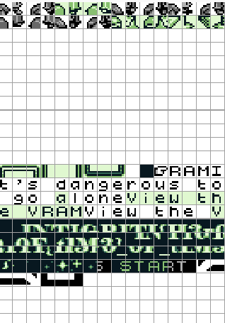

# 1337UP LIVE CTF 2023

## Virtual RAM

> I wonder what the old man is talking about 😕
> 
> Author: Mohamed Adil
> 
> Password is "infected"
> 
> [`VirtualRAM.zip`](VirtualRAM.zip)

Tags: _rev_

## Solution
After unpacking the archive we get a file named `VirtualRam`, using `file` on the file gives us.

```bash
$ file VirtualRam
VirtualRam: Game Boy ROM image: "VIRTUALRAM" (Rev.01) [MBC5+RAM+BATT], ROM: 1Mbit, RAM: 256Kbit
```

So a `Game Boy ROM`, we need to find a fitting emulator, best with debugging capabilities. [`BGB`](https://bgb.bircd.org/) is exactly what we need for this job. After opening the ROM we can start a new game.


We can't do much except talk to the `NPC` which will tell us `It's dangerous to go alone - View the VRAM`. All right, then we should do so.



And horray, there is the flag, lying unused, and a bit scrambled, in `vram`. After reordering the tiles we get the flag.


Flag `INTIGRITI{H3r0_0F_t1M3}`