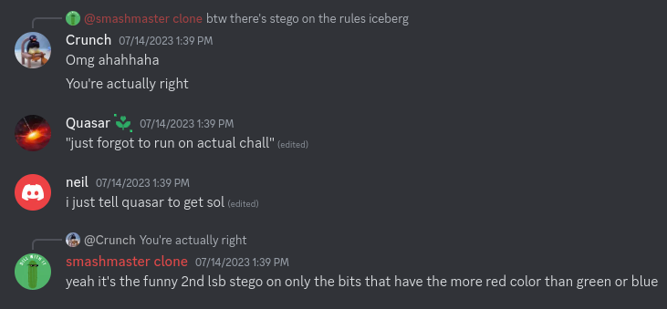

# AmateursCTF 2023

## rules-iceberg

> So apparently larry leaked this challenge already. Due to high demand for rules-iceberg stego and server profile picture discord stego, I've decided to release the challenge anyways.
>
>  Author: stuxf
>
> [`generate.py`](generate.py) [`larry-screenshot.png`](larry-screenshot.png) [`new-rules-iceberg.png`](new-rules-iceberg.png) [`rules-iceberg.png`](rules-iceberg.png)

Tags: _forensics_

## Solution
The challenge comes with a few images and a python script. One image contains a snapshot of a discord conversation.



Not sure, but it apparently is thought to be some sort of hint. The hint is not really needed though, since the generator script is given and tells exactly whats going on.

```python
from PIL import Image

def encode_lsb(image_path, message):
    # Open the image
    image = Image.open(image_path)
    pixels = image.load()

    # Check if the message can fit within the image
    if len(message) * 8 > image.width * image.height:
        raise ValueError("Message is too long to fit within the image.")

    # Convert the message to binary
    binary_message = ''.join(format(ord(char), '08b') for char in message)

    # Embed the message into the image
    char_index = 0
    for y in range(image.height):
        for x in range(image.width):
            r, g, b, a = pixels[x, y]

            if char_index < len(binary_message):
                # Modify the second least significant bit of the red channel
                # only if red is greater than green and blue
                if r > g and r > b:
                    r = (r & 0xFD) | (int(binary_message[char_index]) << 1)
                    char_index += 1

            pixels[x, y] = (r, g, b, a)

    # Save the modified image
    encoded_image_path = f"new-{image_path}"
    image.save(encoded_image_path)
    print("Message encoded successfully in the image:", encoded_image_path)


# Example usage
image_path = "rules-iceberg.png"

# extract flag from flag.txt
with open("flag.txt", "r") as f:
    flag = f.read().strip()

assert len(flag) == 54

encode_lsb(image_path, flag)
```

We can seee that the image [`rules-iceberg.png`](rules-iceberg.png) is taken an flag is encoded into the lsb of red channels, for each pixel where r > g and b. Decoding this is simpel since we have both, the original and the image with the encoded flag. We basically loop over all the pixels, check which pixel meets the constraint and merge the second bit into our bitmask. We also know, from the generator script, that the flag is 54 characters long so we stop when we read 54*8 bits. Running the script successfully extracts the flag

```python
from PIL import Image
from struct import *
from Crypto.Util.number import long_to_bytes

src = Image.open("rules-iceberg.png")
srcPixels = src.load()

dst = Image.open("new-rules-iceberg.png")
dstPixels = dst.load()

flag = int("0")
bits = 0
for y in range(src.height):
    for x in range(src.width):
        r1, g1, b1, a1 = srcPixels[x, y]
        r2, g2, b2, a2 = dstPixels[x, y]
        if r1 > g1 and r1 > b1:
            flag = (flag << 1) | ((r2 & 2) >> 1)
            bits = bits + 1
        if bits // 8 == 54:
            break
print(bytes.fromhex(hex(flag)[2:]))
```

Flag `amateursCTF{3v3ry0n3_d3f1n1t3ly_l0v3s_st3g0_mhmhmhmhm}`