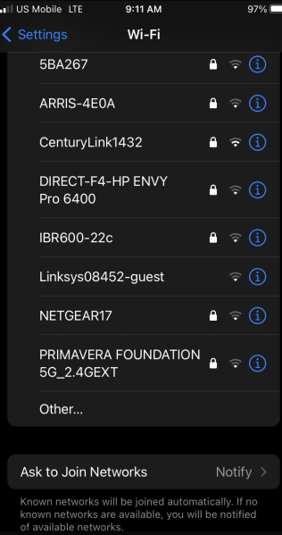

# AmateursCTF 2023

## ScreenshotGuesser

> I screenshoted a list of wifi networks on vacation but forgot where I was at.
>
> To check your coordinates use the provided server (pass in format x, y, example: 123.456789, -123.456789).
>
> "try to look at the direction ish in which stuff becomes more clustered" - author, note: we relaxed the coordinate percision as an update.
>
> You should be able to solve this in a manageable amount of guesses.
>
>  Author: smashmaster
>
> [`main.py`](main.py) [`screenshot.png`](screenshot.png)

Tags: _osint_

## Solution
For this challenge a screenshot and a script is provided. The script seems to check some longitude and latitude coordinates the user can input. The screenshot contains some wi-fi `SSIDs`.



```python
import json
with open("locations.json") as f:
	locations = json.load(f)
wrong = False
for i, coords in enumerate(locations, start=1):
	x2, y2 = coords
	x, y = map(float, input(f"Please enter the long and lat of the location: ").replace(",","").split(" "))
	if abs(x2 - x) < 0.0025 and abs(y2 - y) < 0.0025:
		print("Correct!")
	else:
		print("Wrong!")
		wrong = True

if not wrong:
	with open("flag.txt") as f:
		print("Great job, the flag is ",f.read().strip())
else:
	print("Better luck next time, but here's a postcard. (hopefully your term can display it) ")
	with open("bear.bin") as f:
		print(f.read())
```

Checking the `SSIDs` in [`wigle.net`](https://wigle.net/) leads to a spot around [`this area`](https://goo.gl/maps/wAUYPabZz5z3jiJH9) in `Tucson, AZ, USA`. 

With a bit of guesswork, providing a point nearby these regions will lead the flag.

```bash
$ nc amt.rs 31450
proof of work: curl -sSfL https://pwn.red/pow | sh -s s.AAA6mA==.rdh/KLBKB7UaIC07pOqu4w==
solution: s.Pf2eMeAF8s5J3+UCa+NJxC5kI7WBpLa7RLp8qVCrWd09t3jcatVOYCUeyKVwpEKWaUDEBxnoBsSffmDeyW9+MG+R4aTwJBVwkVwFoDci6560Tzu+4+gZHKGrkJb3pFmihVpdiVjc+aXahOgRkd7cCyL02vbWEkkgmOpUBp0enWi2d1SmV4+QN5mjHyvHDokpd6DFwP+qOch4l+uUvnOLXg==
Please enter the long and lat of the location: 32.23686862783563, -110.98392964220763
Correct!
Great job, the flag is  amateursCTF{p01nt_mast3r}
```

Flag `amateursCTF{p01nt_mast3r}`