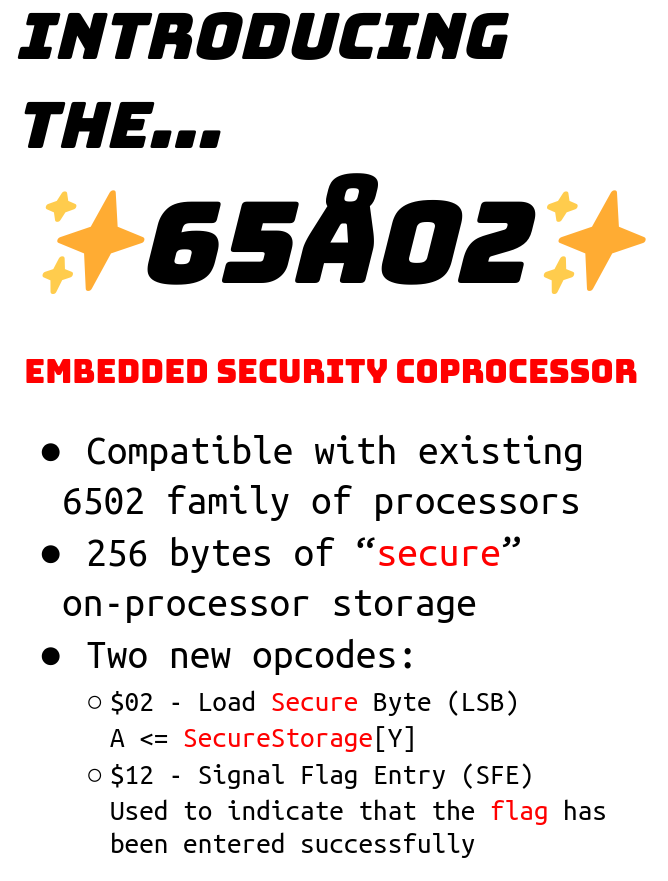

# ångstromCTF 2024

## Clockstep

> Someone tried to break into my super-secure flag checking machine!! They didn't get the flag, fortunately, but I'm still suspicious - can you check out this execution trace and see what they were doing? Don't worry, the flag data is stored securely on the processor, so don't worry about accidentally stumbling across it.
>
>  Author: rous
>
> [`clockstep.s`](clockstep.s), [`clockstep.txt`](clockstep.txt), [`65a02.png`](65a02.png)

Tags: _rev_

## Solution
This challenge comes with a `6502` assembler [`listing`](clockstep.s), a memory [`trace`](clockstep.txt) and a instruction image.



Good, we have some 6502 style processor with two new opcodes, apparently this model didn't gain any importance and no assembler would implement support for the two opcodes... :-(

Ok, jokes aside. To get an idea of what we have we look at the listing. The code is fairly short and roughly subdivied in three parts.

```js
main:
        LDX #$FF            ; setup stack so subroutines...
        TXS                 ; ...can be called
        JSR shuffleInput
        JSR checkInput
        BCC noWinning
        .byte   $12         ; opcode `SFE` Signal Flag Entry
noWinning:
        JMP $0000
```

The main only calls two functions and then signals (`SFE`) if the result of `checkInput` as positive. The return value is passed via `carry flag`, so it is assumed that, if `C` is set the user input was verified successfully. We could write some pseudocode for this.

```c
main()
{
    setupStack();
    shuffleInput();
    if (checkInput()) {
        signalFlagEntry();
    }
}
```

Apart from that we have a few variables on the [`zero page`](https://en.wikipedia.org/wiki/Zero_page). The values are used within the `shuffleInput` subroutine. Also we have two arrays `shufTable` and `checkTable` with 256 bytes each.

```js
shufPtr1 = $00
shufPtr2 = $01
shufMask = $02
shufTemp0 = $03
shufTemp1 = $04
input = $200

; ...

shufTable:
        .byte $49, $bc, $1d, $5a, $1c, $47, $74, $99, $67, $34, $19, $2f, $cf, $9f, $93, $84
        .byte $6e, $b0, $aa, $3c, $78, $24, $ca, $88, $c1, $d5, $47, $82...

checkTable:
        .byte $00, $00, $00, $00, $00, $a8, $00, $64, $00, $00, $cd, $00, $00, $00, $80, $00  
        .byte $00, $00, $00, $00, $00, $00, $00, $00, $00, $00, $00, $00...
```

Lets check out the next function `shuffleInput`, its a bit lengthy. After some initialization of variables we essentially have two nested loops.

```js
shuffleInput:   LDY #$AB
        STY shufPtr1        ; shufPtr1 = ABh
        LDY #$00
        STY shufPtr2        ; shufPtr2 = 00h
shufLoop:   LDA #$80
        STA shufMask        ; shufMask = 80h
        ; ...
        ; ...
        ; ...
shufSkip:   
        ; ...
        INY                 ; increment Y by one
        CPY #$30            ; check if Y is 30h
        BNE shufLoop        ; if not jump back
        RTS                 ; return from subroutine
```

So, just a loop that loops 48 times and everytime loads `80h` to `shufMask`. Lets have a look at the second part.

```js
shufLoop2:  
        .byte   $02         ; opcode for `LSB` Load Secure Byte
        AND shufMask        ; SecureStorage[Y] & shufMask 
        BEQ shufSkip        ; if result of bitwise and is 0 jump to shufSkip
        ; ...
        ; ...
        ; ...
shufSkip:   LSR shufMask    ; shufMask >>= 1
        BCC shufLoop2       ; if carry flag is clear jump back to shufLoop2
        ; ...
```

This is again a loop. A byte is loaded from `secure storage` (at index of register `Y`) and a bitwise or with `shufMask` is done. Every iteration the mask is shifted one byte to the right and we jump back if the carry flag is clear.

Since we initialize shufMask with `80h` which is `10000000b` the loop iterates 8 times. The `LSR` will shift the least significant byte into carry, since we only have one byte set (the MSB) we shift 8 times until the loop stops.

Our current pseudocode looks something like this:

```c
shufPtr1 = 0xab
shufPtr2 = 0

for (int y = 0; y < 48; ++y)
{
    shufMask = 0x80;

    while ((shufMask & 1) == 0)
    {
        if (SecureStorage[y] & shufMask)
        {
            /// ... missing code here ...
        }
        shufMask >>= 1;
    }
}
```

Ok, lets do the next chunk.

```js
        ; ...
        STY shufTemp0       ; store Y to memory
        LDA shufPtr1        ; load A with ptr1 value
        AND #$3F
        CMP #$30            ; check if A + 3fh is 30h
        BCC shufOk1         ; if not skip substraction, else substract 30h
        SBC #$30    
shufOk1:
        TAY                 ; transfer A to Y
        LDA shufPtr2        ; same logic as above for ptr2
        AND #$3F
        CMP #$30
        BCC shufOk2
        SBC #$30    
shufOk2:
        TAX                 ; transfer A to X
        ; ...
        ; ...
```

And the next part.

```js
        LDA input,X         ; load input at X...
        PHA                 ; ... push to stack ...
        LDA input,Y         ; ... load input at Y ...
        STA input,X
        PLA
        STA input,Y         ; ... all in all swap input[X] with input[Y]
        LDA shufMask
        ADC #$E3
        STA shufTemp1
        LDA shufPtr1
        ROR
        EOR shufTemp1
        TAX
        LDA shufTable,X     ; calculate/load shufPtr1 from shufTable...
        STA shufPtr1
        LDA shufPtr2
        ROR
        EOR shufTemp1
        TAX
        LDA shufTable,X     ; ... as well as shufPtr2
        STA shufPtr2
        LDY shufTemp0       ; restore Y for next iteration
```

All in all the speudocode looks something like this. The basically shuffle the user input so it's all scrambled in the end. The interesting bit here is, that we shuffle based on memory values in `secure storage`. This will come in handy later.

```c
void shuffleInput()
{
    shufPtr1 = 0xab
    shufPtr2 = 0

    for (int y = 0; y < 48; ++y)
    {
        shufMask = 0x80
        
        while ((shufMask & 1) == 0)
        {
            if (SecureStorage[y] & shufMask) 
            {
                shufTemp0 = y
                
                a = shufPtr1 & 0x3f
                if (a > 0x30) {
                    a -= 0x30;
                }
                y = a
                
                a = shufPtr2 & 0x3f
                if (a > 0x30) {
                    a -= 0x30
                }
                x = a
            
                tmp = input[x]
                input[x] = input[y]
                input[y] = tmp
                
                shufTemp1 = shufMask + 0xe3
                
                x = (shufPtr1 >> 1) & shufTemp1
                shufPtr1 = shufTable[x]
                
                x = (shufPtr2 >> 1) & shufTemp1
                shufPtr2 = shufTable[x]
                
                y = shufTemp0
                
            }
            
            shufMask >>= 1;
        }
    }
}
```

The last part is the subroutine `checkInput`. Its faily small, so lets go fast over it.

```js
checkInput:
        LDY #$30            ; load Y with 30h
checkLoop:  .byte   $02     ; load byte from secure storage at Y
        EOR input-$30,Y     ; xor with input[Y-30]
        TAX                 ; transfer A to X
        LDA checkTable,X    ; load value from checkTable[X]...
        STA input-$30,Y     ; ...and write the value back to input[Y-30]
        INY                 ; increment Y by one
        CPY #$60
        BNE checkLoop       ; check if Y is 60h, if not jump back
        ; ...
```

This again a simple loop, it loops from `30h` to `5fh`, xors the scrambled user input with a value from secure storage and replaces the original value in user input with the result.

```js
LDY #$00                    ; load Y with 00h
checkLoop2: .byte   $02     ; load byte from secure storage at Y
        CMP input,Y         ; check if the value is identical with what is
                            ; now in input[Y]
        BEQ checkOk
        CLC                 ; clear carry flag indicating failure
        RTS 
checkOk:    INY             ; move to next index
        CPY #$30
        BNE checkLoop2      ; jump back if Y < 30h
        SEC                 ; set carry flag indicating success
        RTS
```

After this the code just compares the first `48` bytes of secure storage with the result that is now in the user input array. If both are identical the subroutine returns success, otherwise it earlies out with a fail.

```c
int checkInput()
{
    for (int y = 30; y < 60; ++y)
    {
        input[y-30] = check_table[SecureStorage[y] ^ input[y-30]]
    }

    for (int y = 0; y < 30; ++y)
    {
        if (input[y] != SecureStorage[y]) {
            return 0;
        }
    }

    return 1;
}
```

Quick summary, what do we know by now? The secure storage is split in two parts. The first part contains `check` values for each flag character, not the flag character itself. The second part contains the index to the correct check values into `checkTable` but xor'ed with the actual flag characters. 

Ok, that was much work for small bits of informations. But we know even more, the secure storage is read and logic depends on the values. Therefore, if we had a memory trace, maybe we could leak the content of the secure storage... And thankfully we have such information.

```bash
A:8000 D:a2 R
A:8001 D:ff R
A:8002 D:9a R
A:8002 D:9a R
A:8003 D:20 R
A:8003 D:20 R
A:01ff D:80 W
...
```

Lets quickly break down the format. We have three columns, the first one is the memory address that is `A`ccessed, the second one is the `D`ata value which is `R`ead or `W`ritten.

So naturally the first access is at `8000h` since our programm is located there, the value `a2h` is the opcode for `LDX #`, thats our first instruction. Since we have a immediate value the opcode needs another byte which is at `8001h`, so we have `LDX #$FF`. The next instruction at `8002h` has a data value of `9ah` which is `TXS impl` and so one. Follow along the trace with [`6502 Instruction Set`](https://www.masswerk.at/6502/6502_instruction_set.html).

So we have all the memory traffic flowing over the bus (except what comes from secure storage). I added a [`listing with instruction addresses`](clockstep1.s), that helps to connect the trace to the listing.

```js
801b    .byte   $02
801c    AND shufMask
801e    BEQ shufSkip
        STY shufTemp0
; ...
```

But does it help? Lets see what we have in the trace at address `801bh` (where we read data from secure storage). Lets search the address within the trace.

```js
A:801b D:02 R       ; .byte   $02
A:801b D:02 R       ; .byte   $02
A:801c D:25 R       ; AND shufMask
A:801d D:02 R
A:0002 D:80 R       ; load content of shufMask from zero page at 02h
A:801e D:f0 R       ; BEQ shufSkip
A:801f D:44 R       ; ...
A:8064 D:46 R       ; ...
A:8065 D:02 R
A:0002 D:80 R
A:0002 D:40 W
A:8066 D:90 R
A:8067 D:b3 R
```

We can easily follow along the trace, but the best thing is, we branch based on the result of our masking of the secure storage value with `shufMask`. That means we can reconstruct the secure storage value by checking if the branch was taken or not.

The branch we want to investigate is at address 801eh, we check the next instruction to see if the branch was taken or not. Since the inner loop scans the secure storage byte bitwise we can just record the result for each bit and retrieve this way the full byte value. Then continue with the next byte, for all the 48 bytes.

```python
def parseLine(line):
    addr, value, op = line.split()
    return (int(addr[2:],16), int(value[2:],16), op)

trace = open("clockstep.txt", "r").readlines()
index = 0
secure_bits = []
secure_buffer = []

while index < len(trace):
    addr, value, op = parseLine(trace[index])

    if addr == 0x801e:
        addr, value, op = parseLine(trace[index+2])
        secure_bits.append('1' if addr == 0x8020 else '0')

    index = index + 1

for i in range(0, len(secure_bits), 8):
    secure_buffer.append(int("".join(secure_bits[i:i+8]),2))

print(secure_buffer)
```

And there we have it, the first part of the secure storage, which are the check values for the flag.

```bash
[70, 100, 49, 41, 100, 134, 237, 156, 215, 31, 194, 7, 37, 72, 32, 162, 196, 168, 90, 235, 11, 32, 65, 73, 79, 139, 241, 248, 205, 48, 241, 19, 148, 34, 60, 248, 168, 41, 149, 128, 73, 87, 135, 110, 159, 167, 17, 99]
```

Sadly this is not enough to retrieve the flag. We also can record the user input (which is _not the flag_ `actf{not_the_flag_not_the_flag_not_the_flag_not}`), but we still need it. Since remember, the second part of the secure storage is xored with the user input. To retrieve the original value, we need to xor again, but then we also can reconstruct the second part.

This time we use read the trace where the loop prepares the check values for the user input. It reads from `checkTable` that starts at address `8191h`. The user input can be found 6 lines before the read.

```js
A:8071 D:59 R       ; EOR input-$30,Y
A:8072 D:d0 R
A:8073 D:01 R
A:0200 D:61 R       ; read input[Y], we want to read the value
A:8074 D:aa R       ; TAX
A:8074 D:aa R
A:8075 D:bd R       ; LDA checkTable,X
A:8076 D:91 R
A:8077 D:81 R
A:81c2 D:46 R       ; read checkTable[X], we want the relative index
...
```

```python
trace = open("clockstep.txt", "r").readlines()
index = 0
secure_buffer2 = []

while index < len(trace):
    addr, value, op = parseLine(trace[index])

    if 0x8191 <= addr < 0x8291:
        _, value, _ = parseLine(trace[index-6])
        secure_buffer2.append((addr - 0x8191) ^ value)

    index = index + 1

print(secure_buffer2)
```

```bash
[80, 107, 78, 91, 140, 143, 164, 219, 27, 149, 211, 232, 197, 197, 80, 90, 231, 55, 173, 144, 96, 231, 239, 86, 62, 104, 24, 221, 62, 41, 65, 142, 148, 143, 233, 32, 31, 141, 251, 58, 34, 207, 34, 232, 148, 183, 66, 123]
```

Now we have the full content of secure storage leaked, but what next? To reconstruct the flag characters we need to remove the `index` part of the second part of the secure storage. The index part we can get by searching the index of the `check` value within the `checkTable` and the check values we have in the first part of the secure storage.

```python
check_table = [...]

secure_storage = [70, 100, 49, 41, 100, 134, 237, 156, 215, 31, 194, 7, 37, 72, 32, 162, 196, 168, 90, 235, 11, 32, 65, 73, 79, 139, 241, 248, 205, 48, 241, 19, 148, 34, 60, 248, 168, 41, 149, 128, 73, 87, 135, 110, 159, 167, 17, 99]

secure_storage2 = [80, 107, 78, 91, 140, 143, 164, 219, 27, 149, 211, 232, 197, 197, 80, 90, 231, 55, 173, 144, 96, 231, 239, 86, 62, 104, 24, 221, 62, 41, 65, 142, 148, 143, 233, 32, 31, 141, 251, 58, 34, 207, 34, 232, 148, 183, 66, 123]

for i in range(48):
    index = check_table.index(secure_storage[i])
    char = secure_storage2[i] ^ index
    print(chr(char), end="")
```

This gives us `al4ra_n1l_kc4wr}2te3À0{f_844a34_de␦¤34_blr0d_`.. It.. doesnt look _that_ bad. :-(

Well, for one thing, the flag is still scrambled. We can unscramble it by recording the swap operations from the trace, just as we did before.

```python
check_table = [...]

secure_storage = [70, 100, 49, 41, 100, 134, 237, 156, 215, 31, 194, 7, 37, 72, 32, 162, 196, 168, 90, 235, 11, 32, 65, 73, 79, 139, 241, 248, 205, 48, 241, 19, 148, 34, 60, 248, 168, 41, 149, 128, 73, 87, 135, 110, 159, 167, 17, 99]

secure_storage2 = [80, 107, 78, 91, 140, 143, 164, 219, 27, 149, 211, 232, 197, 197, 80, 90, 231, 55, 173, 144, 96, 231, 239, 86, 62, 104, 24, 221, 62, 41, 65, 142, 148, 143, 233, 32, 31, 141, 251, 58, 34, 207, 34, 232, 148, 183, 66, 123]

trace = open("clockstep.txt", "r").readlines()
shuffle_pairs = []
addr = 0
index = 0

while index < len(trace):
    prev_addr = addr
    addr, value, op = parseLine(trace[index])

    if 0x200 <= addr < 0x230 and op == 'W' and prev_addr < 0x806d:
        ofs = addr - 0x200
        shuffle_pairs.append(ofs)
    index = index + 1

flag = []
for i in range(48):
    index = check_table.index(secure_storage[i])
    char = secure_storage2[i] ^ index
    flag.append(chr(char))

shuffle_pairs = shuffle_pairs[::-1]
for i in range(0, len(shuffle_pairs), 2):
    index1 = shuffle_pairs[i+0]
    index2 = shuffle_pairs[i+1]
    flag[index1], flag[index2] = flag[index2], flag[index1]

print("".join(flag))
```

This gives us `atÀ{bl4ck_4nd_wr1␦e_4a_r34d_4ll_03r¤423ea08f}`, still looks somewhat off, but it gets fairly close to a correct flag. Inspecting a bit further we can see that `checkTable` as duplicate entries. Most entries can be filtered out by checking if it's in printable ascii range. But some entries are left, for these the correct value can be checked manually. The full script can be found [`here`](solve.py), and we finally have the flag.

> Disclaimer: I fully solved the challenge only after the event ended, also thanks for the community input.

Flag `actf{bl4ck_4nd_wr1te_4nd_r34d_4ll_0v3r_423ea08f}`