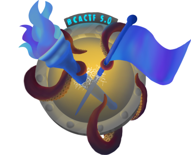

# BCACTF 5.0

 Credits [BCACTF](https://bcactf.com/)

## forensics
[`Static`](forensics/static/README.md)\
[`Wiretapped`](forensics/wiretapped/README.md)\
[`sheep`](forensics/sheep/README.md)\
[`flagserver`](forensics/flagserver/README.md)\
[`magic`](forensics/magic/README.md)

## web
[`Fogblaze`](web/fogblaze/README.md)\
[`Duck Finder`](web/duckfinder/README.md)\
[`MOC, Inc.`](web/moc_inc/README.md)\
[`JSLearning.com`](web/jslearning/README.md)

## misc
[`JailBreak Revenge`](misc/jailbreak/README.md)\
[`reload-decode`](misc/reload_code/README.md)\
[`Physics Test`](misc/physics_test/README.md)\
[`MathJail`](misc/mathjail/README.md)\
[`JailBreak 2`](misc/jailbreak/README.md)\
[`JailBreak 1`](misc/jailbreak/README.md)

## crypto
[`rad-be-damned`](crypto/rad_be_damned/README.md)\
[`Cha-Cha Slide`](crypto/cha_cha_slide/README.md)\
[`Encryptor Shop`](crypto/encryptor_shop/README.md)\
[`RSAEncrypter`](crypto/rsa_encrypter/README.md)

## rev
[`xnorzzz`](rev/xnorzzz/README.md)\
[`FPS Frenzy`](rev/fps_frenzy/README.md)