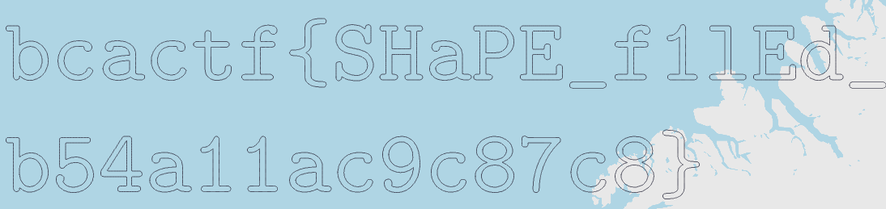

# BCACTF 5.0

## sheep

> baa
> 
> Author: Marvin
> 
> [`sheep.shp`](sheep.shp)

Tags: _forensics_

## Solution
We get a `ESRI Shapefile` for this challenge as `file` tells us.

```file
$ file sheep.shp
sheep.shp: ESRI Shapefile version 0 length 0 type Null Shape
```

To view this tools exist like [`Manifold Viewer`](https://manifold.net/viewer.shtml). If we open it, we find a `b` which could be the start of the flag.. But there is something missing. Lets open the file in a hexeditor. The shape file starts with a header like described [`here`](https://en.wikipedia.org/wiki/Shapefile), or [`mapshaper`](https://mapshaper.org/).

```
byte    type    endianess   usage
0-3     int32   big         File code (0x0000270a)
4-23    int32   big         Unused
24-27   int32   big         File length (in 16-bit words, including header)
28-31   int32   little      Version
32-35   int32   little      Shape type
36-67   double  little      Minimum bounding rectangle min X, min Y, max X, max Y
68-83   double  little      Range of Z. min Z, max Z
84-99   double  little      Range of M. min M, max M
```

There is definitely data missing within the header. Lets fix this.

```bash
File length = 69414
Version = ?
Shape Type = 5 (Polygon)
Min X = -999999
Min Y = -999999
Max X = 999999
Max Y = 999999
```

After opening the file again, we can see the flag.



Flag `bcactf{SHaPE_f1lEd_b54a11ac9c87c8}`