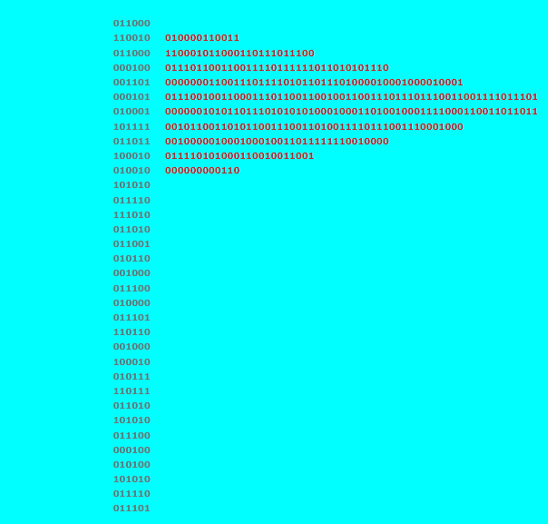

# BCACTF 5.0

## reload-decode

> Greetings neighbor. My name's Crazy Dave but you can just call me Crazy Dave. I found this weird website that seems to represent something. Says something about taco as a reward Can you find whatever the code is and hand it to me? I could really go for a taco right now
> 
> Author: Nikhil
> 
> [`main.py`](main.py)

Tags: _misc_

## Solution
We get the source code for a small web-app for this challenge. The app has one interesting endpoint `/flag`. If we call it some flag ascii art is displayed, where the flag is made out of binary data.

```python
@app.route('/flag')
def getFlag():
    #Get flag from flag.txt
    with open("flag.txt") as f:
        flag = bytearray(f.read().encode())
    flag_str = ""
    for b in flag:
        b = b << 4 ^ ((b << 4 & 0xff) >> 4)
        bm = 1 << random.randint(0, 11)
        cb = b ^ bm
        flag_str += bin(cb)[2:].zfill(12)
        
    return render_template('index.html', joined_flag = flag_str)
```



The challenge would be easy enough, but if we check out the code we can see that, for each character, 12 bits are stored and one of the 12 bits is flipped. The logic shifts the upper nibble 4 bits to the left and combines this with the lower nibble. This means the upper 8 bits contain the full character, together with the lower 4 bits the lower nibble is present twice: `HHHHLLLLLLLL`.

Since only one bit is flipped we can just record the bitstream multiple times and check which of the bits are stay stable most of the time. We then can assume that this bits are the original character bits. After a few rounds the flag is correctly reconstructed.

```python
import requests, textwrap

samples = []
histo = [0]*(47*255)

for i in range(100):
    resp = requests.get("http://challs.bcactf.com:30831/flag?")

    # record all the bits of the flag
    bits = ""
    for line in resp.text.split("\n"):
        line = line.strip()
        if "\"flag-pole\"" in line:
            value = line[24:-5]
            bits += value
        if "\"flag\"" in line:
            value = line[19:-5]
            bits += value

    # split into 12 bit chunks (12 bits per character)
    sample = textwrap.wrap(bits, 12)

    # get the character code and add to histogram
    for i, chunk in enumerate(sample):
        value = int(chunk,2)
        value = ((value >> 4) & 0xf0) | (value & 0x0f)
        histo[i*255+value] += 1

for i in range(47):
    max_char = -1
    max_idx = -1

    # find the character at position #i that we received most of the requests
    for j in range(255):
        if histo[i*255+j] > max_char:
            max_idx = j
            max_char = histo[i*255+j]

    print(chr(max_idx),end="")
```

Flag `bcactf{n0w-HEr3's-@-taco-cGxhbnRzIHZzIHpvbWJpZ}`