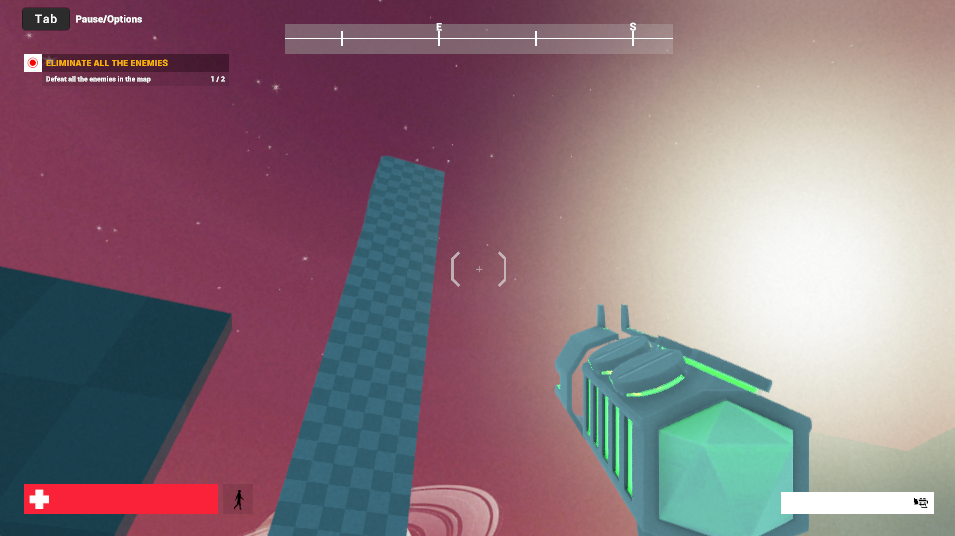
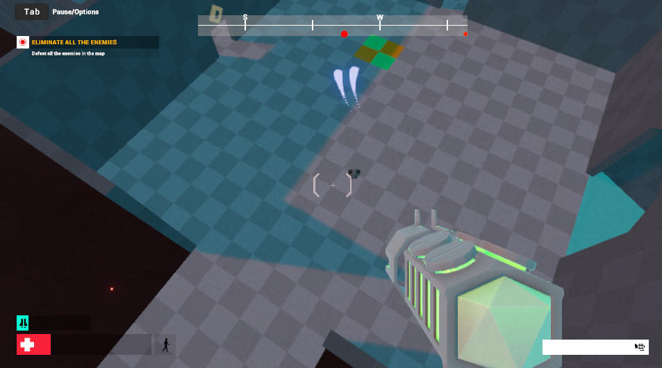
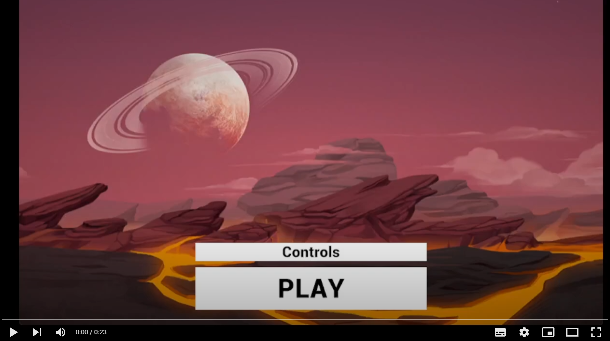

# BCACTF 5.0

## FPS Frenzy

> My friend Timmy made a game at the MoCO (Master of Code Olympiad) in just 50 nanoseconds! He told me that he hid a secret text somewhere in the game and placed a bet that I would not solve it. I'm not good at games, so can you please find this text?
> 
> Author: Puhalenthi, Zevi
> 
> [`Windows.zip`](Windows.zip)

Tags: _rev_

## Solution
For this challenge we get a build of a Unity game. We can choose between builds for `Windows`, `Linux` or `Mac`. After unpacking the archive we immediately see traces that the engine used was Unity (e.g. `UnityPlayer.dll` available in root folder or the general folder structure).

Great, with [`dnSpy`](https://github.com/dnSpy/dnSpy) we can decompile the source. Typically Unity uses `C#` for scripting. The `.NET` dlls are loaded and run within the native player. The game assemblies can by found in `<Name of the game>_Data/Managed/`. Assemblies can be named, if not they fall back to `Assembly-CSharp. dll`, in our case we have four:

```bash
fps.AI.dll
fps.Game.dll
fps.Gameplay.dll
fps.UI.dll
```

With dnSpy we can open these and export them as projects. This way we can manipulate the code and recompile from `Visual Studio`, that is more confortable (mind, some unambiguous names need to be resolved and a few other things need to be fixed).

The game itself is a simple first person shooter. We can run around, shoot enemies.. No flag though. Somewhere on the map there is a towering block we definitely can't reach the top. Probably this is where the flag is hiding.



Browsing the source code we find some interesting things. In `PlayerCharacterController.cs` we find the player movement (`HandleCharacterMovement`). One solution would be to increase the jump velocity, so we can jump to higher places.

Another interesting thing is, there is a `Jetpack` which is disabled and nowhere a `pickup` that enables it. In `Jetpack.cs` we find this line:

```cs
this.IsJetpackUnlocked = this.IsJetpackUnlockedAtStart;
```

Thats nice, lets unlock the jetpack. With double jump we can now jump quite hight, but still not enough to reach the top of the tower.



There's also this line, that consumes "fuel" or whatever the jetpack uses. Lets just comment it out for ability to infinite jetpacking.

```cs
this.CurrentFillRatio -= Time.deltaTime / this.ConsumeDuration;
```

And lets gooo....

[](https://www.youtube.com/watch?v=vB2Ti9sKq10)

Flag `bcactf{7H3_14w_of_c0S1nEs_4b723470334e}`