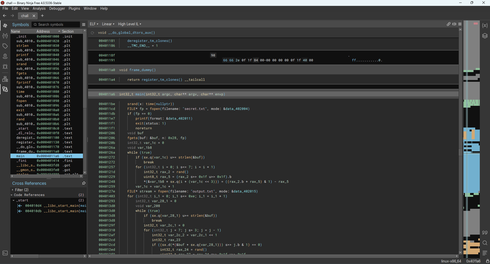

# BCACTF 5.0

## xnorzzz

> A mutated man wakes up with sixteen fingers and too much time on his fingers. He challenges you to return him the number he is thinking of and he will give you a reward/cookie.
> 
> Author: Michael Pylypovych
> 
> [`chall`](chall), [`output.txt`](output.txt)

Tags: _rev_

## Solution
This challenge comes with a binary file that needs to be reversed as well as a text file. The text file contains 15 hexadecimal numbers, each with the same length (62 characters), so 32 bytes of information each.

```bash
668C7DBEF9DD588006AC9F4B5C21AE8816D135CDC66B79DF4D09A88BA5C81B
F280E3B278CCDC0396E89E4B56B9A4008CC9BD8DC66BF9C78108B04DECC199
E6947FAAFADDD800142C07C872A1248C1453F50D467F794F09883888215199
77086F2A78D55808132C864B72B18C009651314DDC7F59D7C10A200C6FC09B
EE80E5AA72DDDC0B81A80ECB54B984000CD3BD09CE6FF9CF850AB805224919
E78CE5A2F144D88007249F5842210400045B79C5466F594F498B28C4A1431B
7784752A78D55C0297E00F4972B12C801ED3F5C956FBF947C508A84C2C4999
EF186BB6F0D5580A846087DA71A9240C1649B9C95C6B59C7C5832883E0DB1B
6B04612EFBC4DC0A826816C8E9B986048CD179C1D67BD9DFC188B08FE2D199
EE9C65AA72DCD80990E487D8DD390E041EC3F18DC6EF59DF8D8028CC6D4399
769C773AFACD580192200F486139260894C1F1C5CE7BD9DF8D0BB887A5D399
FA88E13E724D5882832816CA74A10C880C53BD45CE6FD9478108304EE84219
73047922F9C55C8316E8074A4F3984048EDBB9C556EB794F0903A04928D29B
77107136F1C45C0A95680E49FB3926080E5971455E7BF9D78983B808655B9B
EA0473A6FA45580A81A49E5859A924080C4BB509C66FD947C581384D26D919
```

To see how this can help us retrieve the flag, we open the binary file with [`Binary Ninja`](https://binary.ninja/).



As per default it shows some `High Level IL` representation of the decompiled code. We also can switch to other representations, for instance showing the `Disassembly` or some sort of pseudo `C`. Whatever helps best...

Naturally most of the symbols and naming is lost, Binary Ninja tries to recover some names (like `fp` for a file pointer). For all other cases, manual renaming can be done by double clicking a name (or selecting a name and pressing `N`), and changing then the name's value.

Lets go top to bottom. First the libc random number generator is initialized with the current time. Then `secret.txt` is opened and 40 bytes are read from the file into a buffer.

```c
004011be      srand(time(nullptr));
004011cd      FILE* fp = fopen("secret.txt", &data_402004);
004011db      if (fp == 0)
004011db      {
004011e7          printf(&data_402011);
004011f1          exit(1);
004011f1          /* no return */
004011db      }
00401206      void buf;
00401206      fgets(&buf, 0x28, fp);
...
```

Next the program loops over the length content read from the buffer. For every buffer entry the program calls `rand()`, does some calculation and stores the value in an array (`var_1b8`) and repeats this process 8 times.

```c
0040120b      int32_t index = 0;
0040126a      void var_1b8;
0040126a      while (true)
0040126a      {
00401272          if (((int64_t)index) >= strlen(&buf))
00401272          {
00401272              break;
00401272          }
00401257          for (int32_t i = 0; i <= 7; i = (i + 1))
00401257          {
0040121d              int32_t rax_2 = rand();
00401229              uint8_t rax_5 = ((int8_t)((rax_2 >> 0x1f) >> 0x1f));
00401248              *(uint8_t*)(&var_1b8 + ((int64_t)(i + (index << 3)))) = (((rax_2 + rax_5) & 1) - rax_5);
00401257          }
00401259          index = (index + 1);
0040126a      }
...
```

We can clean this up a bit more by changing the type of `var_1b8`, which is unspecified at the moment. Since we see its casted to `uint8_t` and then indexed into the meory range `i + (index * 8)` we can change the type to an array with `32 * 8`. The 8 is clearly coming from the inner loop, but why the 32? From the data we know the flag must be 32 bytes wide, we could also choose 40 as a upper bound, but it doesnt matter in this case, since the stack layout will not be changed. 

Good, we got rid of the cast and the array indexing looks a bit more readable.

```c
00401257          for (int32_t i = 0; i <= 7; i = (i + 1))
00401257          {
0040121d              int32_t rax_2 = rand();
00401229              uint8_t rax_5 = ((int8_t)((rax_2 >> 0x1f) >> 0x1f));
00401248              lookup[((int64_t)(i + (index << 3)))] = (((rax_2 + rax_5) & 1) - rax_5);
00401257          }
```

There is still the weird calculation though. The calculation is rather weird, lets check out the disassembly.

```c#
0040121d  e88efeffff         call    rand
00401222  89c2               mov     edx, eax
00401224  89d0               mov     eax, edx
00401226  c1f81f             sar     eax, 0x1f
00401229  c1e81f             shr     eax, 0x1f
```

Here are things more clear that where hidden in the pseudo c code. The first shift is an `arithmetic shift right` which does a signed divide, meaning it preserves the sign bit, so shifting eax 31 bits to the right will result in 0xffffffff (all 32 bits set) if eax contained a negative number, otherwise the result will be 0x00000000. This result is shifted 31 bits to the right with `shift right`, that does not preserve the sign bit, therefore the result will be 0x00000001 if eax originally contained a negative value or 0x00000000 in the other case.

```c#
0040122c  01c2               add     edx, eax
0040122e  83e201             and     edx, 0x1
00401231  29c2               sub     edx, eax
00401233  89d1               mov     ecx, edx
```

The next part adds this value (stored in `eax`) to `edx` (1 if edx is negative, 0 if edx is positive), masks the lsb and subtracts the value from the result of the `and` operation. This code is basically just implementing a simple `modulo 2` with support for negative values. Mind that `-1 % 2` is `-1` etc... 

So the actual code is as short as 

```c
lookup[i + index * 8] = rand() % 2;
```

We can add comments to the code by pressing `;`, to add to readability of the code.

```c
00401257          for (int32_t i = 0; i <= 7; i = (i + 1))
00401257          {
0040121d              int32_t rax_2 = rand();
00401229              uint8_t rax_5 = ((int8_t)((rax_2 >> 0x1f) >> 0x1f));
00401248              // calculates lookup[i+index*8] = rand() % 2
00401248              lookup[((int64_t)(i + (index << 3)))] = (((rax_2 + rax_5) & 1) - rax_5);
00401257          }
```

And all the sudden the code becomes clear. The table stores 8 random bits for every character in the input.

Moving on, the file `output.txt` is opened with option `a` (append). The parameter is hidden in `data_402015` but we can easily follow to the memory location by double clicking onto the name. 

And then the program loops 15 times, does some calculations and writes the result to the output file. 

```c
0040127e      FILE* stream = fopen("output.txt", &data_402015);
00401403      for (int32_t i_1 = 0; i_1 <= 0xe; i_1 = (i_1 + 1))
00401403      {
...
004013f6          fprintf(stream, &data_402022, &var_208);
00401403      }
```

Lets see how the output is calculated. For every iteration the programm loops over the whole input buffer. And then has two loops that do, more or less, the identical work.

```c
004013d0          while (true)
004013d0          {
004013d8              if (((int64_t)index1) >= strlen(&buf))
004013d8              {
004013d8                  break;
004013d8              }
...
004013d0          }
```

Lets inspect the first of them. The loop counter goes from 7 downwards to 4 (7,6,5,4). Then the input current character is loaded and shifted to the right by the inner loop counter (`j`). This brings basically the bits 7, 6, 5 or 4 to the bit position 1, then the bit is masked and checked if set. 

The program scans basically the bits, starting from the MSB going down, one by one. If the bit is set, the output gets a value from the previously created `lookup`. Otherwise the output bit is chosen randomly. Here again we have the `modulo 2` logic, we analyed earlier already.

The output is in variable `var_2c_1` which is shifted one bit to the left, making space for the new bit in the LSB. The new bit is added as the last operation to the output, the code is basically just doing a `output = (output << 1) | currentBit`.

```c
0040129f              int32_t var_2c_1 = 0;
00401310              for (int32_t j = 7; j > 3; j = (j - 1))
00401310              {
004012af                  int32_t var_2c_2 = (var_2c_1 << 1);
004012cd                  int32_t rax_23;
004012cd                  if (((((int32_t)buf[((int64_t)index1)]) >> j) & 1) == 0)
004012cd                  {
004012ed                      int32_t rax_24 = rand();
004012f9                      uint32_t rax_27 = ((rax_24 >> 0x1f) >> 0x1f);
00401303                      rax_23 = (((rax_24 + rax_27) & 1) - rax_27);
004012cd                  }
004012cd                  else
004012cd                  {
004012e8                      rax_23 = ((int32_t)lookup[((int64_t)(j + (index1 << 3)))]);
004012cd                  }
00401305                  var_2c_1 = (var_2c_2 + rax_23);
00401310              }
00401327              var_208[((int64_t)(index1 * 2))] = *"0123456789ABCDEF"[((int64_t)var_2c_1)];
```

This generates an index that is used to index into a lookup containing the values `0-9A-Z` which basically does just a decimal to hexadecimal conversion for a nibble (4 bits).

The second loop does the same thing for the lower nibble, so every to bytes of the output contain the hexadecimal value of one input character.

The full, working program looks something like this:

```c
#include <stdio.h>
#include <stdlib.h>
#include <time.h>
#include <string.h>
#include <stdint.h>

int main()
{
    srand(time(NULL));

    FILE* in = fopen("secret.txt", "r");
    if (in == 0)
    {
        printf("err");
        exit(1);
    }

    char buffer[40];
    char lookup[256];
    fgets(buffer, 40, in);

    for (int i = 0; i < strlen(buffer); ++i)
    {
        for (int j = 0; j <= 7; ++j)
        {
            lookup[i * 8 + j] = rand() % 2;
        }
    }

    FILE* out = fopen("output.txt", "a");
    for (int line = 0; line <= 14; ++line)
    {
        char data[63]{};

        for (int i = 0; i < strlen(buffer); ++i)
        {
            uint8_t value = 0;
            for (int j = 7; j > 3; --j)
            {
                int bit = 0;
                if (((buffer[i] >> j) & 1) == 0)
                {
                    bit = rand() % 2;
                }
                else
                {
                    bit = lookup[i * 8 + j];
                }
                value = (value << 1) | bit;
            }
            data[i * 2] = "0123456789ABCDEF"[value];

            value = 0;
            for (int j = 3; j >= 0; --j)
            {
                int bit = 0;
                if (((buffer[i] >> j) & 1) == 0)
                {
                    bit = rand() % 2;
                }
                else
                {
                    bit = lookup[i * 8 + j];
                }
                value = (value << 1) | bit;
            }
            data[i * 2 + 1] = "0123456789ABCDEF"[value];
        }

        fprintf(out, "%s\n", data);
    }
}
```

This gives us a similar output as we have in `output.txt`. Not the same for sure, since we don't have the correct input and even then, we would need to right seed for the exact output. The keypoint is, the output leaks informations about the input bitstream. Since every character has it's own `random` bit sequence (in `lookup`), the output bit will always be the same for input bits that are set and random for input bits that are not set.

We can imagine the hex values of `output.txt` in binary format and check which of the columns *always have the same bit set*. There is a huge chance that this are the candidates which came from `lookup` and therefore must be a `1` bit in the input. The rest are `0` bits. 

If the theory is ok, we can therefore reconstruct the full input stream.

```python
alphabet = "0123456789ABCDEF"

def check_col(m, c):
    value = m[0][c]

    for i in range(1, len(m)):
        if value != m[i][c]:
            return False
    return True


m = [""]*15

lines = open("output.txt", "r").readlines()
for i, line in enumerate(lines):
    line = line.strip()
    for c in line:
        value = alphabet.index(c)
        m[i] += bin(value)[2:].rjust(4,'0')

mask = []
for c in range(len(m[0])):
    mask.append("1" if check_col(m, c) else "0")

print(int("".join(mask),2).to_bytes(31,"big"))
```

Flag `bcactf{th3fl@gUsee33ek_g3tg00d}`