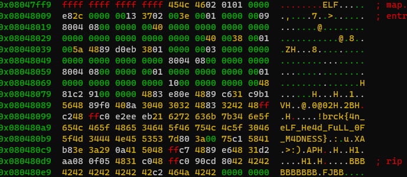

# BraekerCTF 2024

## Binary shrink

> After hearing about young computer problems, you have decided to become a computer shrink. Your first patient is a robot elf.
>
>
>"A little machine dream I keep having, " she says. "But when it is over, I always forget the end. I've captured the dream's program, but I don't dare look".
>
>
>Can you run the program for her? Are you able to figure out what's in her memory right before execution stops?
>
>  Author: n/a
>
> [`binary_shrink.zip`](binary_shrink.zip)

Tags: _rev_

## Solution
This challange is a follow up challenge of [`Embryobot`](../embryobot/README.md). The technique here is the same as described before. A [`Tiny ELF`](https://nathanotterness.com/2021/10/tiny_elf_modernized.html) is given and we start making sense of it by nopping out parts that normally cannot be changed in `ELF files` and dumping the disassembly. 

The hexdump again is fairly small and we start by investigating where the entry point is pointing to (`offset 18h points to 8048009h`). If we remove the base address part we can see the program jumps to `09h` within our image.

```bash
00000000  7F 45 4C 46  02 01 01 00   00 E8 2C 00  00 00 13 37                                           .ELF......,....7
00000010  02 00 3E 00  01 00 00 00   09 80 04 08  00 00 00 00                                           ..>.............
00000020  40 00 00 00  00 00 00 00   00 00 00 00  00 00 00 00                                           @...............
00000030  00 00 00 00  40 00 38 00   01 00 5A 48  89 D0 EB 38                                           ....@.8...ZH...8
00000040  01 00 00 00  03 00 00 00   00 00 00 00  00 00 00 00                                           ................
00000050  00 80 04 08  00 00 00 00   00 80 04 08  00 00 00 00                                           ................
00000060  01 00 00 00  00 00 00 00   01 00 00 00  00 00 00 00                                           ................
00000070  00 10 00 00  00 00 00 00   48 81 C2 91  00 00 00 48                                           ........H......H
00000080  83 E8 0E 48  89 C6 31 C9   B1 56 48 89  F0 40 8A 30                                           ...H..1..VH..@.0
00000090  40 30 32 48  83 32 42 48   FF C2 48 FF  C0 E2 EE D6                                           @02H.2BH..H.....
000000A0  26 6C 76 23  28 38 76 2C   F5 0B 0E 04  1D 19 10 74                                           &lv#(8v,.......t
000000B0  26 23 04 36  0E 0E 1D 7B   84 19 07 76  06 0C 07 51                                           &#.6...{...v...Q
000000C0  11 3F C2 78  42 37 83 1A   03 FA 7C 78  6B 48 03 12                                           .?.xB7....|xkH..
000000D0  0A BD 85 4A  CB 9C 0A 72   90 AA 02 C4  97 E1 4B 83                                           ...J...r......K.
000000E0  0A BD 82 D1  8F C2                                                                            ......
```

Again, if we dump the disassembly (this time file tells us it's a 64-bit binary) the disassembler doesn't line up with out jump offset `09h`, so we need to give a bit of help by replacing some bytes immediately before this offset with nops.

```bash
$ objdump -D -Mintel,x86-64 -b binary -m i386 binary_shrink

0:   90                      nop
1:   90                      nop
2:   90                      nop
3:   90                      nop
4:   90                      nop
5:   90                      nop
6:   90                      nop
7:   90                      nop
8:   90                      nop
9:   e8 2c 00 00 00          call   0x3a
e:   13 37                   adc    esi,DWORD PTR [rdi]
```

Right, the program calls to offset `3ah` so we move on from there helping the disassembler again with some bytes replaced with nop instructions.

```bash
39:   90                      nop             ; we replaced this one byte with a nop
3a:   5a                      pop    rdx      ; pops the return address (804800eh) from stack
3b:   48 89 d0                mov    rax,rdx  ; assigns the return address to rax
3e:   eb 38                   jmp    0x78     ; jumps to offset 78h
```

This snipped is used to get the a valid address with image base into `rdx` and `rax` and then jumps to another offset. Lets continue there. This time the instructions are aligned already so the disassembler gives us the correct output.

```bash
78:   48 81 c2 91 00 00 00    add    rdx,0x91               ; add 91h to rdx, rdx points now to 9fh (relative to base)
7f:   48 83 e8 0e             sub    rax,0xe                ; substracting 0eh from rax, rax points now to the base address (image start in memory)
83:   48 89 c6                mov    rsi,rax
86:   31 c9                   xor    ecx,ecx                ; ecx = 0
88:   b1 56                   mov    cl,0x56                ; set low byte of ecx, ecx = 56h
8a:   48 89 f0                mov    rax,rsi
8d:   40 8a 30                mov    sil,BYTE PTR [rax]     ; load byte from at offset of rax
90:   40 30 32                xor    BYTE PTR [rdx],sil     ; xor byte at offset of rdx with the loaded byte
93:   48 83 32 42             xor    QWORD PTR [rdx],0x42   ; xor byte at offset of rdx with 42h
97:   48 ff c2                inc    rdx                    ; increase rdx and rax
9a:   48 ff c0                inc    rax
9d:   e2 ee                   loop   0x8d                   ; loop back to 8dh if ecx is not zero
9f:   d6                      (bad)           ; bad code... from here :(
```

This looks just like a loop doing some `xor encryption`. In total `86` bytes are rewritten while the target (`rdx`) starts at offset `9fh` (the instruction just after the loop that is marked as `bad`). And the source (`rax`) starts at the base address (where our `ELF header` is). Then the program loops over 86 bytes in total xoring them and additionally xoring the target byte with `42h`. This also explains why the following instructions where not disassembled correclty. So lets write a small script that decrypts the code for us.

```python
data = bytearray(open("binary_shrink", "rb").read())

# add some bytes as the loop overflows our image quite a bit
for i in range(0,15):
    data.append(0)

# this is more or less 1:1 taken from our disassembly
rdx = 0xe
rax = rdx
rdx += 0x91
rax -= 0xe
rsi = rax
ecx = 0
cl = 0x56
rax = rsi

# encrypt the instructions
while True:
    sil = data[rax]
    data[rdx] ^= sil
    data[rdx] ^= 0x42
    rdx += 1
    rax += 1
    cl -= 1
    if cl == 0:
        break

open("binary_shrink_out", "wb").write(data)
```

Now we get the following:

```bash
78:   48 81 c2 91 00 00 00    add    rdx,0x91
7f:   48 83 e8 0e             sub    rax,0xe
83:   48 89 c6                mov    rsi,rax
86:   31 c9                   xor    ecx,ecx
88:   b1 56                   mov    cl,0x56
8a:   48 89 f0                mov    rax,rsi
8d:   40 8a 30                mov    sil,BYTE PTR [rax]
90:   40 30 32                xor    BYTE PTR [rdx],sil
93:   48 83 32 42             xor    QWORD PTR [rdx],0x42
97:   48 ff c2                inc    rdx
9a:   48 ff c0                inc    rax
9d:   e2 ee                   loop   0x8d                   ; the loop as we had it before
9f:   eb 21                   jmp    0xc2                   ; jump to c2h now

...

c2:   80 3a 00                cmp    BYTE PTR [rdx],0x0     ; is [rdx] != 0...
c5:   75 c1                   jne    0x88                   ; ... then jump to 88h
c7:   58                      pop    rax                    ; ... otherwise continue here, pops '1' from stack
c8:   41 b8 3e 3a 29 0a       mov    r8d,0xa293a3e          ; string for '>:)\n'
ce:   41 50                   push   r8
d0:   48 ff c7                inc    rdi
d3:   48 89 e6                mov    rsi,rsp
d6:   48 31 d2                xor    rdx,rdx
d9:   b2 08                   mov    dl,0x8
db:   0f 05                   syscall

; exit program
dd:   48 31 c0                xor    rax,rax                ; rax = 0
e0:   48 ff c0                inc    rax                    ; rax = 1
e3:   90                      nop
e4:   cd 80                   int    0x80                   ; syscall exit
```

The following instructions setup another syscall to `1` (write), a string of `length 8` (rdx = 8) is written to `stdout` (rdi = 1), the string is pushed to stack (`rsi=rsp`). The string output is a smiley, then the program exits. Interesting, no flag. The description says we should check out the memory on program exist, so lets use radare2 and set a breakpoint somewhere before the program exits.

```bash
$ r2 -d binary_shrink
[0x08048009]> db 0x080480d9
[0x08048009]> dc
[+] SIGNAL 4 errno=0 addr=0x080480d9 code=2 si_pid=134512857 ret=0
[+] signal 4 aka SIGILL received 0 (Illegal instruction)
V!
Press `m`
View -> Hexdump
```



To be fair, since we decrypted the program ourself we could also just have looked at the hexdump or used strings on the program.

Flag `brck{4n_eLF_He4d_FuLL_0F_M4DNESS}`