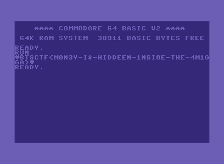

# Break the Syntax CTF 2025

## c64

> Recently, I was cleaning my attic and found my dad's old computer with a disk containing an encrypted message and a decryption code. However, for decryption to happen, a passkey is required, but no one can remember what the key was. Here is a copy of that disk. Hope you can find the correct passphrase.
>
> [`disk.d64`](disk.d64)

Tags: _rev_

## Solution
The file provided for this challenge is a [`disk image for commodore 64`](https://www.c64-wiki.com/wiki/D64), as we can conclude from the file extension and the title of the challenge. We can inspect the disk image with tools like [`dirmaster`](https://style64.org/dirmaster). 


We can see there are two files on that disk, one is a program and the other one a data file. Let's inspect the program first:

```basic
2 gosub 1000
4 input b$
10 gosub 4000
13 poke 11,tt-47
30 lli = lli + 1
31 xd = asc(mid$(a$,lli,1))
35 if xd > 127 then xd = xd - 160
40 poke 251,xd
41 poke 252,dk
50 sys 49152
51 dk = peek(253)
52 poke 252,dk
53 poke 251,peek(11)
54 sys 49152
98 print chr$(peek(253));
99 if peek(6) <= lli then goto 3000
100 goto 30
1000 print "searching for a secret file on drive 8.."
1001 open 2,8,2,"secret,s,r"
1002 input#2,a$
1003 if st<>0 then print "cannot find a secret file" :close 2 :end
1004 print "secret file found!"
1005 print "enter decryption key (8 chars)"
1006 poke 6,len(a$) :
1008 lli = 0
1009 return
1500 rem
1501 poke 250,0
1505 poke 251,y
1506 sys 49159
1510 for x=1 to 6
1515 z = asc(mid$(b$,x,1))
1520 poke 251,z
1530 poke 252,y
1540 sys 49152
1546 sys 49159
1550 y = peek(253)
1560 next x
1600 return
2000 rem
2020 for i=0 to 17
2030 read a: poke 49152+i,a
2040 next
2060 restore
2070 return
3000 end
4000 rem
4001 close 2
4002 if len(b$) <> 8 then print "invalid key length!" : goto 3000
4018 gosub 2000
4020 y = asc(mid$(b$,7,1))
4025 gosub 1500
4026 dk = peek(250)
4030 if y <> asc(mid$(b$,8,1)) then print "invalid key!" : goto 3000
4049 read tt
4050 return
10000 data 165,251,69,252,133,253,96,6,250,165,251,41,1,5,250,133,250,96
```

It's lengthy and like many of the [`BASIC`](https://en.wikipedia.org/wiki/BASIC) programs from the past, a bit of spaghetti code. But really not too bad. Lets start at the top, as execution will also start there.

```basic
2 gosub 1000
4 input b$
10 gosub 4000
```

The program will first call a subroutine at line `1000`. The line numbering that was used in BASIC seems a bit confusing nowaday. But in the past code editors where nothing like code editors now. The way to go was to 'tell' the editor on which position a certain code line would go. Therefore one also often sees lines incrementing in larger steps, to leave some space for future edits, as inserting new lines was no easy task.

Anyways, `gosub 1000` would cause the interpreter to jump into a subroutine at line `1000`. Then some user input is read into a string variable `b` and then a subroutine at `4000` is called.

Let's see what the subroutines are doing.

```basic
1000 print "searching for a secret file on drive 8.."
1001 open 2,8,2,"secret,s,r"
1002 input#2,a$
1003 if st<>0 then print "cannot find a secret file" :close 2 :end
1004 print "secret file found!"
1005 print "enter decryption key (8 chars)"
1006 poke 6,len(a$) :
1008 lli = 0
1009 return
```

This is the first subroutine (`1000-1009`). The routine prints a message, opens the `secret` file and reads the content to a string variable named `a`. There is a bit of error handling, if the file was not found. But if everything went alright the program tells us `secret file found!` and prompts `enter decryption key (8 chars)`. 

The [`POKE`](https://www.c64-wiki.com/wiki/POKE) statement is basically a memory write operation, writing here the length of the data read (from `secret`) to memory location `6`. And lastely an variable (`lli`) is set to `0`, before returning to the call-site.

```basic
4000 rem
4001 close 2
4002 if len(b$) <> 8 then print "invalid key length!" : goto 3000
4018 gosub 2000
4020 y = asc(mid$(b$,7,1))
4025 gosub 1500
4026 dk = peek(250)
4030 if y <> asc(mid$(b$,8,1)) then print "invalid key!" : goto 3000
4049 read tt
4050 return
```

The second subroutine starts with an empty statement ([`REM`](https://www.c64-wiki.com/wiki/REM) is a line comment). Then the file index `2` is closed (which is the secret file descriptor) and the user input `b` is checked the have a length of `8`.

Goto `3000` will jump to line `3000` which will end the program (check listing above).

Then subroutine `2000` is called, and `y` is set to the [`PETSCII`](https://www.c64-wiki.com/wiki/PETSCII) value of the 7th character of the user input (mind that string indexing is 1-based).

Then suborutine `1500` is called and after the subroutine returned the value of `y` is checked to have the same value as the user input's 8th character. If not, the program prints `invalid key!` and shuts down.

Finally, before returning a value `tt` is read from the program data section.

This is all kinda confusing, also things are interleaved a bit, that doesn't help much. So lets see what subroutines `2000` and `1500` are doing.

```basic
2000 rem
2020 for i=0 to 17
2030 read a: poke 49152+i,a
2040 next
2060 restore
2070 return
```

This one is interesting. It loads the 18 bytes from the data section (note that loop max is inclusive) and writes them to memory location `49152+i`. Then the data read index is restored (`restore`)(https://www.c64-wiki.com/wiki/RESTORE_(BASIC)). This is important, as we read again from the data section into value `tt`. So we know `tt` is assigned with the value `165`.

The data is declared at line 10000 using [`DATA`](https://www.c64-wiki.com/wiki/DATA).

```basic
1500 rem
1501 poke 250,0
1505 poke 251,y
1506 sys 49159
1510 for x=1 to 6
1515 z = asc(mid$(b$,x,1))
1520 poke 251,z
1530 poke 252,y
1540 sys 49152
1546 sys 49159
1550 y = peek(253)
1560 next x
1600 return
```

This subroutine writes some values (`0` and the value of `y`) to memory addresses `250` and `251` and then calls a machine language subroutine at address `49159`. 

As there is no kernal subroutine mapped to this address, there must something else. And if we recap subroutine `2000` wrote some values into that address region. This means, the data bytes are actually program code we are executing. 

We can use [`this disassembler`](https://www.masswerk.at/6502/disassembler.html) to get the disassembly, by plugging the hex codes of the data bytes into it.

```bash
                            * = $0000
0000   A5 FB                LDA $FB
0002   45 FC                EOR $FC
0004   85 FD                STA $FD
0006   60                   RTS
0007   06 FA                ASL $FA
0009   A5 FB                LDA $FB
000B   29 01                AND #$01
000D   05 FA                ORA $FA
000F   85 FA                STA $FA
0011   60                   RTS
                            .END
```

We are calling to 49159, and subroutine `2000` wrote to `49152`. This means we start at a relative offset of `7`. Check out the [`6502 instruction set`](https://www.masswerk.at/6502/6502_instruction_set.html) to follow the next steps.

```bash
0007   06 FA                ASL $FA     ; MEM[$FA] = MEM[$FA] >> 1
0009   A5 FB                LDA $FB     ; A = MEM[$FB]
000B   29 01                AND #$01    ; A = A & 1
000D   05 FA                ORA $FA     ; A = A | MEM[$FA]
000F   85 FA                STA $FA     ; MEM[$FA] = A
0011   60                   RTS         ; 
```

Translated to python this code does the following:

```py
def func_49159():
    MEM[250] = (MEM[250] << 1) | (MEM[251] & 1)
```

There is also another subroutine at offset `0`, which is even shorter

```bash
0000   A5 FB                LDA $FB     ; A = MEM[$FB]
0002   45 FC                EOR $FC     ; A = A ^ MEM[$FC]
0004   85 FD                STA $FD     ; MEM[$FD] = A
0006   60                   RTS         ;
```

In python:

```py
def func_49152():
    MEM[253] = MEM[251] ^ MEM[252]
```

Ok, back to the basic code. The following writes to memory addresses `250` and `251` are for preparing parameters for the SYS call. Then the subroutine is called, (check `func_49159`). 

```basic
1501 poke 250,0
1505 poke 251,y
1506 sys 49159
```

The remaining part of the function loops over the user input characters 1-6 and calculates some kind of hash function over the key, which is tracked in memory location `250`.

```basic
1510 for x=1 to 6
1515 z = asc(mid$(b$,x,1))
1520 poke 251,z                 -- second param for 49159, first parameter for 49152
1530 poke 252,y                 --                         second param for 49152
1540 sys 49152
1546 sys 49159
1550 y = peek(253)
1560 next x
1600 return
```

This is roughly equivalent to what this python code does.

```py
def hash(user_input):
    prev = user_input[6]
    result = prev & 1

    for i in range(0, 6):
        tmp = user_input[i] ^ prev
        result = (result << 1) | (user_input[i] & 1)
        prev = tmp

    return result
```

This means, we are calculating a checksum, or some hash over the input key in this subroutine, and store the key at memory location 250.

So lets finally continue with the main routine.

```basic
...
13 poke 11,tt-47
30 lli = lli + 1
31 xd = asc(mid$(a$,lli,1))
35 if xd > 127 then xd = xd - 160
40 poke 251,xd
41 poke 252,dk
50 sys 49152
51 dk = peek(253)
52 poke 252,dk
53 poke 251,peek(11)
54 sys 49152
98 print chr$(peek(253));
99 if peek(6) <= lli then goto 3000
100 goto 30
```

The program writes `tt-47` to memory location 11. We already know that `tt` has the value `165` so the program writes `118` to memory. Then `lli` is incremented and the `secret` data is read at index `lli`.

If the secret value (at `lli`) is larger than `127` it's decreased by `160` and then `xd` and `dk` are used as parameters for `func_49152` (which is basically only calculating `xd ^ dk`). The result is written back to `dk`.

We know that `dk` was initially set by func `4000` (line `4026`), by reading the result of the hash function `1500`. We don't know the correct value though, since this is coming from hasing the user input.

Anyways, next the program calculates `dk ^ mem[11]` which is `dk ^ 118` as memory[11] is never written again and prints the result of the calculaten to screen.

The last two lines are used as loop control, checking that `lli` is less or equal to `6`, if not the program exits otherwise the program loops back to line `30`.

If we put this into a python function, we get:

```py
dk = ???
for value in secret:
    if value > 127:
        c -= 160
    dk = value ^ dk
    print(chr(dk ^ 118),end="")
```

The only missing thing is the value of `dk`. Since the value is only one byte we actually don't really care about the initial key phrase but can just bruteforce the whole range (it's only 256 values in total anyways). And doing this gives us eventually the flag.



Flag `BtSCTF{M0N3Y-I$-HIDDEN-1NSI0E-THE-4M1GA}`