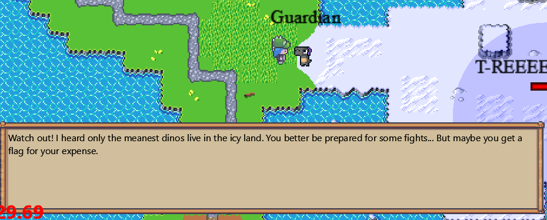
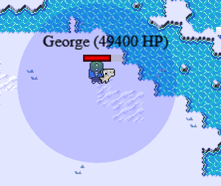
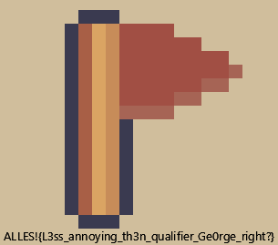

# CCCamp CTF 2023

## Boss

> 
> The best kind of gamehacking: smash the overpowered boss enemy.
> 
> George returned from his mountain vaccation and continues to roam the prehistoric earth, still causing troubles for CTF players. Get your revenge and beat him to death!
>
>  Author: 0x45da
>
> [`camp_gamedev-public.zip`](../camp_gamedev-public.zip)

Tags: _game_

## Solution
We start to explore the world a bit. At some point the green biome ends and some ice biome starts. The guardian warns us of some mean dinos in the icy land. This sounds like the right place to find the `overpowered boss enemy`.



Since the boss enemy really is overpowered, there is no way to defeat him with the default player strength and health. So lets analyze the code a bit, and see what we can do.

The game has a `client-server` architecture. This basically expludes all easy local hacking of properties, since the server will most likely keep track of the game state. So lets see what happens when the player attacks a enemy.

src/client/client/game/entities/player@146
```python
def _update_move(self, dt: float) -> None:
    game: Game = cast("Game", client.scene_manager.current_scene)

    self.velocity_x = 0
    self.velocity_y = 0

    keys = cast(Dict[int, bool], client.scene_manager.keys.data)
    controller = client.scene_manager.controller

    # ....

    if client.game_state.session_type == SessionType.SESSION_TYPE_NORMAL:
        match keys:
            case {key.SPACE: True}:
                if self.can_attack():
                    self._attacking = True
                    self._last_attack = time.time()
                    self._find_attack_enemy()

            case _:
                pass
    # ....
```

So, in `_update_move` the player input is handled. When pressing `space` the player checks if he can attack and then tries to find a enemy to attack.

src/client/client/game/entities/player@261
```python
def can_attack(self):
        return time.time() > self._last_attack + 0.600  # One attack is 600ms
```

This looks interesting. The 600ms timeout is calculated locally, so we can try to remove it for faster attack rate. This might be something the server counters, but it does not hurt. So we change this to always return `true`.

src/client/client/game/entities/player@123
```python
def _find_attack_enemy(self):
    direction = self.rotation_to_directionproto()
    self.sprites[Activity.ACTIVITY_ATTACKING][
        direction
    ].frame_index = 0  # Reset attack animation to start
    self.sprite = self.sprites[Activity.ACTIVITY_ATTACKING][direction]

    objects_in_range: List[Enemy] = client.game_state.get_objects_in_range(
        distance_squared=400
    )

    enemy_obj = None
    # print("Obj in range: " + str(len(objects_in_range)))

    if len(objects_in_range) == 0:
        return

    enemy_obj = objects_in_range[0]  #  TODO: Differentiate between enemies

    client.global_connection.attack_enemy(
        time=datetime.now(), uuid=enemy_obj.uuid, damage=10
    )
```

Next the game tries to check for attackeable enemies within `20` units radius. If a candidate is found the client notifies the server about the attack with a fixed damage of `10`.

src/server/server/server_runner@402
```python
@authenticated
async def _attack_enemy(self, uuid: str, message: AttackEnemy) -> None:
    # ....

    if not server.game_state.fight_manager.is_plausible_attack(
        user=user, enemy=enemy, attack_msg=message
    ):
        print("not plausible attack")
        return  # TODO: Not plausible message to client?

    if not server.game_state.fight_manager.can_take_damage_enemy(
        enemy_uuid=enemy.uuid, cooldown_ticks=30
    ):  # TODO: Dynamic cooldown for attacks
        print("Enemy can't get damage again, cooldown not reached")
        return  # TODO: Not plausible message to client?

    await enemy.take_damage(message.damage)

    # ....
```

The server checks for various things like if user and enemy are valid. But also if the attack properties are `plausible` and if the enemy can take damage.

src/server/server/game/fight@34
```python
def can_take_damage_enemy(self, enemy_uuid: str, cooldown_ticks: int = 30) -> bool:
    # User not in list => Store and allow to take damage
    if not enemy_uuid in self.user_damage_cooldowns:
        self.enemy_damage_cooldowns[enemy_uuid] = time.time()
        return True

    last_damage_timestamp = self.enemy_damage_cooldowns[enemy_uuid]
    ticks_passed = (time.time() - last_damage_timestamp) * SERVER_TICK_RATE

    # Cooldown did not pass yet
    if ticks_passed < cooldown_ticks:
        return False

    self.enemy_damage_cooldowns[enemy_uuid] = time.time()
    return True

def is_plausible_attack(self, user: User, enemy: Enemy, attack_msg: AttackEnemy):
    # Check if attack direction is plausible:
    # TODO

    # Check if damage is plausible
    if attack_msg.damage > 11:
        return False

    if attack_msg.damage < 0:
        return False

    # Check if enemy is in range of weapon
    dist_x = (user.coords.x - enemy.x) ** 2
    dist_y = (user.coords.y - enemy.y) ** 2
    max_attack_distance = 400  # TODO: Find good value, maybe dynamic from weapon
    if dist_x + dist_y > max_attack_distance:
        return False

    attack_timestamp = time.mktime(attack_msg.time.timetuple())

    if not enemy.uuid in self.enemy_damage_cooldowns:
        self.enemy_damage_cooldowns[enemy.uuid] = attack_timestamp
        return True

    # TODO: Get dynamic from current user weapon
    weapon_cooldown_ticks = 30

    last_damage_timestamp = self.enemy_damage_cooldowns[enemy.uuid]

    ticks_passed = (attack_timestamp - last_damage_timestamp) * SERVER_TICK_RATE
    if ticks_passed > weapon_cooldown_ticks:
        self.enemy_damage_cooldowns[enemy.uuid] = time.mktime(
            attack_msg.time.timetuple()
        )

        return True
    return False
```

Ok, changing the damage to a high value will not work, since everything damage value greater `11` will be recognized as `implausible`. Also the player distance to the enemy is checked, so no range weapons are allowed. Also the attack cooldown is checked here, so we cannot increase the hit rate for the client.

This looks all save, more or less at least. So lets see what happens when the enemy takes damage. For base entities just the health is decreased.

src/server/server/game/entity/enemy@70
```python
async def take_damage(self, damage: int) -> None:
    self.health -= damage
```

There is a specialization `BossPatrolEnemy` that puts a flag in the players inventory when the enemy dies. But nothing interesting that can be done here, except we have a hint for what to watch out in code to find other places where flags are added to the players inventory.

src/server/server/game/entity/enemy@246
```python
class BossPatrolEnemy(PatrolEnemy):
    def __init__(self, *args: Any, **kwargs: Any) -> None:
        super().__init__(*args, **kwargs)

    async def take_damage(self, damage: int) -> None:
        self.health -= damage

        if self.user_uuid is None:
            return

        if self.health <= 0:
            success = await server.game_state.give_item(
                user_id=self.user_uuid,
                item=ITEMS["flag_boss"],
                once=True,
            )
            if success:
                await server.global_server.update_self(self.user_uuid)
```

But we still cannot defeat the boss. So lets check what happens when the player takes damage. Lets check the `PatrolEnemy` in server code.

src/server/server/game/entity/enemy@225
```python
class PatrolEnemy(Enemy):
    patrol_path: NPCPath
    speed: float

    def __init__(
        self, path: Polygon | None, speed: float, *args: Any, **kwargs: Any
    ) -> None:
        super().__init__(*args, **kwargs)

        self.speed = speed

        self.patrol_path = NPCPath(path=path, speed=speed, loop=True)

        self.state_machine.add_state(PatrolState(self))
        self.state_machine.add_state(AggroState(self))
        self.state_machine.add_state(AttackingState(self))
        self.state_machine.add_state(DeadState(self))

        self.state_machine.change_state("patrol")
```

The enemies behaviour is implemented with a simple state machine. As per default the enemy is in `patrol state`. If the player is moving to close the enemy changes from `patrol` to `aggro state` and tries to reach the player until being in attack range. If the player is reached the enemy goes from `aggro` to `attack state` and sends a `GiveDamage` packet to the client after a attack happened.

src/server/server/game/entity/enemy@192
```python
if time.time() > self.last_attack + AttackingState.ATTACK_SPEED:
    await server.global_server.give_damage(
        self_obj.uuid, 7, include_user_ids=[self_obj.user_uuid]
    )
    self.last_attack = time.time()
    self_obj.last_attack = time.time()
```

The client then recieves the message and sends back a `AcknowledgeDamage` damage packet with the amount of acknowledged damage.

src/client/client/networking/network@153
```python
case {"giveDamage": inner_message}:
    self.acknowledge_damage(damage=inner_message["damage"])
```

src/server/server/server_runner@380
```python
@authenticated
async def _acknowledge_damage(self, uuid: str, message: AcknowledgeDamage) -> None:
    user_uuid = server.game_state.peer_sessions[self.peer].user_id
    user = server.game_state.get_user(uuid=user_uuid)

    if user is None:
        return

    response = ServerMessage(uuid=uuid)

    if (
        server.game_state.fight_manager.can_take_damage_user(
            username=user.username, cooldown_ticks=30
        )
        and message.damage > 0
    ):
        user.health -= message.damage

        await self.network_queue.put((response, None))

        await server.global_server.update_self(user.uuid)
```

The server then receives the `AcknowledgeDamage` package checks if the user can take damage and if the damage taken is greater `0` and decreases the user healt... So, we easily can turn on `god mode` by just not acknowledgeing damage (sending `0` for `message.damage`)?

Now we indeed can handle this boss 



and after a while the boss drops the flag.



Flag `ALLES!{L3ss_annoying_th3n_qualifier_Ge0rge_right?}`