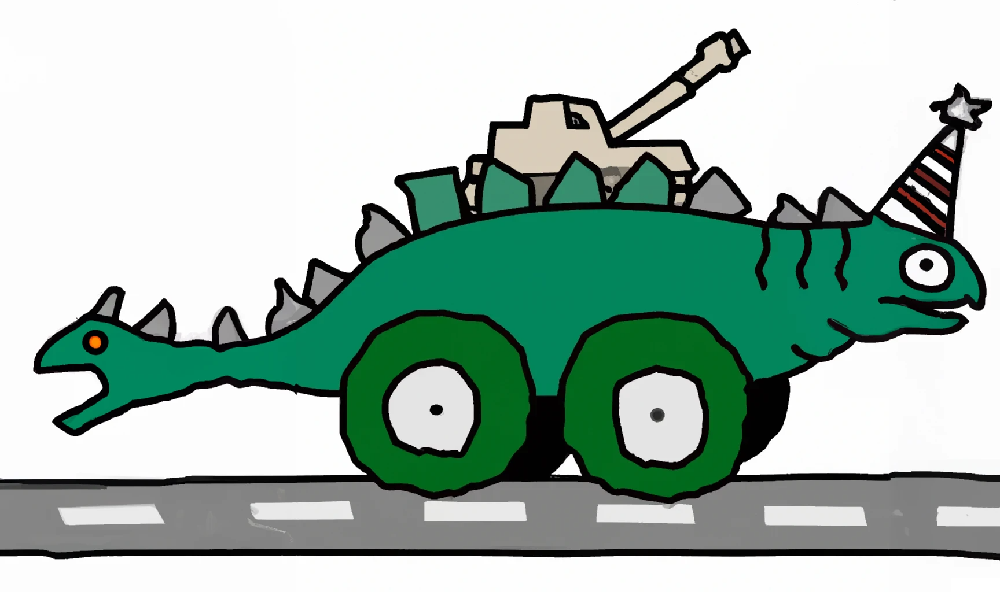

# CCCamp CTF 2023

## Cheat Code

> 
> Remember Circle, Circle, L1, Circle, Circle, Circle, L1, L2, R1, Triangle, Circle, Triangle? This cheat code does not spawn a tank, dinos don't even have tanks. But even if they would, they probably would look like this:
>
> 
>
> Anyway, you may find some other cheat codes hidden in the game.
>
>  Author: lion
>
> [`camp_gamedev-public.zip`](../camp_gamedev-public.zip)

Tags: _game_

## Solution
Right, style of cheat codes is known from console games. But we have to find the correct combination. I searched the codebase for `flag_` and found 

src/server/server/game/state@527
```python
if self.recent_moves[user_id].check_next(
    (sign(distance_x), sign(distance_y))
):
    await self.give_item(
        user_id,
        ITEMS["flag_cheat"],
        True,
    )
```

Next we check where `recent_moves` is occuring and find this part where the dictionary is initialized after a user logged in.

src/server/server/game/state@410
```python
self.recent_moves[user_id] = PrefixMatch(
    [
        (-1, 0),
        (1, 0),
        (1, -1),
        (0, -1),
        (-1, 1),
        (0, -1),
        (1, -1),
        (-1, 0),
        (1, 1),
        (1, -1),
        (0, -1),
        (1, 0),
    ]
)
```

`PrefixMatch` is a small class which holds a list of tuples and an index. For every call to `check_next` the item at position `index` is validated to be equal to the passed `obj` which is `(sign(distance_x), sign(distance_y)` and index is incremented if this is the case. If the check failed the index is reset to `0`, this means we always start with the first sequence item no matter what movements the player did before. If all items of the list are checked successfully the method returns `true` causing the server to give us the flag.

src/server/server/game/state@57
```python
class PrefixMatch:
    index: int
    expected: List[Any]

    def __init__(self, expected: List[Any]):
        self.index = 0
        self.expected = expected

    def check_next(self, obj: Any) -> bool:
        if self.expected[self.index] == obj:
            self.index += 1
            if self.index == len(self.expected):
                self.index = 0
                return True
        elif self.index > 0 and self.expected[self.index - 1] != obj:
            self.index = 0

        return False
```

So, all we need to do is to move in the right sequence. This can be automated in various ways, I added a bit of code the the user input handler.

```python
match keys:
    case {key.UP: True, key.DOWN: True} | {key.W: True, key.S: True}:
        pass
    case {key.UP: True} | {key.W: True}:
        self.velocity_y = -1
    case {key.DOWN: True} | {key.S: True}:
        self.velocity_y = 1
    case _:
        pass

# cheat code start
match keys:
    case {key.R: True}:
        self.move_cheat_index = 0
    case {key.C: True}:
        if self.move_cheat_timeout < 0:
            moves = [
                (-1, 0),
                (1, 0),
                (1, -1),
                (0, -1),
                (-1, 1),
                (0, -1),
                (1, -1),
                (-1, 0),
                (1, 1),
                (1, -1),
                (0, -1),
                (1, 0),
            ]
            self.velocity_x = -moves[self.move_cheat_index][0]
            self.velocity_y = -moves[self.move_cheat_index][1]
            self.move_cheat_index = (self.move_cheat_index+1) % len(moves)
            self.move_cheat_timeout = 30
    case _:
        pass
# cheat code end

# ....

self.move_cheat_timeout -= 1
```

By keeping `C` pressed the player moves through the sequence. There is a small timeout to let the server synchronize with the client move, but after a while the flag is in our inventory.


Flag `ALLES!{WORSHIPME=Maxmium_RESPECT_ACTIVATED}`