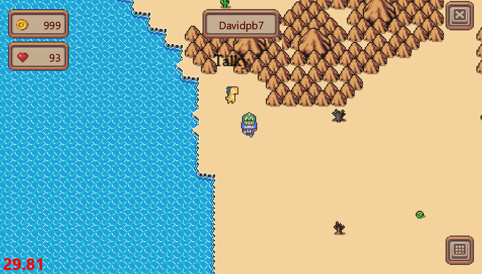

# CCCamp CTF 2023

## Desert Dino Dialogue

> 
> Welcome to the "Desert Dino Dialogue" challenge, where you will embark on a unique and captivating encounter in the scorching desert. Deep within the arid landscape, hidden behind towering mountains, resides a lonely NPC (Non-Player Character) like no other—a talking dinosaur longing for a conversation.
> 
> Your task is to engage in an extended conversation with this fascinating desert-dweller. The dinosaur, with its ancient wisdom and boundless tales, awaits someone who can listen patiently and provide companionship. As the sweltering sun beats down upon the desert, only the most persevering challengers will succeed in breaking through the dinosaur's initial reserve to unearth its treasure trove of knowledge.
> 
> The key to this challenge lies in building a rapport with the dinosaur. Though initially wary and hesitant, it will gradually warm up to you as you demonstrate genuine interest and empathy. The NPC's experiences span centuries, ranging from tales of long-lost civilizations to the secrets of survival in the unforgiving desert. Show your dedication, and it will reveal hidden clues that can be utilized in future challenges.
> 
> As you converse with the dinosaur, be mindful of the surrounding environment. The desert can be treacherous, with blistering winds, sandstorms, and dangerous wildlife. Maintain your focus and stay resilient, for every conversation carries the potential to unlock new avenues of exploration.
> 
> Remember, the objective of this challenge is to establish a meaningful connection with the dinosaur by actively listening and engaging in a dialogue. Patience and perseverance are the keys to success in unraveling the secrets of the desert and earning the respect of this ancient creature.
> 
> Are you ready to delve into the heart of the desert, behind the mountains, to converse with the last remaining dinosaur? Prepare yourself for a journey of discovery, where a simple conversation may hold the key to untold mysteries and open doors to unimaginable possibilities.
> 
> Good luck, brave challenger! The desert awaits your arrival, and the dinosaur yearns for someone to share its stories with.
>
>  Author: D_K
>
> [`camp_gamedev-public.zip`](../camp_gamedev-public.zip)

Tags: _game_

## Solution
This challenge really has a long description. The location we need to go to is somewhere in the desert.



If we talk to this `npc` it will tell us a endless story about [`Lorem Ipsum`](https://www.lipsum.com/). We can keep going to the next page but the text is too long.

Searching for `Lorem Ipsum` in the code base has a match in `logbook.txt` which contains 561322 lines, and in the last line is the (redacted) flag. Meaning, we somehow need to fetch the whole story from the server.

Lets see how `Dialogs` are working...

`DialogScene` is a sene which is composed over the `Game` scene whenever we interacted with a npc character. The class contains methods like `append_text`, `set_text` or `next_text` which are forwarding to a `Dialog` instance. `Dialog` is a ui class deriving from `WidgetBase` and responsible for the displaying and managing the content of the dialog window. 

When the player is in range of an `npc` and presses `space` the method `interact` of the npc is called which does things like aligning player and npc so that they look at each other, and also sending a `Interact` message to the server, either with `INTERACT_STATUS_START` or `INTERACT_STATUS_UPDATE` depending on, if the player started a new interaction or just pressed space again while already interacting with the npc.

There are various (custom) interaction types. The one interesting in this case is `CustomInteraction.TALKY`:

src/server/server/game/entity/npc@172
```python
case CustomInteraction.TALKY:
    if len(self._text) == 0:
        with open(Path(server.PATH, self.custom_attribute), "r") as f:
            self._text = f.read()

        return ""

    split = self._text.split("\n", 1)
    passage = split[0]
    if len(passage) <= 200:
        if len(split) > 1:
            self._text = split[1]
        else:
            self._text = ""
    else:
        passage = passage[:200].rsplit(" ", 1)[0]
        self._text = self._text[len(passage) :]

    passage = passage.lstrip()

    return passage
```

This code creates a list of lines for the text displayed and returns passages of max 200 characters for each call, meaning we don't get the full text but have to request the next passage over and over again until we reach the end of the text. 

Whenever a interaction of type `INTERACT_TYPE_TEXT` is send back from the server, the game scene opens the dialog and starts displaying the first passage. When the player hits `space` again the dialog callback is invoked, which is set to `npc.interact` and will cause to fetch the next passage from the server.

src/client/client/scenes/game@241
```python
def _on_interact_handler(self, interact: Interact) -> None:
    match interact.type:
        case InteractType.INTERACT_TYPE_TEXT:
            match interact.status:
                case InteractStatus.INTERACT_STATUS_START:
                    npc = self.npcs[interact.uuid]
                    self.display_dialog([interact.text], cb=npc.interact)
                case InteractStatus.INTERACT_STATUS_UPDATE:
                    if self.is_overlay_scene("dialog"):
                        self.dialog.append_text(interact.text)
                    else:
                        npc = self.npcs[interact.uuid]
                        self.display_dialog([interact.text], cb=npc.interact)
                case InteractStatus.INTERACT_STATUS_STOP:
                    self.npcs[interact.uuid].stop_interaction()
                    self.remove_dialog()
                case InteractStatus.INTERACT_STATUS_UNSPECIFIED:
                    assert False
```

One thing we can do is, to rewrite the talky interaction handling so that the dialog is not used but the passages are printed to console and the next passage is requested immediately:

```python
case InteractType.INTERACT_TYPE_TEXT:
    match interact.status:
        case InteractStatus.INTERACT_STATUS_START:
            self.remove_dialog()
            print(interact.text)
            self.npcs[interact.uuid].interact()
        case InteractStatus.INTERACT_STATUS_UPDATE:
            print(interact.text)
            self.npcs[interact.uuid].interact()
        case InteractStatus.INTERACT_STATUS_STOP:
            self.npcs[interact.uuid].stop_interaction()
        case InteractStatus.INTERACT_STATUS_UNSPECIFIED:
            assert False
```

This runs for a while but will eventually print the whole text to the console, along with the flag.

```
...
aliquam erat volutpat. Ut wisi enim ad minim veniam, quis nostrud exerci tation ullamcorper suscipit lobortis nisl ut aliquip ex ea commodo consequat. Duis autem vel eum iriure dolor in hendrerit in
vulputate velit esse molestie consequat, vel illum dolore eu feugiat nulla facilisis. At vero eos et accusam et justo duo dolores et ea rebum. Stet clita kasd gubergren, no sea takimata sanctus est
Lorem ipsum dolor sit amet. Lorem ipsum dolor sit amet, consetetur sadipscing elitr, sed diam nonumy eirmod tempor invidunt ut labore et dolore magna aliquyam erat, sed diam voluptua. At vero eos et
accusam et justo duo dolores et ea rebum. Stet clita kasd gubergren, no sea takimata sanctus est Lorem ipsum dolor sit amet. Lorem ipsum dolor sit amet, consetetur sadipscing elitr, At accusam
aliquyam diam diam dolore dolores duo eirmod eos erat, et nonumy sed tempor et et invidunt justo labore Stet clita ea et gubergren, kasd magna no rebum. sanctus sea sed takimata ut vero voluptua.
est Lorem ipsum dolor sit amet. Lorem ipsum dolor sit amet, consetetur sadipscing elitr, sed diam nonumy eirmod tempor invidunt ut labore et dolore magna aliquyam erat. 
ALLES!{L0n3ly_D1n0sp34k1ng1n_D3s3rt}
```

Flag `ALLES!{L0n3ly_D1n0sp34k1ng1n_D3s3rt}`