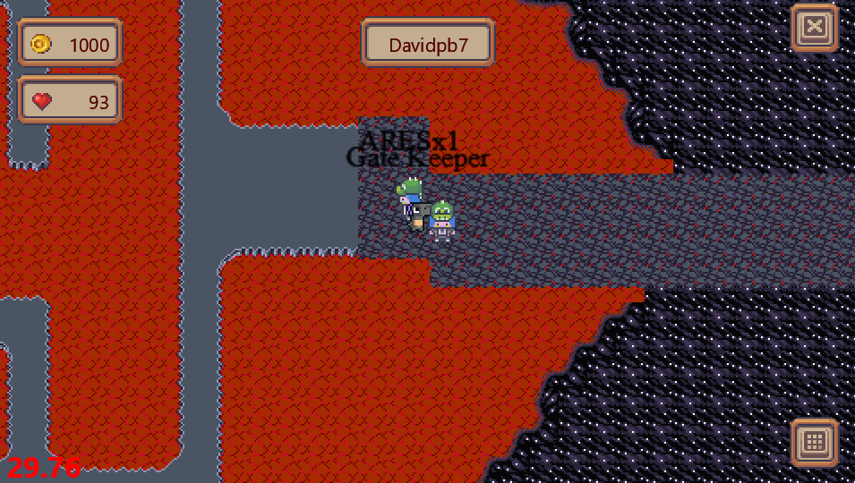
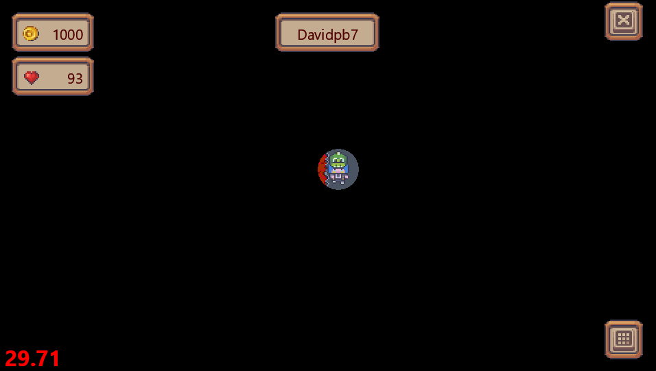
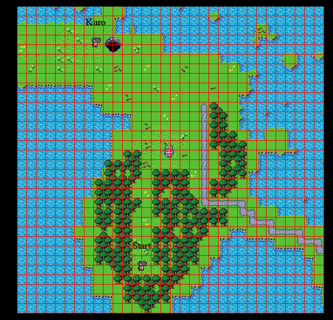
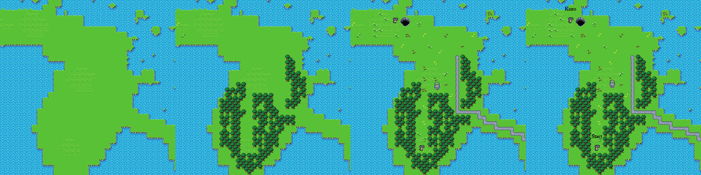
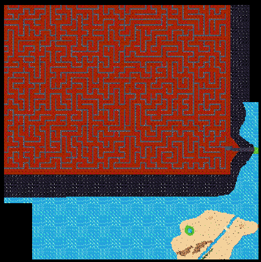
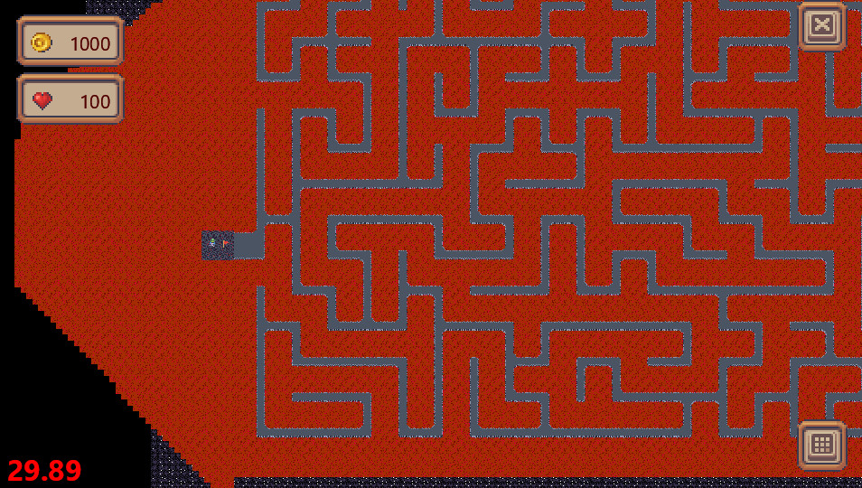
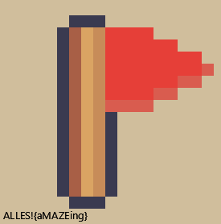

# CCCamp CTF 2023

## Maze

> 
> Lights out! Can you still navigate the randomly generated maze?
>
>  Author: D_K
>
> [`camp_gamedev-public.zip`](../camp_gamedev-public.zip)

Tags: _game_

## Solution

On one side of the green biome there is a cave style area. At the point where the `Gate Keeper` is, is also a entry to a dynamically generated cave labyrinth. This sounds like the right location to find the flag for this challenge.



When entering the maze some camera overlay is displayed and only a very small part of the scene is visible. Navigating the maze with this effect obviously is not working at all.



Since rendering is obviously a client side thing here we can tweak it. The cutout effect is applied in `CenteredCamera`.

src/client/client/game/camera@195
```python
def begin(self) -> None:
    if self.cut_out:
        glClear(GL_DEPTH_BUFFER_BIT)
        glEnable(GL_STENCIL_TEST)
        glColorMask(GL_FALSE, GL_FALSE, GL_FALSE, GL_FALSE)
        glDepthMask(GL_FALSE)
        glStencilFunc(GL_NEVER, 1, 0xFF)
        glStencilOp(GL_REPLACE, GL_KEEP, GL_KEEP)  # draw 1s on test fail (always)

        glStencilMask(0xFF)
        glClear(GL_STENCIL_BUFFER_BIT)  # needs mask=0xFF
        self._circle_cut.draw()

        glColorMask(GL_TRUE, GL_TRUE, GL_TRUE, GL_TRUE)
        glDepthMask(GL_TRUE)
        glStencilMask(0x00)

        glStencilFunc(GL_EQUAL, 1, 0xFF)

    x = -self.window.width // 2 / self._zoom + self.offset_x
    y = self.window.height // 2 / self._zoom + self.offset_y

    # pyglet.gl.glTranslatef(-x * self._zoom, -y * self._zoom, 0)

    # pyglet.gl.glScalef(self._zoom, self._zoom, 1)
    self.window.view = self.window.view.translate(
        pyglet.math.Vec3(-x * self._zoom, y * self._zoom, 0)
    )
    self.window.view = self.window.view.scale(
        pyglet.math.Vec3(self._zoom, self._zoom, 1)
    )
```

The effect is triggered in `_on_interact_handler` in `game.py`.

src/client/client/scenes/game@241
```python
def _on_interact_handler(self, interact: Interact) -> None:
    match interact.type:
    # ....
        case InteractType.INTERACT_TYPE_CUT_OUT:
            match interact.status:
                case InteractStatus.INTERACT_STATUS_START:
                    self.camera.cut_out = True
                case InteractStatus.INTERACT_STATUS_UPDATE:
                    self.camera.cut_out = True
                case InteractStatus.INTERACT_STATUS_STOP:
                    self.camera.cut_out = False
                case InteractStatus.INTERACT_STATUS_UNSPECIFIED:
                    assert False
```

We don't need this part, we just comment it out and the cutout effect is gone. But even then, the labyrinth is way to large to just navigate through it. For better overview we can add functionality to zoom the camera a bit.

src/client/client/scenes/game@485
```python
def on_key_press(self, symbol: int, modifiers: int) -> bool | None:
    # ....
    if symbol == PLUS:
        self.camera.zoom += 0.1
    if symbol == MINUS:
        self.camera.zoom -= 0.1
    # ....
```

src/client/client/game/camera@168
```python
class CenteredCamera(Camera):
    """A simple 2D camera class. 0, 0 will be the centre of the screen, as opposed to the bottom left."""

    def __init__(
        # ....
        min_zoom: float = 0.01,
        # ....
```

Time to speak a bit about rendering. The games world is subdivided into chunks. Every chunk is made of `32x32` tiles (whereas every tile is `16x16` pixels in dimension).

For rendering a number of chunks are streamed from the server. Which chunks is decided by where the player is currently located at. The chunk the player is currently in and the eight neighbouring chunks are drawn. This way the player can transition between chunks with no visible loading artifacts (at least this *should* be the plan). The following image shows the chunk at the current players position and how the chunk is subdivided into tiles.



On top of that, every chunk is made out of multiple layers. Starting with a background layer and on top of this various decoration layers, and on top of this entities and name tags are drawn.



To render visible chunks the client requests the information at the server. The `map` has a `ChunkCache` object which is used to request chunks from the server and does some preparation like precreating `tile uvs`. The class itself is derived from `dict` where chunk x and y-index are the lookup key. If the client tries to look up a chunk but the chunk is not present in the cache, the cache will send a `MapChunkRequest` request to the server. When the server has send the information, the cache computes the tile uvs and creates a `Chunk` object, for each received chunk, containing used `tileset`, `tile uvs` and `collision primitives` amongst other properties.

src/client/client/game/map@304
```python
def __missing__(self, keys: tuple[int, int]) -> None:
    assert isinstance(keys, tuple) and len(keys) == 2

    if (
        keys not in self.request_time
        or self.request_time[keys] + timedelta(seconds=60) < datetime.now()
    ):
        print("Requesting chunk", keys[0], keys[1])
        self.request_time[keys] = datetime.now()
        client.global_connection.get_chunks(x=keys[0], y=keys[1])

    return None
```

src/client/client/game/map@262
```python 
async def _add_chunk(self, chunk_response: MapChunkResponse) -> None:
    cx = chunk_response.chunks[0].x
    cy = chunk_response.chunks[0].y
    print(
        "Adding chunk",
        cx,
        cy,
        len(chunk_response.chunks),
    )
    chunks: List[Chunk] = []
    t0 = time.time()
    for c in chunk_response.chunks:
        tids = copy(TILE_IDS)
        for x in range(len(TILE_IDS)):
            tids[x] = copy(TILE_IDS[x])
            await check_wait()
        x = 0
        y = 0

        for tile in c.tiles:
            await check_wait()
            tids[x][CHUNK_SIZE_Y - 1 - y] = tile
            x += 1
            if x == c.width:
                x = 0
                y += 1

        tex_coords = self._create_tex(tids, c.tileset)

        cchunk = Chunk(
            c.tileset,
            c.width,
            c.height,
            tids,
            tex_coords,
            c.collisions,
        )

        chunks.append(cchunk)
    print("adding chunk took:", time.time() - t0)
    self.__setitem__((cx, cy), chunks)
```

For rendering the visible chunks the rendering code stores vertex data per chunk in a list of `RenderChunk` objects. The class only precreates `IndexedVertexList` data for each layer the chunk contains. This is a list of quads, for each tile in the chunk-layer and for every quads position and uv coords are stored. Interestingly the vertex data is static, at least positions are translation independent and *could* be precreated once. Also uv coords are defaulted to `0,0` and replaced only later. 

The basic idea is, to have one `RenderChunk` per potentially visible chunk. The rendering loop then goes over all visible chunks, requests information from the `ChunkCache`. If the information is found in the cache a `RenderChunk` is assigned and the vertex data for the chunk layers is created. After this the triangle list for the chunk tiles of a single chunk layer is drawn in one go.

Why we are talking about all this? In order to zoom out, we also need to increase the number of chunks being rendered a bit by modifying the `draw` method of the `ClientMap` class.

```
# increase number of render chunks to cope with potentially visible chunks
if self.vlists is None:
    self.vlists = (*(RenderChunk() for _ in range(VIS_CHUNKS * VIS_CHUNKS)),)

# ...

# calculate chunk indice for all visible chunks
chunk_indice = []
for x in range(-VIS_CHUNKS//2, VIS_CHUNKS//2+1):
    for y in range(-VIS_CHUNKS//2, VIS_CHUNKS//2+1):
        chunk_indice.append((x, y))

for x, y in chunk_indice:
    chunks = self.chunk_cache[(chunk_x + x, chunk_y + y)]

    if not chunks:
        continue

    # adapt render chunk index calculation 
    idx = ((chunk_x + x + 1) % VIS_CHUNKS) * VIS_CHUNKS + ((chunk_y + y + 1) % VIS_CHUNKS)
```

The rest of the method stays the same. Much better! Another thing, to get better overview, is, to add free camera movement. 



But this is still not enough, for better overview we need a free camera movement. I hacked this a bit by decoupling the automatic movement with the player and adding a key to snap the camera to the player.

```
if symbol == I:
    self.camera.position = (self.camera.position[0], self.camera.position[1]-200)
if symbol == K:
    self.camera.position = (self.camera.position[0], self.camera.position[1]+200)
if symbol == J:
    self.camera.position = (self.camera.position[0]-200, self.camera.position[1])
if symbol == L:
    self.camera.position = (self.camera.position[0]+200, self.camera.position[1])
if symbol == H:
    self.camera.position = (self.player.x, self.player.y)
```

And also commenting out automatic camera positioning in `Game -> update`:

src/client/client/scenes/game@435
```python
def update(self, dt: float) -> None:
        online_time = datetime.now() - timedelta(minutes=1)
        if client.game_state.last_ping.timestamp() < online_time.timestamp():
            self.logout()

        self.player.update(dt)
        #self.camera.position = (self.player.x, self.player.y)
```

With all this additional overview we can navigate through the maze and fine the flag inside the flag room:





Flag `ALLES!{aMAZEing}`