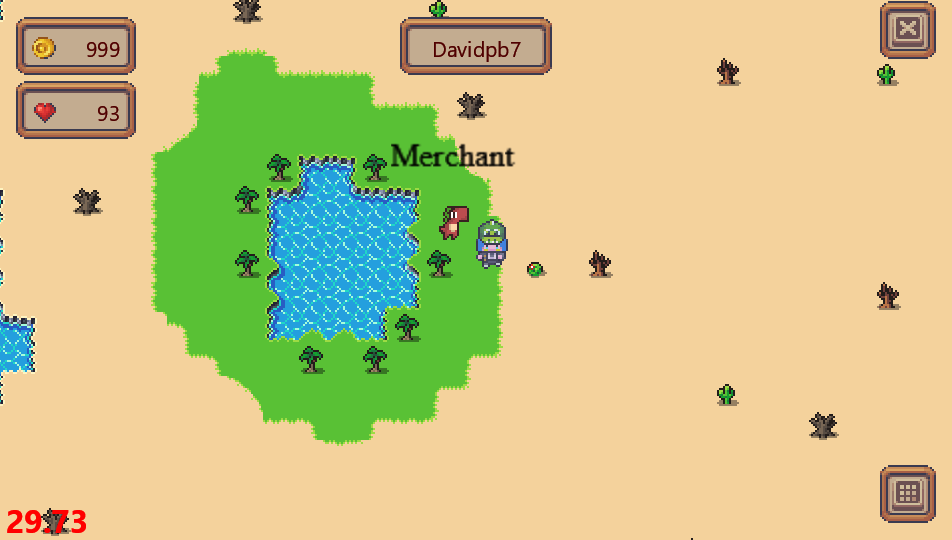
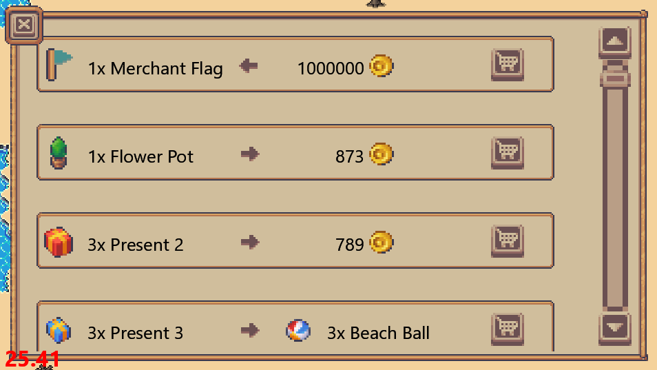
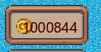
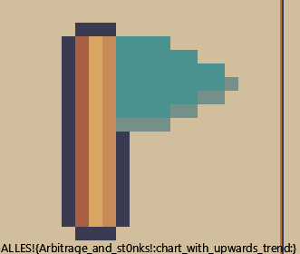

# CCCamp CTF 2023

## Merchant

> 
> Throwback to the Great Exchange north of Varrock in RuneScape. If you got the best trades back then, you will have no issues to make some profit and buy the flag.
>
>  Author: D_K
>
> [`camp_gamedev-public.zip`](../camp_gamedev-public.zip)

Tags: _game_

## Solution
For this challenge we find the `merchant` in the desert standing by the oasis. 



When we interact with the merchant a shop is displayed where we can sell, buy or trade objects.



One item we can buy is the flag. With a initial amount of `1000 coins` the flag obviously is to expensive. But, one can notice that, after opening the shop again a couple of times, that the offerings are randomized. What we could do is, to try to find good offers, buy items cheap, trade smart and sell items expensive to finally reach the `1M` coins to get the flag.

This needs to be done in a (semi) automated way. The client uses `InnerShop -> recreate` to recreate the shop ui with the newest offerings. Here the list of items is iterated. For every item we can try to calculate some value between 0-1 which is the rating for a item. High values mean better rating, lower worse. If we find a item with a rating larger 70% we take the offer.

This method will automatically buy items when the shop is opened, after the item is bought the shop will close. Meaning space needs to be hit *a lot*. This could be easily tweaked, but whatever works. :-)

src/client/client/scenes/shop@367
```python
for i, item in enumerate(items):
    s = ShopItem(
        x=self.x,
        y=self.height + self.y - self.item_height * (i + 1),
        width=self.width,
        height=self.item_height,
        item=item,
        batch=self.batch,
        group=self,
        frame=self.frame,
    )

    if item.type == 1:
        rating = ((item.cost / item.item.quantity)/1000)

        hasEnoughItems = False
        for invItem in client.game_state.my_user.inventory:
            if invItem.name == item.item.name and invItem.quantity >= item.item.quantity: hasEnoughItems = True

        if not hasEnoughItems:
                print("cannot sell item... not enough in inventory")
                rating = 0
        
        ratings.append((rating, s, i, item.type))
    elif item.type == 2:
        if item.cost < 10000:
            ratings.append((1-((item.cost / item.item.quantity)/1000), s, i, item.type))
    elif item.type == 3:
        ratings.append(((item.trade_in.quantity - item.item.quantity)/3, s, i, item.type))


    self.shop_items_ui.append(s)

best_rated_item = max(ratings, key=lambda x: x[0])
if best_rated_item[0] > 0.7:
    if best_rated_item[3] == 1: print("sell")
    if best_rated_item[3] == 2: print("buy")
    if best_rated_item[3] == 3: print("trade")
    best_rated_item[1].buy()
```

And voilà, we have the one million and can buy the flag:





Flag `ALLES!{Arbitrage_and_st0nks!:chart_with_upwards_trend:}`