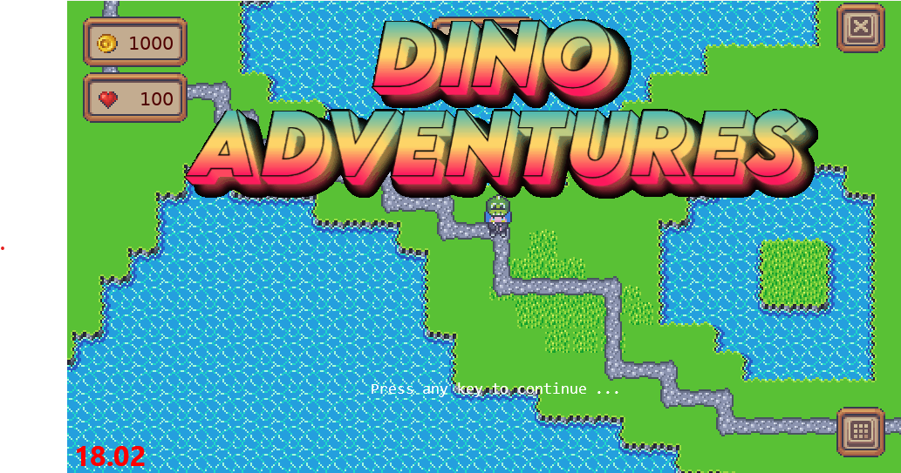
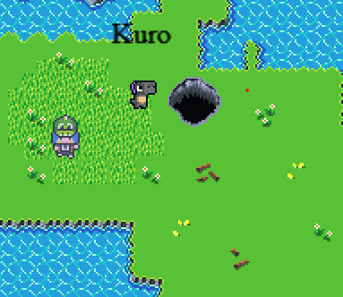
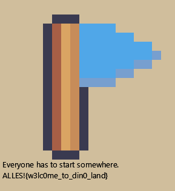

# CCCamp CTF 2023

## Sanity Check

> 
> Talk to Kuro and learn about this wonderful dino land you landed in.
> 
> Before you can do that, you have to get the client (and local server) running. Here are some primers to get started:
> 
> * We use poetry to manage the python venv and all dependencies. Check out the poetry docs how to install poetry
> * You need python >= 3.10, otherwise the game won't start
> * Use poetry install in the root directory to do all the magic.
> * If you use Ubuntu, poetry might being stuck resolving dependencies. Disabling they keyring support might solve this: export PYTHON_KEYRING_BACKEND=keyring.backends.null.Keyring before poetry install
> * If you encounter errors regarding *.gif animations when starting the game, make sure to install gdk-pixbuf and gdk-pixbuf-xlib (or use the nix flake)
>
> After installation, check out the README.md to get the server running. The server allows you to better understand the game, but has some limitations:
>
> * You only get access to a test map in JSON format
> * The flags are redacted (duh)
> * Some modules are missing, like the source code of the native folder
>
> **Note: You can't use ncat to connect to the game server directly. Use the game client instead. The ncat command below is just for copy and paste convenience. Read the README.md for further instructions!**
>
>  Author: 0x45da
>
> [`camp_gamedev-public.zip`](../camp_gamedev-public.zip)

Tags: _game_

## Solution
This is a `sanity check` really. The challenge is to follow the instruction to get the game environment up and running. There where some bumps with the windows version. For me turning on long pathname support helped greatly to let the build system setup all the fancy things used by the game.

Another thing was that 16 bit depth buffers are not supported on all the systems (why does the game need 16 bit depth buffer anyways?). But putting that question aside, when trying to run we get a exception raised:

```
pyglet.gl.ContextException: Unable to share contexts.
```

This is easily fixed

src/client/client/main@105
```python
config = pyglet.gl.Config(
        double_buffer=True,
        # depth_size=16,
        depth_size=8,
        major_version=3,
        minor_version=3,
        stencil_size=8,
    )
```

Afterwards the game starts and we are greetet with an intro screen:



After pressing `any key` the game wants us to log in with the credentials described in the readme. For me it was `Davidpb1` and `password123`. Since typing this is annoying one thing could be to pre fill the username and password so only clicking `Login` is needed. There are `--username` and `--password` arguments that can be used, or just replacing them in code:

src/client/client/main@145
```python
mainmenu = MainMenu(window, "Davidpb1", "password123")
```

Right... so much for the prerequisites. The game connects and runs. We can move with `wasd` or `arrow keys`, we can interact with `npcs` or `objects` by pressing `space`.

 

Talking to `Kuro` gives us the first flag.



Flag `ALLES!{w3lc0me_to_din0_land}`