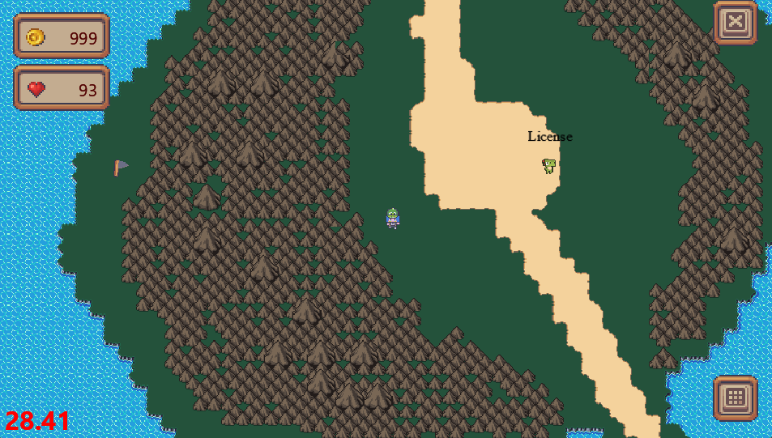
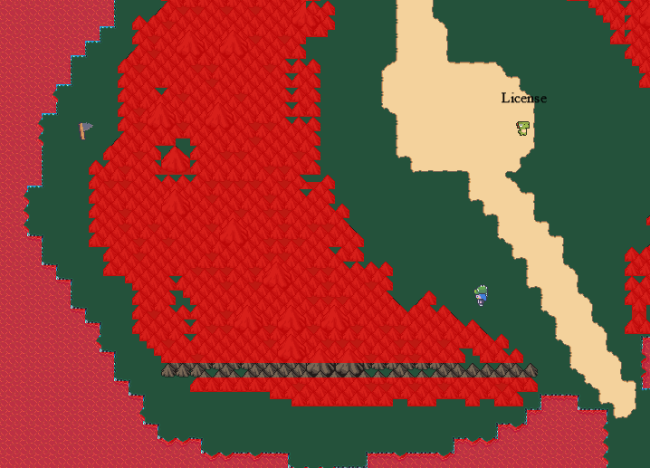
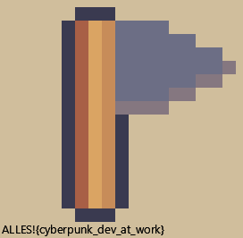

# CCCamp CTF 2023

## Unreachable

> 
> Oopsie woopsie, I somehow managed to loose a flag while working on the map, I will remove when I find it again in a day or two.
>
>  Author: localo
>
> [`camp_gamedev-public.zip`](../camp_gamedev-public.zip)

Tags: _game_

## Solution
The flag for this challenge can be reached at the following location. It's behind the mountains and very obviously not reachable. Also the flag cannot be seen with standard camera settings, since the user will not be able to move close enough due to the mountains. By [`zooming the camera out`](../maze/README.md) a bit the flag position can be spotted.



The character cannot move to the flag though, as collision is hindering the movement. So, time to talk about collision a bit.

The general world data structure and rendering basics where already described [`here`](../maze/README.md). Feel free to catch up before continuing to read here.

Every world `chunk` has a list of collision primitives which can be looked up for each tile. So every tile can use a combination of multiple polygons for collision detection. When a character moves, the `CollisionManager` does check if the character position is colliding with the tile collider the character is located at.

src/shared/shared/collison@46
```python
def _do_edge_detection(
        self,
        map: Map,
        old_x: float,
        old_y: float,
        new_x: float,
        new_y: float,
        offset_x: int,
        offset_y: int,
        user_id: str,
    ) -> Tuple[float, float] | None:
    player = collision.Poly(
        collision.Vector(new_x, old_y),
        [
            collision.Vector(x, y)
            for x, y in [
                (0, 0),
                (0, self.height),
                (self.width, self.height),
                (self.width, 0),
            ]
        ],
    )
    # ....
     match map.get_tiles(new_x + offset_x, old_y + offset_y, user_id):
        case None:
            return
        case tiles, tx, ty:
            pass

    for col in functools.reduce(
        operator.iconcat, [tile.collision for tile in tiles], []
    ):
        poly = collision.Concave_Poly(
            collision.Vector(tx, ty),
            [collision.Vector(p.x, p.y) for p in col.points],
        )
        c = collision.collide(poly, player)
        if c:
            break
    else:
        return (new_x, old_y)
    # ....
```

If a collision was detected, the character is reset to the last know position. 

To visualize this, we can draw the collision geometry as overlay on top of the world. To do this the vertex buffer for collisions is generated in `RenderChunk -> get_layer`:

```python
def get_layer(self, idx: int, chunk: Chunk, dirty: bool, program: ShaderProgram, debug_shader: ShaderProgram) -> IndexedVertexList:
    if len(self.layers) <= idx:
        self.layers.append(get_vlist(program, debug_shader))

    # generate vertex buffer for collision geometry
    debug_collision_buffer = None
    if DEBUG_COLLISION:
        if dirty or len(self.debug_layers) <= idx:
            positions = []
            for x in range(CHUNK_SIZE_X):
                for y in range(CHUNK_SIZE_Y):
                    offsetx = x * TILE_SIZE_X
                    offsety = (y - CHUNK_SIZE_Y + 1) * TILE_SIZE_Y
                    collisions = chunk.collisions[chunk.tiles[x][y]]
                    for collision_prim in collisions.polygons:
                        poly = collision.Concave_Poly(
                            collision.Vector(0, 0),
                            [collision.Vector(p.x, p.y) for p in collision_prim.points],
                        )
                        for tri in poly.tris:
                            for p in tri.points: 
                                positions.append(p[0] + offsetx)
                                positions.append(-p[1] + offsety)
            debug_collision_buffer = debug_shader.vertex_list(
                len(positions),
                GL_TRIANGLES,
                position=("f", positions),
            ) 

        if len(self.debug_layers) <= idx: self.debug_layers.append(debug_collision_buffer)
        else: self.debug_layers[idx] = debug_collision_buffer

    return (self.layers[idx], debug_collision_buffer)
```

And after drawing the world tiles we can draw the collision geometry on top:

```python
vlist.draw(GL_TRIANGLES)

# draw collision geometry
if DEBUG_COLLISION:
    self.debug_shader.use()
    self.debug_shader["translation"] = (
        (chunk_x + x) * (CHUNK_SIZE_X * TILE_SIZE_X),
        (chunk_y + y) * (CHUNK_SIZE_Y * TILE_SIZE_Y),
    )
    chunk_collider_buffer.draw(GL_TRIANGLES)
    self.debug_shader.stop()
    self.program.use()
```

We immediately can see, that there is a way through the mountains where no collision happens. The passageway is not large enough to just walk thorugh, but by holding left + down the character moves with slight zigzag motion downwards and left so that we can `glitch` through the passageway.



After some trial end error we reach the flag.



Flag `ALLES!{cyberpunk_dev_at_work}`