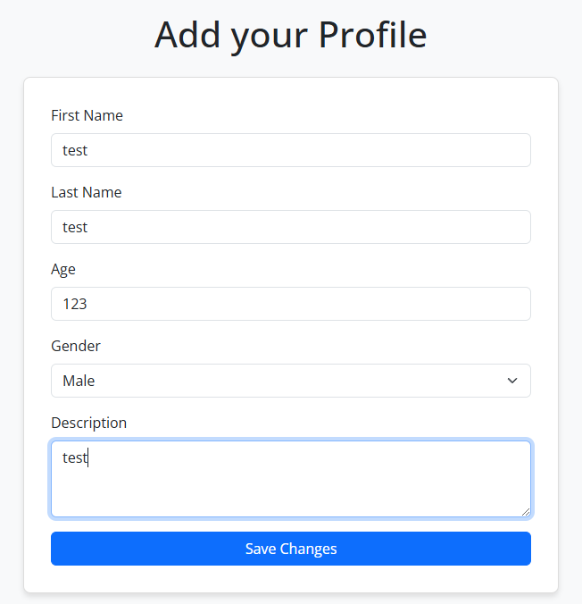
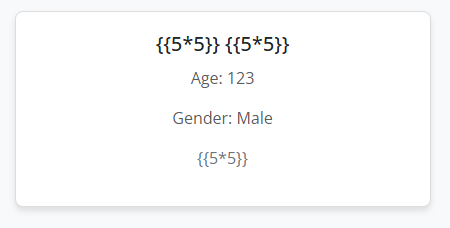

# Codefest CTF 2025

## Love Profiles

> 
> Made my own dating app as I had no matches on existing ones. Only genuine profiles allowed!
> 
> PS: Its under development so you have to wait before you can match and talk!
>
>  Author: 0xkn1gh7
>

Tags: _web_

## Solution
For this challenge, there is no source code given. So we have to search for vulnerabilities ourselfe. The webservice is fairly simple, it provides just a bunch of tiles with some information in them. We cannot access any user profiles or anything, but we can create new profiles:



This will forward us to a `success page`, telling us personally that our profile was created and providing a link to the profiles.

```bash
Congratulations test! Your profile has been successfully added!
View profiles here
```

So, the input we can control is via the `new profile` option, so we can see if things are vulnerable for server side template injection.



Everything looks fine... But, wait. There was this weird `success page` in between. And going back confirms, they greet us with `Congratulations 25! Your profile has been successfully added!`, so we have a `SSTI` vulnerability here. Better even, we just can control the content with a parameter `name`.

One working payload here was `{{ request.application.__globals__.__builtins__.__import__('os').popen('whoami').read() }}` that allows us to execute commands. With this the flag file can be located quickly in `root` folder and we get the flag.

```
http://codefest-ctf.iitbhu.tech:61477/success?name={{ request.application.__globals__.__builtins__.__import__('os').popen('cat /flag.txt').read() }}
```

Flag `CodefestCTF{1_w4n7_l0v3_SjP6f2ANL}`