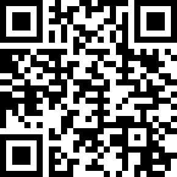

# CSAW'23

## 1black0white

> 
> We received this file of seemingly random numbers, but the person that sent it is adamant that it is a QR code. Can you figure it out for us?
>
>  Author: robert-todora
>
> [`qr_code.txt`](qr_code.txt)

Tags: __forensics__

## Solution
For this challenge we get a list of numbers and the hint that the numbers for a `QR code` in any way. The title hints `1 = black, 0 = white`, so one thing we can try is to convert the numbers to the binary representation and check if the result could be something `QR code` like.

```python
lines = open("qr_code.txt").readlines()

for l in lines:
    print(bin(int(l))[2:].rjust(29, "0"))
```

If we look at the result, we can see the [`position markers`](https://en.wikipedia.org/wiki/QR_code), so we are on the right track. We need to bring this into a form that we can scan with a QR code reader.

```bash
11111110010001101111101111111
10000010110110111010001000001
10111010011100100010101011101
10111010110100000110101011101
10111010001011001001101011101
10000010101001110010101000001
11111110101010101010101111111
00000000000011000001100000000
11111011111010111101110101010
...
```

Lets modify the script a bit to draw the QR code for us.

```python
from PIL import Image

lines = open("qr_code.txt").readlines()

width = 29
height = len(lines)

image = Image.new("RGB", (width, height), "white")
pixels = image.load()

for y, l in enumerate(lines):
    bits = bin(int(l))[2:].rjust(29, "0")
    for x, pixel in enumerate(bits):
        if pixel == "1": pixels[x,y] = (0,0,0)

image = image.resize((width*10, height*10), Image.NEAREST)
image.save("qr_code.png")
```

After running the script we end up with a QR code we put into any QR code reader to get the flag.



Flag `csawctf{1_d1dnt_kn0w_th1s_w0uld_w0rk}`