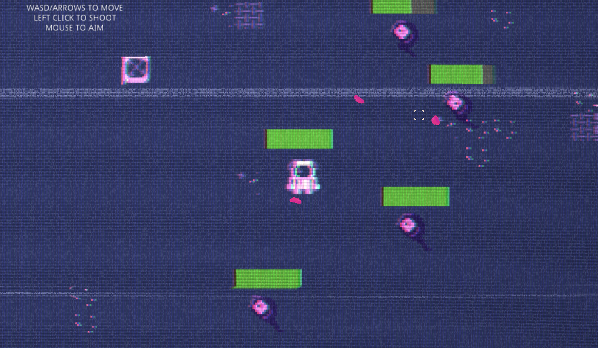
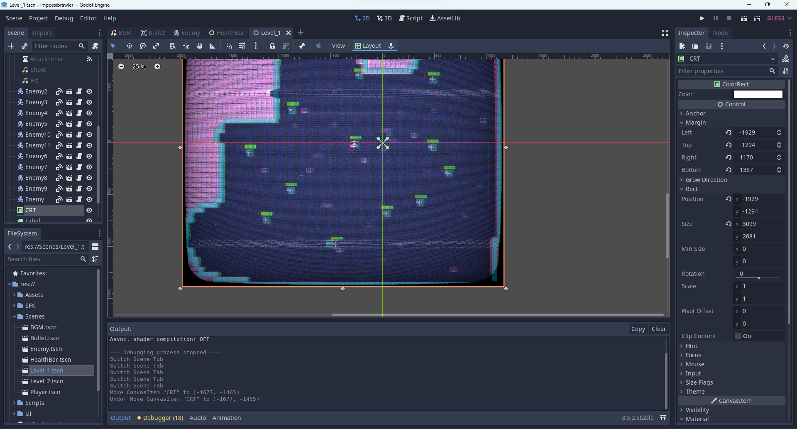
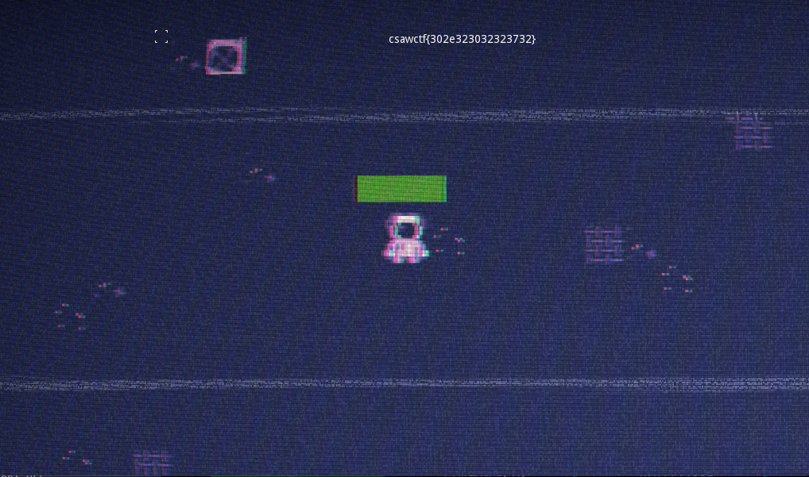

# CSAW'23

## Impossibrawler!

> 
> How do I beat these guys?!
>
>  Author: barrwani
>
> [`Impossibrawler.exe`](Impossibrawler.exe), [`Impossibrawler.pck`](Impossibrawler.pck)

Tags: _rev_

## Solution
This challenge is a game hacking challenge. It's a `beat 'em up` where the player has to defeat some enemies. The only thing is, the enemies are totally overpowered and take no damage at all.

To get an idea how the game works I opened the resource package file with an editor and scrolled through the content. There where some strings and some shadercode and in the shadercode there where comments mentioning [`Godot`](https://godotengine.org/). 




Nice, now we know what engine was used to create the game, we can search for tools that allow us to extract the resources for further inspection. One very useful tool package I found was the [`Godot RE Tools`](https://github.com/bruvzg/gdsdecomp). 

With the `Godot RE Tools` projects can be recovered from `pck` file. Just open the tool, choose `RE Tools -> Recover project` and open `Impossibrawler.pck`. Now we get the whole list of assets displayed and can export all the assets to a folder.

After export the `Godot RE Tools` give a hint what engine version should be used for editing. For this package `Use Godot editor version 3.5 to edit the project.`. So next up I downloaded `Godot 3.5.2 LTS`, and opened the project.



With this we can iterate on the game, run it, change everything. One interesting thing could be to check out the game scripts. Godot uses a scripting language called [`GDScript`](https://docs.godotengine.org/en/stable/tutorials/scripting/gdscript/gdscript_basics.html) and there is quite a bit of source code the be inspected.

In `Bullet.gd` we can find the code that is invoked when bullets collide with objects. We can see that enemy bullets give `50` damagepoints to the player. We change this to `0` so our player is basically in godmode. 
```js
func _on_Area2D_body_entered(body):
    if body.is_in_group("player"):
        if target == "player":
            body.damage(50)
            queue_free()
    elif body.is_in_group("enemy"):
        if target == "enemy":
            body.damage(Vals.playerdmg)
            queue_free()
    elif body.is_in_group("tilemap"):
        queue_free()
```

The next interesting part is in `Level_2.gd`. There are two levels in total, and after level 2 was finished the game displays the flag.

```js
func _process(delta):
    var mousepos = get_global_mouse_position()
    get_node("Crosshair").position = mousepos

    if enemies_left == 0:
        rng.seed = int(Vals.sd)
        var fbytes = rng.randf()
        Vals.sd = fbytes
        fbytes = str(fbytes)
        var flg = fbytes.to_ascii().hex_encode()
        $CanvasLayer / Label.set_text("csawctf{" + flg + "}")
```

Sadly the flag is based on a random value. But since we are looking for a fixed flag (that can be verified) we can assume that the `RNG` produces deterministic results. Here, the seed is set right before generating a random value, to the value of `Vals.sd`. So where comes this from?

In `Vals.gd` we find some global stat values. Amongst them `Vals.sd`. It's initialized with zero.

```js
var hits = 0
var playerdmg = 20
var sd = 0
```

Now we lookup all code parts where the value is modified.And we find that the value is set after the player finished the first level. Here it is set to a random value as well and also here the seed is set, right before generating a random value, to `Vals.hits ^ enemies_left ^ Vals.playerdmg`.

```js
if enemies_left == 0:
        rng.seed = Vals.hits ^ enemies_left ^ Vals.playerdmg
        var fbytes = rng.randf()
        Vals.sd = fbytes
        get_tree().change_scene("res://Scenes/Level_2.tscn")
```

This looks somewhat random, but is not as bad as it seems. We know that `enemies_left` is always `0` (as this is the branch condition) and can be ignored. `Vals.playerdmg` is never changed and is always `20`. Only the `Vals.hits` global variable changes.

We can see this in `Enemy.gd`. Every thime the enemy health is set the hit value is increased by one. The function is called by `damage` and `damage` is called when a bullet collision was detected, as we saw ealier.

```js
func _set_health(value):
    if not dead:
        dmg = true
        Vals.hits += 1
        $dmgtimer.start()
        var prev_health = health
        health = clamp(99, 0, max_health)
        if health != prev_health:
            emit_signal("health_updated", health)
            if health == 0:
                health = 100

func damage(amount):
    $Hit.play()
    _set_health(health - amount)
```

Here we also can see why the enemies cannot be defeatet. The damage is just not applied and *if* the health would go down to zero at any point, the health would be reset to 100 again. Assuming we stick to the default damage of `20` the player will do, we just implement this function as it would be intended. This would increase `Vals.hits` always to the same amount and therefore would result in the correct seed for the flag generation.

```js
func _set_health(value):
	if not dead:
		dmg = true
		Vals.hits += 1
		$dmgtimer.start()
		var prev_health = health
		health = clamp(value, 0, max_health) # set health to calculated value
		if health != prev_health:
			emit_signal("health_updated", health)
			if health == 0:
				death() # if health is 0 then the enemy dies
```

But enough theory, lets defeat this game. And indeed, after playing through both of the levels, the flag is printed to screen.



Flag `csawctf{302e323032323732}`