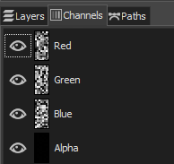
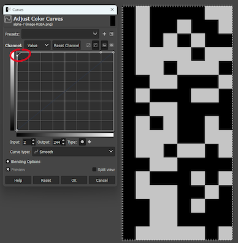

# CTF@CIT 2025

## Blank Image

> I was gonna make a really cool challenge but then I literally forgot about it so all I have is this blank image. Good luck!
>
>  Author: ronnie
>
> [`image.png`](image.png)

Tags: _stego_

## Solution
The challenge comes with a small, apparently blank image. If we look at the image in an image editor, we can see the image isn't actually blank but contains color information.



The image appears to be blank, because the alpha channel is all *zero*, or it actually it contains values close to zero. We can make this visible by splitting the components in separate layers and cranking up the color curve very much to the top left.



This looks suspicious enough to investigate. So next up is to extract the values and stitch them together to (hopefully) the hidden message. As we want to avoid doing this by hand, lets command the computer do do it instread.

```py
from PIL import Image

def load_image(path):
    img = Image.open(path)
    width, height = img.size
    return (img.getdata(), width, height)

def pack_bits(channels, bit):
    result = 0
    for channel in channels:
        result = (result << 1) | ((channel >> bit) & 1)
    return (result, len(channels))

def extract_data(pixels, width, height, bit):
    result = bytearray()
    current_byte = 0
    bit_count = 0

    # iterate in x direction, then y direction
    # look only at 'a' channels least significant bit
    # same as "zsteg b1,a,lsb,xy"
    for y in range(height):
        for x in range(width):
            r, g, b, a = pixels[y * width + x]
            bits, shift = pack_bits((a,), bit)

            current_byte = (current_byte << shift) | bits
            bit_count += shift

            while bit_count >= 8:
                byte = (current_byte >> (bit_count - 8)) & 0xff

                # if last byte is 0 we assume no more encoded bits
                if byte == 0:
                    return bytes(result)

                result.append(byte)
                bit_count -= 8

            current_byte &= (1 << bit_count) - 1

    return result

pixels, width, height = load_image("image.png")
print(extract_data(pixels, width, height, bit=0))
```

Running this, gives us the flag.

Flag `CIT{n1F0Rsm0Er40}`