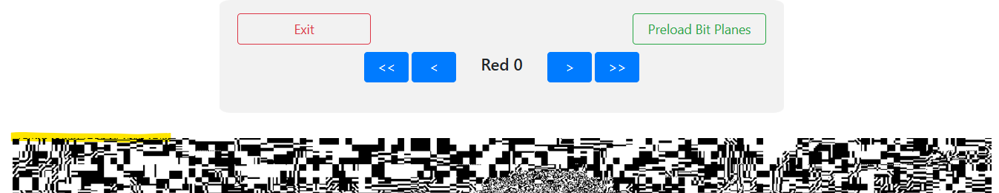

# CTF@CIT 2025

## Dog Picture

> Forget about the flag, look at how cute that dog is!
>
>  Author: ronnie
>
> [`dogpicture.png`](dogpicture.png)

Tags: _stego_

## Solution
As in [`I AM Steve`](../i_am_steve/README.md), we first use this online [`tool`](https://georgeom.net/StegOnline), to inspect the bit planes. Uploading the image to the tool and clicking `Browse  Bit Planes` shows again, there is a hidden message encoded in R, G and B channel LSB. 



It's not that obvious this time, since the LSB bit planes contain some data, but we find a bit of noise on the top left corner that suggests the message is written there. We go back to our trusted script from [`Queens Gambit`](../queens_gambit/README.md) et al...

The only problem, extracting bits from RGB planes doesn't give good results. But of course there is nothing that prevents reordering the planes, so we need to check all the permutations. Thankfully we only have a handfull, so lets just bruteforce through all of them.

Actually, we have to adapt the script slightly, as the challenge sneakily starts with two zero bytes the old version would assume the end of the encoded message. The adapted version will check for any number of trailing zero bytes before breaking the decoding.

```py
from PIL import Image

def load_image(path):
    img = Image.open(path)
    width, height = img.size
    return (img.getdata(), width, height)

def pack_bits(channels, bit):
    result = 0
    for channel in channels:
        result = (result << 1) | ((channel >> bit) & 1)
    return (result, len(channels))

def extract_data(pixels, width, height, channel_order, bit = 0, min_trailing_zero_bytes = 2):
    result = bytearray()
    current_byte = 0
    bit_count = 0

    for y in range(height):
        for x in range(width):
            channels = [pixels[y * width + x][channel] for channel in channel_order]
            bits, shift = pack_bits(channels, bit)

            current_byte = (current_byte << shift) | bits
            bit_count += shift

            while bit_count >= 8:
                byte = (current_byte >> (bit_count - 8)) & 0xff

                # if last bytes are 0 we assume no more encoded bits
                if byte == 0:
                    if len(result) >= min_trailing_zero_bytes and all(result[-i-1] == 0 for i in range(min_trailing_zero_bytes)):
                        return bytes(result)

                result.append(byte)
                bit_count -= 8

            current_byte &= (1 << bit_count) - 1

    return result

pixels, width, height = load_image("dogpicture.png")
channel_orders = [(0, 1, 2), (0, 2, 1), (1, 0, 2), (1, 2, 0), (2, 0, 1), (2, 1, 0)]
for channel_order in channel_orders:
    print(extract_data(pixels, width, height, channel_order, bit=0))
```

Running this script gives us a bunch of nonsense, but amongst them also some message with the flag (`(look how cute this dog is :) anyway here's the flag CIT{bL30KMnEbj21}`, same as `zsteg 1b,gbr,xy`).

```bash
$ python revelio.py
b'\x00\x00\x01\x8477\xb5\xbc\x90\xa4?\x9f\x809\x9e\xb82\x90\xb854\xa9\x91\x12\xb5\xba\x90\xa4\xf8\x90\x8d\x14\x90\xa0\xbf<\xb9\xb1\xbc\x805\x16\xa92\x97\xa9\x91\x1a\xa42\x90\xb17\x14\xb1\x91\x05$\xe3=\xa1&\x1d\x88-\xa6\xb5#\x91\xa5X\x1c\xbe\xed\xb6$\x92I\xff\xff\xff\x00\x00'
b'\x00\x00\x02\x887/\xd9\xbaH\xc8?_\x809]\xd44H\xd43,\xc5\xa1\t\xd9\xbcH\xc9xH\x8c\xa2H\xc1?<\xd5\xb1|\x803\r\xc4\xb4O\xc5\xa1\x19\xc84H\xd0\xb7\x0c\xd1\xa1\x06IU>\xc0\x96\x1e\x84\x1be\xd8\x95J\xc8\xe8\x1c\xdf[mI$\x92\xff\xff\xff\x00\x00'
b"\x00\x00\x01DZ\xb7n\xdd d_\xaf@U\xaexS xX\xb2r\x90\xa4n\xd7 d\xf5 V\x19 `\xde\xbaz\xd1\xba@X\xa6rS'r\x90\xacdS jZ\xa2j\x90\x83$\xe2\xbbbJ+PM\x96nC\xa1f4*}\xed\xb6$\x92I\xff\xff\xff\x00\x00"
b"\x00\x00\x02(look how cute this dog is :) anyway here's the flag CIT{bL30KMnEbj21}\xdbmI$\x92\xff\xff\xff\x00\x00"
b'\x00\x00\x04PZ\x9f\xda\xd6H\xd0^\xef@T\xeb\xccXH\xccR\x9a\xc6\xc0\x89\xda\xdcH\xd2tHT\xc2H\xc2^\xba\xce\xd0\xfa@R\x8b\xc4\xd8O\xc6\xc0\xa9\xd0XH\xc8\xda\x8a\xca\xc0\x86\x928\xbe\xc0\x9a.D\x16\xd3\xd8\x98\xcc\xd0\xe4*\xdf6\xdb\x92I$\xff\xff\xff\x00\x00'
b'\x00\x00\x040l_\xb7f\x90\xb0n\xf7 b\xf3\xach\x90\xacdY\xab@R\xb7j\x90\xb2r\x909D\x90\xa2ny\xaf`\xf9 dS\xa9h\x97\xab@r\xb0h\x90\xa5lQ\xa7@E\x928}\xa1,5(&\xcb\xb5(\xd4\xb1R1\xbe\xb6\xdb\x92I$\xff\xff\xff\x00\x00'
```

Flag `CIT{bL30KMnEbj21}`