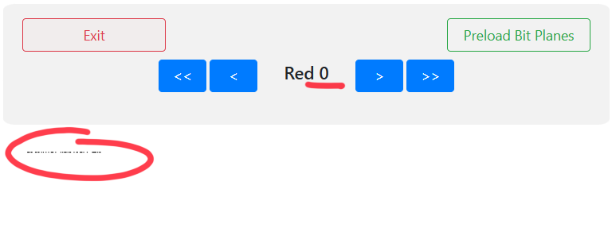

# CTF@CIT 2025

## I AM Steve

> You were supposed to be a hero, Brian!
>
>  Author: kristine
>
> [`ChickenJockey.png`](ChickenJockey.png)

Tags: _stego_

## Solution
To unveil the hidden message of this challenge, lets first inspect the bit planes. There is a wonderfull [`tool`](https://georgeom.net/StegOnline) that helps with all this (if we are too lazy to write a script for it). Uploading the image to the tool and clicking `Browse  Bit Planes`.



We clearly can see there is something encoded in the top left corner in bit 0 (LSB) of the R, G and B channel. Next up, extract the data (actually, the online tool has quite some good support for extracting data too, but we are not that lazy).

```py
from PIL import Image

def load_image(path):
    img = Image.open(path)
    width, height = img.size
    return (img.getdata(), width, height)

def pack_bits(channels, bit):
    result = 0
    for channel in channels:
        result = (result << 1) | ((channel >> bit) & 1)
    return result

def extract_data(pixels, width, height, bit):
    result = bytearray()
    current_byte = 0
    bit_count = 0

    # iterate in x direction, then y direction
    # look 'r, g, b' channels least significant bit
    # same as "zsteg b1,rgb,lsb,xy"
    for y in range(height):
        for x in range(width):
            r, g, b, _ = pixels[y * width + x]
            bits, shift = pack_bits((r, g, b), bit)

            current_byte = (current_byte << shift) | bits
            bit_count += shift

            while bit_count >= 8:
                byte = (current_byte >> (bit_count - 8)) & 0xff

                # if last byte is 0 we assume no more encoded bits
                if byte == 0:
                    return bytes(result)

                result.append(byte)
                bit_count -= 8

            current_byte &= (1 << bit_count) - 1

    return result

pixels, width, height = load_image("ChickenJockey.png")
print(to_bytes(extract_data(pixels, width, height, bit=0)))
```

Running this gives us a string `VEhJU19pc19hX2NyYWZ0aW5nX3RhYmxl` that suspiciously looks like being `Base64` encoded. Decoding gives us the flag.

```bash
$ echo "VEhJU19pc19hX2NyYWZ0aW5nX3RhYmxl" | base64 -d
THIS_is_a_crafting_table
```

Flag `CIT{THIS_is_a_crafting_table}`