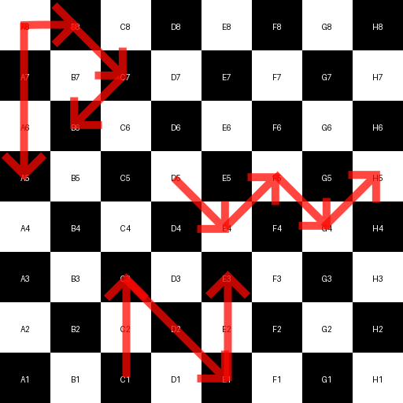

# CTF@CIT 2025

## Queen's Gambit

> Like the actual Queen, not the band
>
>  Author: kristine
>
> [`Queen.png`](Queen.png)

Tags: _stego_

## Solution
As in [`I AM Steve`](../i_am_steve/README.md), we first use this online [`tool`](https://georgeom.net/StegOnline), to inspect the bit planes. Uploading the image to the tool and clicking `Browse  Bit Planes` shows again, there is a hidden message encoded in R, G and B channel LSB. 

```py
from PIL import Image

def load_image(path):
    img = Image.open(path)
    width, height = img.size
    return (img.getdata(), width, height)

def pack_bits(channels, bit):
    result = 0
    for channel in channels:
        result = (result << 1) | ((channel >> bit) & 1)
    return (result, len(channels))

def extract_data(pixels, width, height, bit):
    result = bytearray()
    current_byte = 0
    bit_count = 0

    # iterate in x direction, then y direction
    # look 'r, g, b' channels least significant bit
    # same as "zsteg b1,rgb,lsb,xy"
    for y in range(height):
        for x in range(width):
            r, g, b, _ = pixels[y * width + x]
            bits, shift = pack_bits((r, g, b), bit)

            current_byte = (current_byte << shift) | bits
            bit_count += shift

            while bit_count >= 8:
                byte = (current_byte >> (bit_count - 8)) & 0xff

                # if last byte is 0 we assume no more encoded bits
                if byte == 0:
                    return bytes(result)

                result.append(byte)
                bit_count -= 8

            current_byte &= (1 << bit_count) - 1

    return result

pixels, width, height = load_image("Queen.png")
print(extract_data(pixels, width, height, bit=0))
```

Running this gives us a sequence of what appears to be checkerboard fields.

```bash
a8 a7 a6 a5 b8 c7 b6 d5 e4 f5 g4 h5 c1 c2 c3 d2 e1 e2 e3 
```

So, what if this are movements of a queen? Let's draw this onto a board.



With some creativity we can read here `P`, `W` and `N`, after wrapping this into the flag format we have the flag.

Flag `CIT{PWN}`