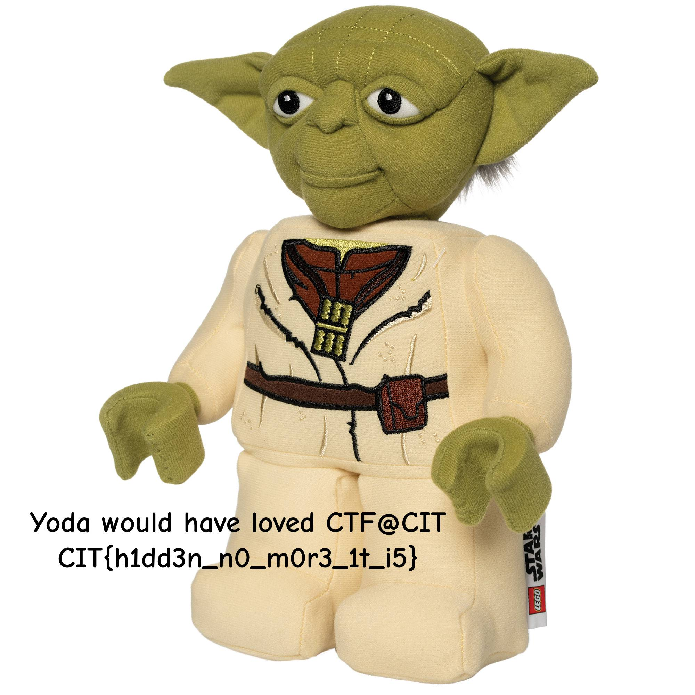

# CTF@CIT 2025

## sw0906

> Deceive you, the bytes do. Look deeper, you must.
>
>  Author: boom
>
> [`yoda`](yoda)

Tags: _stego_

## Solution
This challenge comes with a file that is not recognizes as a known file format.

```bash
$ file yoda
yoda: data
```

So let's have a closer look with an hex editor.

```bash
00000000  E0 FF D8 FF  46 4A 10 00   01 00 46 49  48 00 01 01                                           ....FJ....FIH...
00000010  00 00 48 00  43 00 DB FF   07 07 0A 00  0A 06 07 08                                           ..H.C...........
00000020  0B 08 08 08  0E 0B 0A 0A   0D 0E 10 18  15 1D 0E 0D                                           ................
00000030  23 18 11 16  22 24 25 1F   26 21 22 1F  26 2F 37 2B                                           #..."$%.&!".&/7+
00000040  21 29 34 29  31 41 30 22   3E 3B 39 34  2E 25 3E 3E                                           !)4)1A0">;94.%>>
```

This looks kinda messy, but we can see a few bytes which ring a bell. Especially `E0 FF D8 FF` look closely related to [`JPEG markers`](https://en.wikipedia.org/wiki/JPEG_File_Interchange_Format#File_format_structure). 

Normally JPEG files start with an `SOI` marker (`FFD8`) followed by an `App0` header, which in turn is marked with `FFE0`. This closely resembles what we have in this file, except the four bytes are just reversed. With the hint from the filename `yoda` we take the bold assumption that the file is just stored in a way that all `dwords` (4 bytes) are swapped. Lets undo this and see if we end with something useful.

```py
import struct

data = open("yoda", "rb").read()

with open("adoy", "wb") as file:
    bytes_read = 0

    # read in dword blocks and swap bytes
    for i in range(0, len(data)-4, 4):
        value = struct.unpack_from(">I", data, i)[0]
        file.write(struct.pack("<I", value))
        bytes_read += 4

    # write remaining bytes as is
    file.write(bytes(struct.unpack_from(f">{len(data)-bytes_read}B", data, bytes_read)))
```

This finally gives us a valid jpeg image with it the flag.



Flag `CIT{h1dd3n_n0_m0r3_1t_i5}`