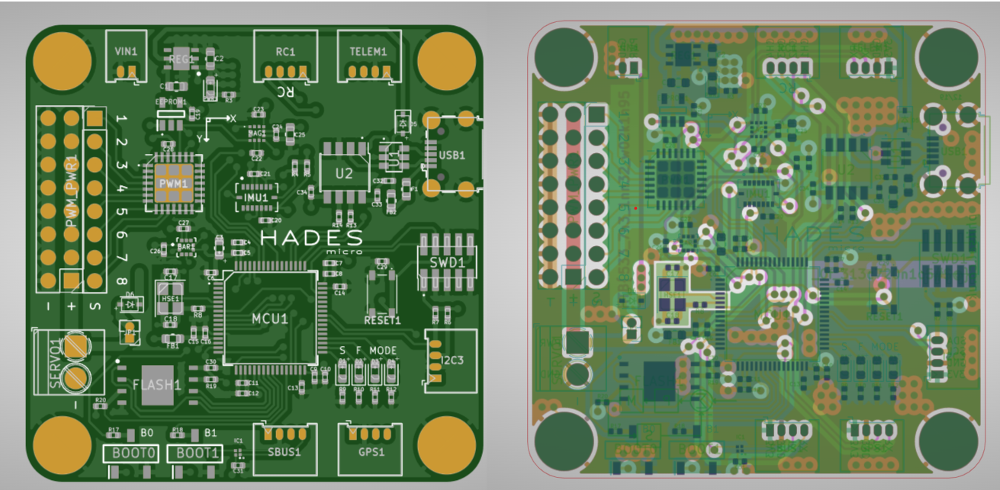

# Cyber Apocalypse 2023

## Critical Flight

> Your team has assigned you to a mission to investigate the production files of Printed Circuit Boards for irregularities. This is in response to the deployment of nonfunctional DIY drones that keep falling out of the sky. The team had used a slightly modified version of an open-source flight controller in order to save time, but it appears that someone had sabotaged the design before production. Can you help identify any suspicious alterations made to the boards?
>
>  Author: N/A
>
> [`hw_critical_flight.zip`](hw_critical_flight.zip)

Tags: _hardware_

## Solution
For this challenge a packet with Gerber files was present. To inspect the packet one can use [`OnlineGerberViewer`](https://www.pcbway.com/project/OnlineGerberViewer.html).

We are presented with a board. When switching to the layers view different layers can be enabled or disabled:

If we disable all layers except `copper` (bottom and inner) we can clearly see both parts of the flag.

 

Stitching both parts together gives us the flag `HTB{533_7h3_1nn32_w02k1n95_0f_313c720n1c5#$@}`.