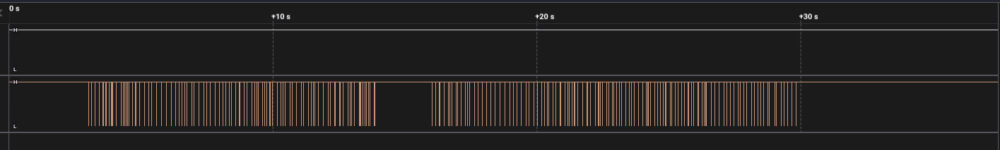
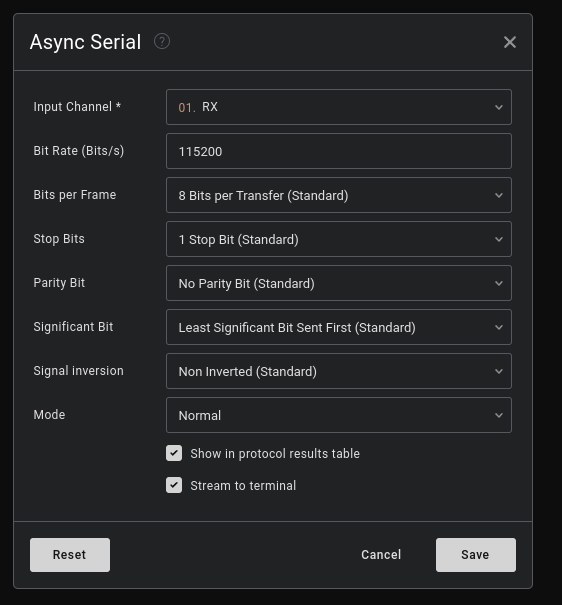
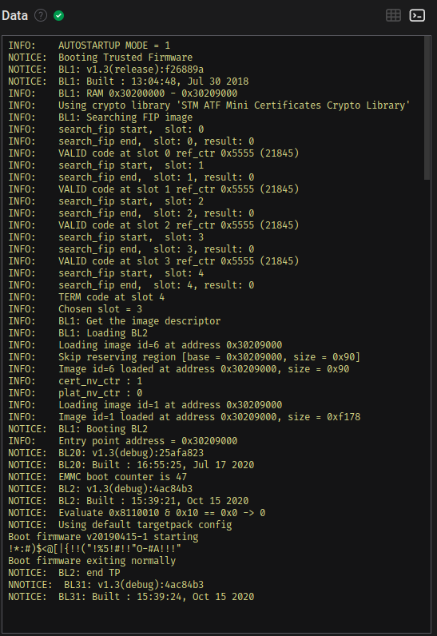
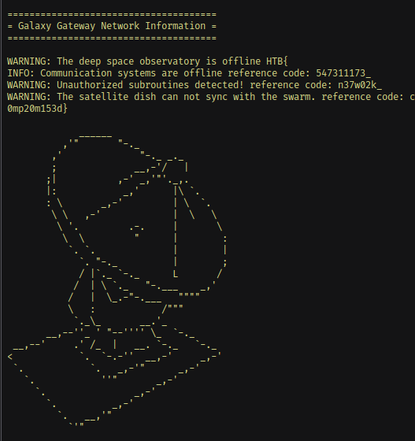

# Cyber Apocalypse 2023

## Debug

> Your team has recovered a satellite dish that was used for transmitting the location of the relic, but it seems to be malfunctioning. There seems to be some interference affecting its connection to the satellite system, but there are no indications of what it could be. Perhaps the debugging interface could provide some insight, but they are unable to decode the serial signal captured during the device's booting sequence. Can you help to decode the signal and find the source of the interference?
>
>  Author: N/A
>
> [`hw_debug.zip`](hw_debug.zip)

Tags: _hardware_

## Solution
In this solution we are presented with a SALEAE file. We can open the file in Logic 2 and inspect whats going on. There is only one signal without much information. 

So a bit more analysis is needed. Adding a async serial analyzer with 115200 bit rate (rest kept to standard) for the channel leads immediately some readable log of a boot sequence of some sort.

Scrolling a bit further down we can see the flag distributed in the log.

Stitching it all together leads to the flag `HTB{547311173_n37w02k_c0mp20m153d}`.