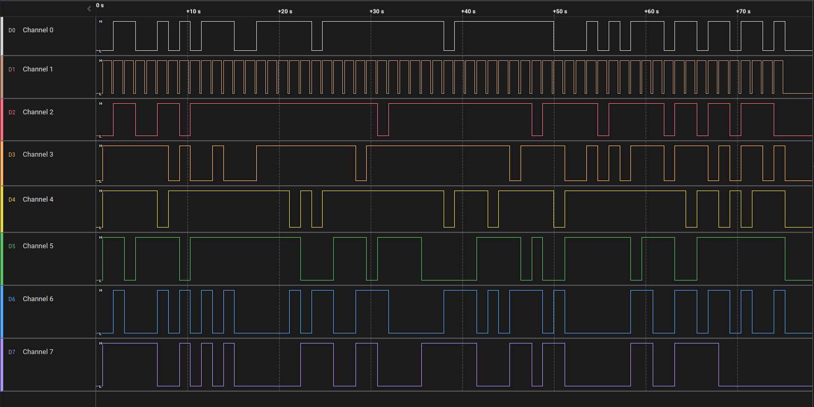

# Cyber Apocalypse 2023

## Secret Code

> To gain access to the tomb containing the relic, you must find a way to open the door. While scanning the surrounding area for any unusual signals, you come across a device that appears to be a fusion of various alien technologies. However, the device is broken into two pieces and you are unable to see the secret code displayed on it. The device is transmitting a new character every second and you must decipher the transmitted signals in order to retrieve the code and gain entry to the tomb.
>
>  Author: N/A
>
> [`hw_secret_code.zip`](hw_secret_code.zip)
> [`hw_secret_codes.sal`](hw_secret_codes.sal)

Tags: _hardware_

## Solution
In this solution we are presented with a SALEAE file and a Gerber file package. We can open the SALEAE file in Logic 2 and inspect whats going on.



We have 8 channels but no futher information. So we go to look at the Geber files. The board looks a bit odd but in the middle of the eye seems to be a 7-segment display.


In the layers view, disabling some layers and zooming a bit so we can better view at the wireing.


It looks like the channels in the SALEAE capture are matching the connectors on the board. This could mean that we can read the states of the 7-segment display from the capture. So first off we need to see what channel is associated with what segment. This can be done by tracing the lines from connector to the chip. The connectors on the chips are assigned to one segment and the dot.

To read the states from the channel signals we need to know how long one intervall is. Since there is no real clock we can assume that channel 1 is giving us the length of the state. Channel 1 is also attached to the `dot` and is basically always on.

For the remaining channels its a matter of reading top to bottom the bit pattern for all 8 channels.

```
0x48 01001000
0x54 01010100
0x42 01000010
0x7b 01111011
0x70 01110000
0x30 00110000
0x77 01110111
0x33 00110011
0x32 00110010
0x5f 01011111
0x63 01100011
0x30 00110000
0x6d 01101101
0x33 00110011
0x35 00110101
0x5f 01011111
0x66 01100110
0x32 00110010
0x30 00110000
0x6d 01101101
0x5f 01011111
0x77 01110111
0x31 00110001
0x37 00110111
0x68 01101000
0x31 00110001
0x6e 01101110
0x40 01000000
0x21 00100001
0x23 00100011
0x7d 01111101
```

Converting the hex string to an byte array leads the flag.
```
>>> bytearray.fromhex("4854427b70307733325f63306d33355f6632306d5f77313768316e4021237d")
bytearray(b'HTB{p0w32_c0m35_f20m_w17h1n@!#}')
```