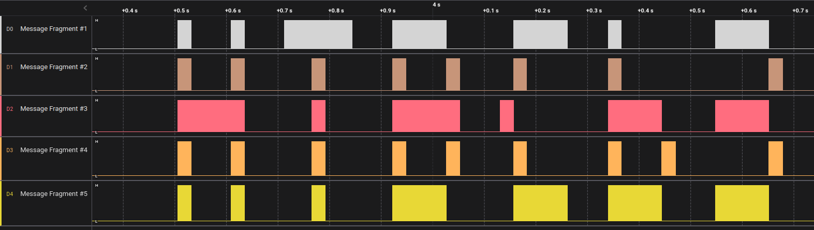

# Cyber Apocalypse 2023

## Timed Transmission

> As part of your initialization sequence, your team loaded various tools into your system, but you still need to learn how to use them effectively. They have tasked you with the challenge of finding the appropriate tool to open a file containing strange serial signals. Can you rise to the challenge and find the right tool?
>
>  Author: N/A
>
> [`hw_timed_transmission.zip`](hw_timed_transmission.zip)

Tags: _hardware_

## Solution
For this challenge we have a SALEAE file which can be inspected with Logic 2. After opening we see some channels with strange looking signals.

After looking closer the channel signals display in fact the flag `HTB{b391N_tH3_HArdWAr3_QU3St}`.