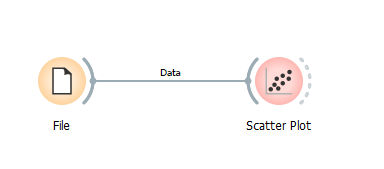
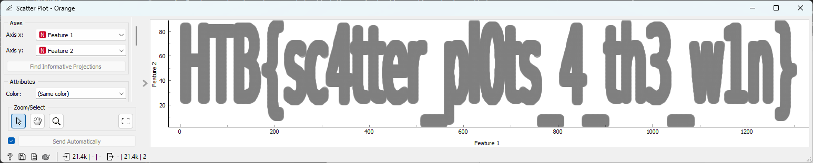

# Cyber Apocalypse 2023

## Reconfiguration

> As Pandora set out on her quest to find the ancient alien relic, she knew that the journey would be treacherous. The desert was vast and unforgiving, and the harsh conditions would put her cyborg body to the test. Pandora started by collecting data about the temperature and humidity levels in the desert. She used a scatter plot in an Orange Workspace file to visualize this data and identified the areas where the temperature was highest and the humidity was lowest. Using this information, she reconfigured her sensors to better withstand the extreme heat and conserve water. But, a second look at the data revealed something otherwordly, it seems that the relic's presence beneath the surface has scarred the land in a very peculiar way, can you see it?
>
>  Author: N/A
>
> [`ml_reconfiguration.zip`](ml_reconfiguration.zip)

Tags: _ml_

## Solution
This is a entry challenge in category `ml`. To solve this we use `Orange Data Mining` as a tool. After opening the `Ows Workflow` and connecting the `data node` to the `scatter plot note` we can investigate the plot.

After opening the plot we can clearly read the flag.

