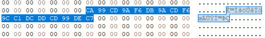

# Cyber Apocalypse 2023

## Alien Saboteaur

> You finally manage to make it into the main computer of the vessel, it's time to get this over with. You try to shutdown the vessel, however a couple of access codes unknown to you are needed. You try to figure them out, but the computer start speaking some weird language, it seems like gibberish...
>
>  Author: N/A
>
> [`rev_alien_saboteur.zip`](rev_alien_saboteur.zip)

Tags: _rev_

## Solution
This challenge provides us with two files. One executable `vm` and on file called `bin`. First we check the executable with Ghidra.

```
undefined8 main(int param_1,long param_2)

{
  FILE *__stream;
  size_t __size;
  void *__ptr;
  undefined8 uVar1;
  
  if (param_1 < 2) {
    printf("Usage: ./chall file");
                    /* WARNING: Subroutine does not return */
    exit(1);
  }
  __stream = fopen(*(char **)(param_2 + 8),"rb");
  fseek(__stream,0,2);
  __size = ftell(__stream);
  rewind(__stream);
  __ptr = malloc(__size);
  fread(__ptr,__size,1,__stream);
  fclose(__stream);
  uVar1 = vm_create(__ptr,__size);
  vm_run(uVar1);
  return 0;
}
```

The `main` is fairly small. It reads the content of a file and passes that to `vm_create`.

```
undefined4 * vm_create(long param_1,long param_2)

{
  undefined4 *puVar1;
  void *pvVar2;
  
  puVar1 = (undefined4 *)malloc(0xa8);
  *puVar1 = 0;
  *(undefined *)(puVar1 + 1) = 0;
  puVar1[0x28] = 0;
  memset(puVar1 + 2,0,0x80);
  pvVar2 = calloc(0x10000,1);
  *(void **)(puVar1 + 0x24) = pvVar2;
  memcpy(*(void **)(puVar1 + 0x24),(void *)(param_1 + 3),param_2 - 3);
  pvVar2 = calloc(0x200,4);
  *(void **)(puVar1 + 0x26) = pvVar2;
  return puVar1;
}

void vm_run(long param_1)

{
  while (*(char *)(param_1 + 4) == '\0') {
    vm_step(param_1);
  }
  return;
}
```

`vm_create` initializes a data structure. The result goes back to `main` and is then passed to `vm_run`. 

`vm_run` is only a loop that calls frequently into `vm_step`. But we can reason about one part of the `vm` structure, since there is a flag that causes the loop to exit.

```
void vm_step(uint *param_1)

{
  if (0x19 < *(byte *)((ulong)*param_1 + *(long *)(param_1 + 0x24))) {
    puts("dead");
                    /* WARNING: Subroutine does not return */
    exit(0);
  }
  (**(code **)(original_ops +
              (long)(int)(uint)*(byte *)((ulong)*param_1 + *(long *)(param_1 + 0x24)) * 8))(param_1)
  ;
  return;
}
```

`vm_step` seems to index into a list of function pointers and calls the specified function. Also there is a range check at the top to avoid indexing out of the function table range.

Hex-Rays was nice enough to provide the function table in a clean way
```
__int64 (__fastcall *original_ops[25])() =
{
  &vm_add,
  &vm_addi,
  &vm_sub,
  &vm_subi,
  &vm_mul,
  &vm_muli,
  &vm_div,
  &vm_cmp,
  &vm_jmp,
  &vm_inv,
  &vm_push,
  &vm_pop,
  &vm_mov,
  &vm_nop,
  &vm_exit,
  &vm_print,
  &vm_putc,
  &vm_je,
  &vm_jne,
  &vm_jle,
  &vm_jge,
  &vm_xor,
  &vm_store,
  &vm_load,
  &vm_input
}; 
```

And sure enough, it's a table for some op-codes that are supported by the vm. Next we can investigate a few of the op-functions, e.g. `nop`:
```
int vm_nop(unsigned int *a0)
{
    unsigned int *v0;  // [bp-0x10]
    unsigned long long v1;  // [bp-0x8]
    unsigned long long v3;  // rbp

    v0 = a0;
    *(a0) = *(a0) + 6;
    v3 = v1;
    return;
}
```

This does nothing except incrementing the instruction pointer. By reading a few more of the functions we can come up with a good set of assumptions:

The vm structure looks something like this:
```
typedef struct vm 
{
	uint32_t eip;       // instruction pointer
	bool shutdown;      // shutdown vm
	uint32_t mem[128];  // vm memory
	uint8_t* cseg;      // vm code segment
	uint32_t* stack;    // vm stack
	uint32_t esp;       // stack pointer
} vm_t;
```

Also we know that the image has a header of 3 bytes (we skip this) and then it's a list of operations where each operation is 6 bytes wide. With this we can write our own disassembler.

```
void (*ops[25])(vm_t*) =
{
    &vm_add,
    &vm_addi,
    &vm_sub,
    &vm_subi,
    &vm_mul,
    &vm_muli,
    &vm_div,
    &vm_cmp,
    &vm_jmp,
    &vm_inv,
    &vm_push,
    &vm_pop,
    &vm_mov,
    &vm_nop,
    &vm_exit,
    &vm_print,
    &vm_putc,
    &vm_je,
    &vm_jne,
    &vm_jle,
    &vm_jge,
    &vm_xor,
    &vm_store,
    &vm_load,
    &vm_input
};

void vm_step(vm_t* vm)
{
    uint8_t op_index = vm->cseg[vm->eip];
    if (op_index < sizeof(ops))
    {
        ops[op_index](vm);
    }
    else
    {
        printf("dead");
        exit(0);
    }
}

vm_t vm_create(const uint8_t* buffer, uint64_t len)
{
    vm_t vm;
    memset(&vm, 0, sizeof(vm_t));
    vm.cseg = calloc(65536, 1);
    memcpy(vm.cseg, buffer+3, (size_t)len-3);
    vm.stack = calloc(512, 4);
    return vm;
}

void vm_shutdown(vm_t vm) 
{
    free(vm.cseg);
    free(vm.stack);
}

int main()
{
    FILE* fp = NULL;
    if (fopen_s(&fp, "bin", "rb") != 0)
        return 0;

    uint8_t buffer[1024 * 16+3];
    fread(buffer, 1, sizeof(buffer), fp);
    fclose(fp);

    vm_t vm = vm_create(buffer, sizeof(buffer));

    while (!vm.shutdown)
        vm_step(&vm);

    vm_shutdown(vm);

    return 0;
}
```

To thats a bit more readable. Also if we implement all the ops we can even run the image by ourselve and investigate memory snapshots and all the other nice parts. To do this we can provide empty mock implementations for each op code that are just telling us that the functionality is not existing yet:
```
void vm_div(vm_t* vm) { printf("not implemented div"); exit(0); }
void vm_cmp(vm_t* vm) { printf("not implemented cmp"); exit(0); }
void vm_jmp(vm_t* vm) { printf("not implemented jmp"); exit(0); }
```

Afterwards we run the image and implement one op-code after another. The first one that comes up is vm_putc:
```
void vm_putc(vm_t* vm) 
{ 
#if TRACE
    trace(vm, "PUTC #%02x", ARG8(1));
#else
    putchar(ARG8(1));
#endif
    INC_EIP(1);
}
```

We also can put in some tracing code to dump the assembly while it's exxecuted. Therefore we can get the whole program flow with all the informations we need for debugging (addresses, values in memory, ...).

After providing all the ops used by the image we get this result:
```
[Main Vessel Terminal]
< Enter keycode
> aaaaaaaaaaaaaaaaaaaaaaaaaaaa
Unknown keycode!
```

This is basically the same as we get if we run the original executable with `./vm bin`. But this time we can inspect the code.

```
0000    PUTC #5b
0006    PUTC #4d
000c    PUTC #61
0012    PUTC #69
0018    PUTC #6e
001e    PUTC #20
0024    PUTC #56
002a    PUTC #65
0030    PUTC #73
0036    PUTC #73
003c    PUTC #65
0042    PUTC #6c
0048    PUTC #20
004e    PUTC #54
0054    PUTC #65
005a    PUTC #72
0060    PUTC #6d
0066    PUTC #69
006c    PUTC #6e
0072    PUTC #61
0078    PUTC #6c
007e    PUTC #5d
0084    PUTC #0a
008a    PUTC #3c
0090    PUTC #20
0096    PUTC #45
009c    PUTC #6e
00a2    PUTC #74
00a8    PUTC #65
00ae    PUTC #72
00b4    PUTC #20
00ba    PUTC #6b
00c0    PUTC #65
00c6    PUTC #79
00cc    PUTC #63
00d2    PUTC #6f
00d8    PUTC #64
00de    PUTC #65
00e4    PUTC #20
00ea    PUTC #0a
00f0    PUTC #3e
00f6    PUTC #20
00fc    MOV [30], 4000
0102    MOV [28], 0
0108    MOV [29], 17
010e    INPUT [25]              args: a
0114    STORE [30], [25]        args: 4000, 97  -> 97
011a    ADDI [30], [30], 1      args: 4000, 1   -> 4001
0120    ADDI [28], [28], 1      args: 0, 1      -> 1
0126    JLE 010e, [28], [29]    args: 1, 17
```

The first lines are the output `[Main Vessel Terminal]` etc... After this some variables are initialized. Memory location #30 is set to 4000, #28 to 0 and #29 to 17. Then input is queried, the input is stored somewhere and  #30, #28 are incremented. The last operation is a jump back if #28 is less or equal to what #29 holds.

This is basically the input loop, requesting a input of 18 characters from us. 

After the whole input was read the program starts checking the input:
```
012c    MOV [30], 4100                                      # pointer to keycode
0132    MOV [31], 4000                                      # pointer to user input
0138    MOV [28], 0                                         # loop counter
013e    MOV [29], 10                                        # loop max
0144    MOV [27], 169
014a    MOV [23], 0
0150    LOAD [25], [30]         args: 202, 4100 -> 202      # load keycode character
0156    LOAD [24], [31]         args: 97, 4000  -> 97       # load user input character
015c    XOR [25], [25], [27]    args: 202, 169  -> 99       # xor keycode with 169
0162    JE 01d4, [25], [24]     args: 99, 97                # check if result equals user input
0168    PUTC #55
016e    PUTC #6e
0174    PUTC #6b
017a    PUTC #6e
0180    PUTC #6f
0186    PUTC #77
018c    PUTC #6e
0192    PUTC #20
0198    PUTC #6b
019e    PUTC #65
01a4    PUTC #79
01aa    PUTC #63
01b0    PUTC #6f
01b6    PUTC #64
01bc    PUTC #65
01c2    PUTC #21
01c8    PUTC #0a
```

By looking at this we can see how the keycode is decrypted and where it is located. We can copy it from the bin (offset 4100) and just decrypt it by xor 169 on every character.



```
>>> keycode = [0xCA, 0x99, 0xCD, 0x9A, 0xF6, 0xDB, 0x9A, 0xCD, 0xF6, 0x9C, 0xC1, 0xDC, 0xDD, 0xCD, 0x99, 0xDE, 0xC7]
>>> "".join([chr(c^169) for c in keycode])
'c0d3_r3d_5hutd0wn'
```

Ok, moving forward. If we enter the keycode we get:
```
[Main Vessel Terminal]
< Enter keycode
> c0d3_r3d_5hutd0wn
< Enter secret phrase
> asdasdasdasdasd
asdasdasdasdasdasd
asdasdasdasdasd
Wrong!
```

So the keycode was correct, but now we need a passphrase. 

One interessting side note: Parts of the image are encrypted and are only decrypted when the correct keycode is entered. Therefore it's not immediately possible to dump the whole dissassembly although we don't really need the keycode but can also patch JLE on offset 126h to a JUMP or JNE.

Side note two: after checking the keycode a operation called 'inv' is called. This is by far the most complex operation popping some values from the stack and issuing a syscall (101).
```
01ec    MOV [15], 0
01f2    PUSH [15]       args: 0
01f8    PUSH [15]       args: 0
0204    INV
```

The result is assumed to be 4011. The code can easily be manipulated to also run in windows (or just to avoid the syscall alltogether).
```
void vm_inv(vm_t* vm) 
{ 

    uint32_t v0 = ARG8(1);
    uint32_t v1 = ARG8(2);

    vm->esp = vm->esp - v1;

    *((uint32_t*)&vm->cseg[vm->eip + 6 + 2]) = 4011; //syscall(101)

#if TRACE
    trace(vm, "INV");
#endif
    INC_EIP(1);
}
```

Afterwards the code section is decrypted so programm flow can move on
```
0288    MOV [30], 119                                   # calculate offset of...
028e    MULI [30], [30], 6      args: 119 6 -> 714      # encrypted code section
0294    MOV [28], 0                                     # loop counter
029a    MOV [29], 1500                                  # block is 1500 bytes wide
02a0    MOV [27], 69
02a6    LOAD [25], [30]         args: 85, 714   -> 85   # load byte
02ac    XOR [25], [25], [27]    args: 85, 69    -> 16   # xor with 69
02b2    STORE [30], [25]        args: 714, 16   -> 16   # store byte to same location
02b8    ADDI [30], [30], 1      args: 714, 1    -> 715  # increment offset
02be    ADDI [28], [28], 1      args: 0, 1      -> 1    # increment counter
02c4    JLE 02a6, [28], [29]    args: 1, 1500           # check if end of code section is reached
```

The next part is again, outputting text and reading user input. Afterwards the input is tested against some values. Lets break down the code:
```
038a    MOV [28], 0                                     # loop counter
0390    MOV [29], 35                                    # max loop value
0396    MOV [30], 4400                                  # pointer to user input
039c    MOV [31], 4500                                  # pointer to scramble array
03a2    MOV [26], 0                                     # inner loop counter
03a8    MOV [27], 35                                    # max inner loop value
03ae    LOAD [20], [30]         args: 120, 4400 -> 120  # load user input 
03b4    LOAD [21], [31]         args: 19, 4500  -> 19   # load scramble value
03ba    PUSH [20]               args: 120               # temporary store user value 
03c0    POP [19]                args: 120
03c6    MOV [18], 4400                                  # move user input start offset
03cc    ADD [18], [18], [21]    args: 4400, 19  -> 4419 # add scramble offset
03d2    LOAD [17], [18]         args: 104, 4419 -> 104  # load user value at this offset
03d8    STORE [30], [17]        args: 4400, 104 -> 104  # swap both...
03de    STORE [18], [19]        args: 4419, 120 -> 120  # ...values
03e4    ADDI [26], [26], 1      args: 0, 1      -> 1    # loop increment 
03ea    ADDI [30], [30], 1      args: 4400, 1   -> 4401
03f0    ADDI [31], [31], 1      args: 4500, 1   -> 4501
03f6    JLE 03ae, [26], [27]    args: 1, 35             # if not finished, scramble ahead
03fc    MOV [30], 4400                                  # pointer to user input
0402    MOV [31], 4600                                  # pointer to xor table
0408    MOV [26], 0                                     # inner loop counter
040e    MOV [27], 35                                    # max inner loop value
0414    LOAD [20], [30]         args: 53, 4400  -> 53   # load user input
041a    PUSH [31]               args: 4600              # xor table offset ...
0420    POP [15]                args: 4600
0426    ADD [15], [15], [28]    args: 4600, 0   -> 4600 # ... + outer loop index
042c    LOAD [16], [15]         args: 22, 4600  -> 22   # load xor value
0432    XOR [20], [20], [16]    args: 53, 22    -> 35   # xor both caracters
0438    STORE [30], [20]        args: 4400, 35  -> 35   # store new value to user input
043e    ADDI [26], [26], 1      args: 0, 1      -> 1
0444    ADDI [30], [30], 1      args: 4400, 1   -> 4401
044a    JLE 0414, [26], [27]    args: 1, 35             # if not finished jump back
0450    ADDI [28], [28], 1      args: 35, 1     -> 36 
0456    JLE 0396, [28], [29]    args: 36, 35            # outer loop
```

This looks like something. But it's essencially only a outer loop and two inner loops. The first one scrambles the user input and the second one applies an xor. This is done 35 times and then the user input is surely unrecoginzable. Here's some pseudocode:
```
    for i in range(0,36):
        for j in range(0,36):
            swap(user_input[j], user_input[scramble_offset[j]])
        for j in range(0,36):
            user_input[j] = user_input[j] ^ xor_table[i]
```

In the last step the program checks if the encoded user input equals the encoded flag:
```
045c    MOV [30], 4400
0462    MOV [31], 4700
0468    MOV [26], 0
046e    MOV [27], 35
0474    LOAD [15], [30]     args: 108, 4400 -> 108
047a    LOAD [16], [31]     args: 101, 4700 -> 101
0480    JE 04b6, [15], [16] args: 108, 101
```

Now we have all the offsets:
* scramble table at 4500
* xor table at 4600
* encrypted flag at 4700

Grabbing the values from the image the flag can easily be decoded:
```
flag = [0x65, 0x5D, 0x77, 0x4A, 0x33, 0x40, 0x56, 0x6C, 0x75, 0x37, 0x5D, 0x35, 0x6E, 0x6E, 0x66, 0x36, 0x6C, 0x36, 0x70, 0x65, 0x77, 0x6A, 0x31, 0x79, 0x5D, 0x31, 0x70, 0x7F, 0x6C, 0x6E, 0x33, 0x32, 0x36, 0x36, 0x31, 0x5D]

xor = [0x16, 0xB0, 0x47, 0xB2, 0x01, 0xFB, 0xDE, 0xEB, 0x82, 0x5D, 0x5B, 0x5D, 0x10, 0x7C, 0x6E, 0x21, 0x5F, 0xE7, 0x45, 0x2A, 0x36, 0x23, 0xD4, 0xD7, 0x26, 0xD5, 0xA3, 0x11, 0xED, 0xE7, 0x5E, 0xCB, 0xDB, 0x9F, 0xDD, 0xE2]

scramble = [0x13, 0x19, 0x0F, 0x0A, 0x07, 0x00, 0x1D, 0x0E, 0x16, 0x10, 0x0C, 0x01, 0x0B, 0x1F, 0x18, 0x14, 0x08, 0x09, 0x1C, 0x1A, 0x21, 0x04, 0x22, 0x12, 0x05, 0x1B, 0x11, 0x20, 0x06, 0x02, 0x15, 0x17, 0x0D, 0x1E, 0x23, 0x03]

for i in range(35,-1,-1):
    for j in range(36):
        flag[j] = flag[j] ^ xor[i]

    for j in range(35,-1,-1):
        tmp = flag[scramble[j]]
        flag[scramble[j]] = flag[j]
        flag[j] = tmp

print("".join([chr(x) for x in flag]))
```

```
[Main Vessel Terminal]
< Enter keycode
> c0d3_r3d_5hutd0wn
< Enter secret phrase
> HTB{5w1rl_4r0und_7h3_4l13n_l4ngu4g3}
Access granted, shutting down!
```

For the interested, the vm code can be found [`here`](vm/main.c).

And we have the flag `HTB{5w1rl_4r0und_7h3_4l13n_l4ngu4g3}`.