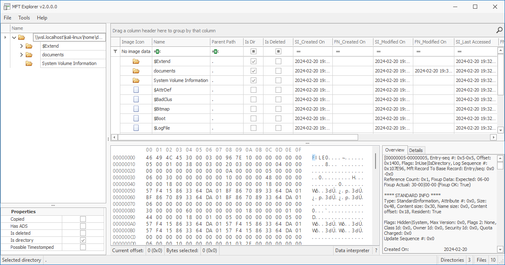
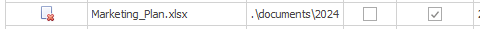

# Cyber Apocalypse 2024

## Pursue The Tracks

> Luxx, leader of The Phreaks, immerses himself in the depths of his computer, tirelessly pursuing the secrets of a file he obtained accessing an opposing faction member workstation. With unwavering determination, he scours through data, putting together fragments of information trying to take some advantage on other factions. To get the flag, you need to answer the questions from the docker instance.
> 
> Author: Nauten
> 
> [`forensics_persue_the_tracks.zip`](forensics_persue_the_tracks.zip)

Tags: _forensics_

## Solution
This challenge is again a questionair concerning the accompanying `mft` file. The file contains the [`Master File Table`](http://ntfs.com/ntfs-mft.htm) of an filesystem. To analyze the contents we can use [`MFT Explorer`](https://ericzimmerman.github.io/#!index.md) or [`MFT_Record_Viewer`](https://github.com/kacos2000/MFT_Record_Viewer).



With this tool, we easily can answer the questions. On the left side, we can see the folder tree. if we expand `documents` we can see to more folders called `2023` and `2024`.

```bash
+-------------------+---------------------------------------------------------------------------------------------------------------------------------------------------+
|       Title       |                                                                    Description                                                                    |
+-------------------+---------------------------------------------------------------------------------------------------------------------------------------------------+
| Pursue The Tracks |                                    Luxx, leader of The Phreaks, immerses himself in the depths of his computer,                                   |
|                   |                      tirelessly pursuing the secrets of a file he obtained accessing an opposing faction member workstation.                      |
|                   | With unwavering determination, he scours through data, putting together fragments of information trying to take some advantage on other factions. |
|                   |                                    To get the flag, you need to answer the questions from the docker instance.                                    |
+-------------------+---------------------------------------------------------------------------------------------------------------------------------------------------+

Files are related to two years, which are those? (for example: 1993,1995)
> 2023,2024
[+] Correct!
```

For this we check when the files where created. `Final_Annual_Report.xlsx` was created slightly before any of the other files.

```bash
There are some documents, which is the name of the first file written? (for example: randomname.pdf)
> Final_Annual_Report.xlsx
[+] Correct!
```

`Marketing_Plan.xlsx` is flagged as deleted.



```bash
Which file was deleted? (for example: randomname.pdf)
> Marketing_Plan.xlsx
[+] Correct!
```

The only file with `hidden` flag set is `credential.txt`.

```bash
**** STANDARD INFO ****
Type: StandardInformation, Attribute #: 0x0, Size: 0x60, Content size: 0x48, Name size: 0x0, Content offset: 0x18, Resident: True

Flags: Hidden, Max Version: 0x0, Flags 2: None, Class Id: 0x0, Owner Id: 0x0, Security Id: 0x108, Quota Charged: 0x0 
Update Sequence #: 0x0

Created On:		2024-02-20 19:32:27.2901732
Content Modified On:	2024-02-20 19:32:27.2901732
Record Modified On:	2024-02-20 19:33:30.3004361
Last Accessed On:	2024-02-20 19:32:27.2901732
```

```bash
How many of them have been set in Hidden mode? (for example: 43)
> 1
[+] Correct!

Which is the filename of the important TXT file that was created? (for example: randomname.txt)
> credentials.txt
[+] Correct!
```

For `Financial_Statement_draft.xlsx` we can see the last modification date lies before the creation data. Checking in the same fashion, the file that was modified after creation is `Project_Proposal.pdf`.

```bash
A file was also copied, which is the new filename? (for example: randomname.pdf)
> Financial_Statement_draft.xlsx
[+] Correct!

Which file was modified after creation? (for example: randomname.pdf)
> Project_Proposal.pdf
[+] Correct!
```

For the next two questions, the records are given and the answer can just be copied.

```bash
What is the name of the file located at record number 45? (for example: randomname.pdf)
> Annual_Report.xlsx
[+] Correct!

What is the size of the file located at record number 40? (for example: 1337)
> 57344
[+] Correct!

[+] Here is the flag: HTB{p4rs1ng_mft_1s_v3ry_1mp0rt4nt_s0m3t1m3s}
```

Flag `HTB{p4rs1ng_mft_1s_v3ry_1mp0rt4nt_s0m3t1m3s}`