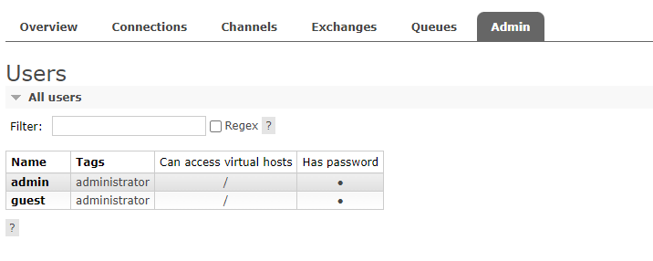
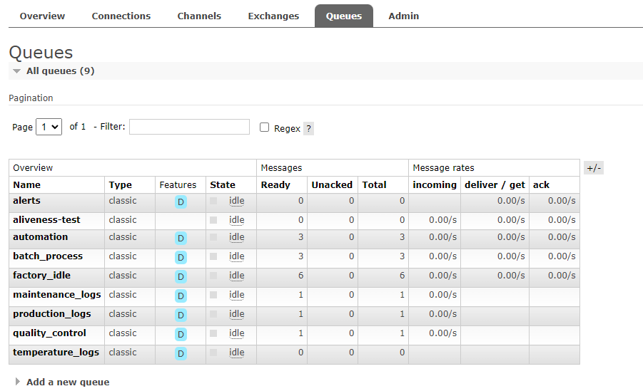
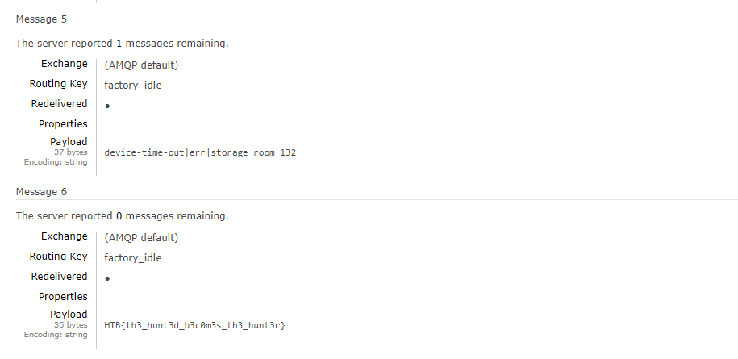

# Cyber Apocalypse 2024

## BunnyPass

> As you discovered in the PDF, the production factory of the game is revealed. This factory manufactures all the hardware devices and custom silicon chips (of common components) that The Fray uses to create sensors, drones, and various other items for the games. Upon arriving at the factory, you scan the networks and come across a RabbitMQ instance. It appears that default credentials will work.
> 
> Author: makelaris
> 

Tags: _hardware_

## Solution
For this challenge we get a docker with a [`RabbitMQ`](https://www.rabbitmq.com/) instance running. As the description tells us, we can login with default credentials, so we try `admin:admin`. 

In the admin section we see there are two users, `admin` and `guest`. Clicking a bit through the UI, there is a tab `Queues` with a list of available queues. 

Since this is a *messaging and streaming broker* we should maybe check out if there are any messages available in any of the queues.

We can choose any of the queues and then get to section `Get messages`, telling how many messages we want to query and then click `Get Message(s)`. And indeed, in queue `Queue factory_idle` is one message containing the flag.

Flag `HTB{th3_hunt3d_b3c0m3s_th3_hunt3r}`