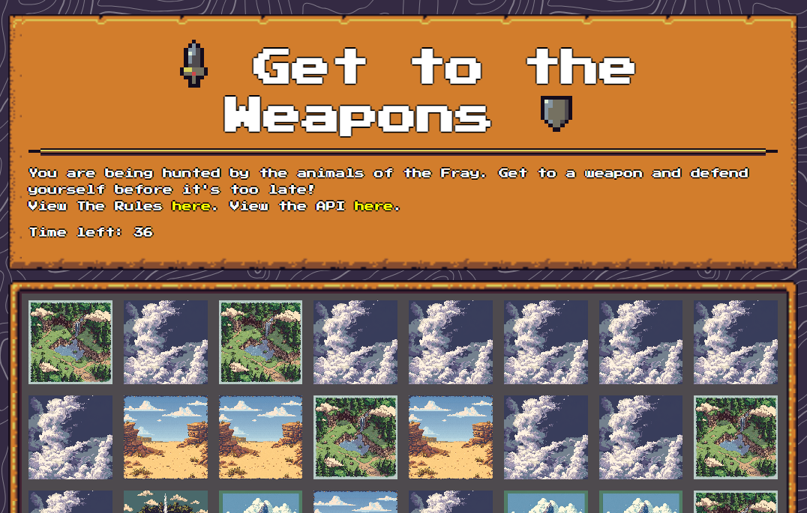
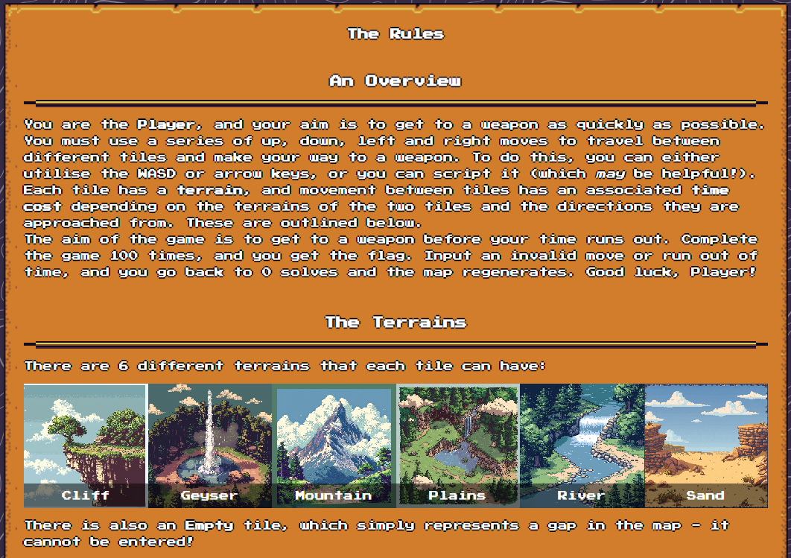
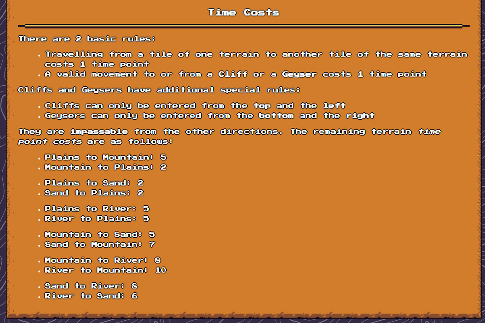
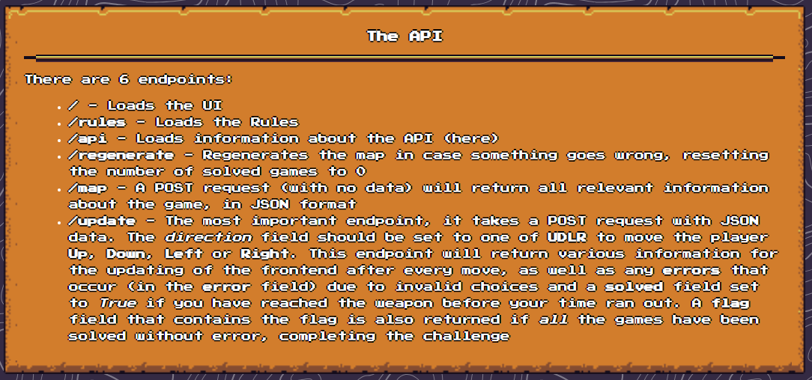

# Cyber Apocalypse 2024

## Path of Survival

> Far off in the distance, you hear a howl. Your blood runs cold as you realise the Kara'ka-ran have been released - vicious animals tortured beyond all recognition, starved to provide a natural savagery. They will chase you until the ends of the earth; your only chance of survival lies in a fight. Strong but not stupid, they will back off if they see you take down some of their number - briefly, anyway...
> 
> Author: ir0nstone
> 

Tags: _misc_
For this challenge a small web application is given. The application is some sort of game.



The gameboard is a grid with different tiles. We can display the rules, there are six different types of tiles: `Cliff`, `Geyser`, `Mountain`, `Plains`, `River` and `Sand`. Also a description is outlined:



There can be multiple tiles with weapons on it and one tile where the player is currently positioned on.


Also there are some rules concering the cost for traveling from one tile to another.



So, what we have to do is to find a way for the player to one of the weapons. For every step the time is reduced by the travel cost. To win a map the player needs to reach a weapon before the time is up. To win the game the player has to win 100 maps.

Thankfully the game offers an API so we can create a script for this.



The problem of course is a typical case for the [`Dijkstra's algorithm`](https://en.wikipedia.org/wiki/Dijkstra%27s_algorithm) where the shortest path from one node to another node in a graph is searched. The edges between nodes could have attached various weights (cost) to them. The implementation is fairly straight forward.

```python
def search_path(start, end):
    heap = [(0, start, [])]
    visited = set()
    distances = defaultdict(lambda: float("inf"))
    distances[start] = 0
    while heap:
        dist, current, path = heapq.heappop(heap)
        if current in visited:
            continue
        visited.add(current)
        if current == end:
            return dist, path + [current]
        for neighbor in get_neighbors(current):
            new_dist = dist + terrain_costs[grid[current]["terrain"]][grid[neighbor]["terrain"]]
            if new_dist < distances[neighbor]:
                distances[neighbor] = new_dist
                heapq.heappush(heap, (new_dist, neighbor, path + [current]))
    return float("inf"), []
```

Choosing the neighbors is also easy, since we only have a few constraints (approaching cliffs and geyser and empty fields).

```python
def get_neighbors(pos):
    x, y = pos
    neighbors = []

    # left
    if (x - 1, y) in grid and not grid[(x-1, y)]["terrain"] == "C":
        neighbors.append((x - 1, y))
    # right
    if (x + 1, y) in grid and not grid[(x+1,y)]["terrain"] == "G":
        neighbors.append((x + 1, y))
    # bottom
    if (x, y + 1) in grid and not grid[(x,y+1)]["terrain"] == "G":
        neighbors.append((x, y + 1))
    # top
    if (x, y - 1) in grid and not grid[(x,y-1)]["terrain"] == "C":
        neighbors.append((x, y - 1))

    return neighbors
```

The full script can be found [`here`](game.py). Running this solves the 100 maps for us while we lean back and wait for the flag.

Flag `HTB{i_h4v3_mY_w3ap0n_n0w_dIjKStr4!!!}`