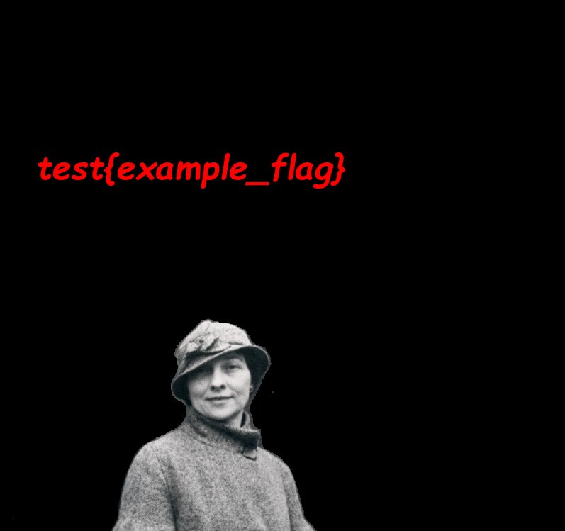
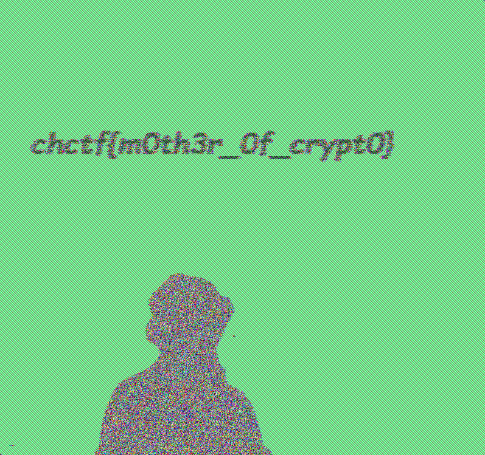

# CyberHeroines 2023

## Elizebeth Friedman

> [Elizebeth Smith Friedman](https://en.wikipedia.org/wiki/Elizebeth_Smith_Friedman) (August 26, 1892 – October 31, 1980) was an American cryptanalyst and author who deciphered enemy codes in both World Wars and helped to solve international smuggling cases during Prohibition. Over the course of her career, she worked for the United States Treasury, Coast Guard, Navy and Army, and the International Monetary Fund. She has been called "America's first female cryptanalyst". - [Wikipedia Entry](https://en.wikipedia.org/wiki/Elizebeth_Smith_Friedman)
>
> Chal: Return this AES encrypted flag from this encrypted image to [America's first female cryptanalyst](https://www.youtube.com/watch?v=VzzAnvsIOnc)
>
>  Author: [Josh](https://github.com/JoshuaHartz)
>
> [`flag.bmp`](flag.bmp), [`flag.enc`](flag.enc)

Tags: _crypto_

## Solution
For this challenge we get two files. A bitmap and what appears to be the `AES` encrypted version of the bitmap.

Since it's known that AES is inherently bad with image data we can just try to visualize the encoded image. For this I copied the [bitmap header](https://en.wikipedia.org/wiki/BMP_file_format) with a hexeditor from `flag.bmp` over to `flag.enc` so the image can be opened as is and...

Flag `chctf{m0th3r_0f_crypt0}`