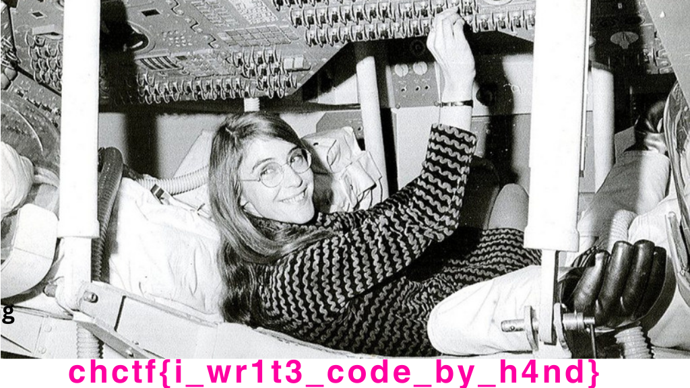

# CyberHeroines 2023

## Margaret Hamilton

> [Margaret Elaine Hamilton](https://en.wikipedia.org/wiki/Margaret_Hamilton_(software_engineer)) (née Heafield; born August 17, 1936) is an American computer scientist, systems engineer, and business owner. She was director of the Software Engineering Division of the MIT Instrumentation Laboratory, which developed on-board flight software for NASA's Apollo program. She later founded two software companies—Higher Order Software in 1976 and Hamilton Technologies in 1986, both in Cambridge, Massachusetts. - [Wikipedia Entry](https://en.wikipedia.org/wiki/Margaret_Hamilton_(software_engineer))
> 
> Chal: Return the flag to NASAs first software engineer.
>
>  Author: [Rusheel](https://github.com/Rusheelraj)
>
> [`Apollo-Mystery.jpg`](Apollo-Mystery.jpg)

Tags: _forensics_

## Solution


For this challenge we get an image of `Margaret Hamilton`. We can use `binwalk` to check if some files are embedded.

```bash
$ binwalk -e Apollo-Mystery.jpg

DECIMAL       HEXADECIMAL     DESCRIPTION
--------------------------------------------------------------------------------
0             0x0             JPEG image data, JFIF standard 1.01
98309         0x18005         Zip archive data, at least v2.0 to extract, compressed size: 923047, uncompressed size: 932086, name: margaret_flag.png
1021518       0xF964E         End of Zip archive, footer length: 22
```

Another image was extracted. Opening the image gives the flag:


Flag `chctf{i_wr1t3_code_by_h4nd}`