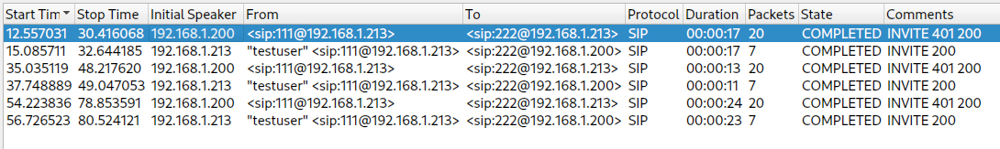

# CyberHeroines 2023

## Marian Croak

> [Marian Rogers Croak](https://en.wikipedia.org/wiki/Marian_Croak) is a Vice President of Engineering at Google. She was previously the Senior Vice President of Research and Development at AT&T. She holds more than 200 patents. She was inducted into the Women in Technology International Hall of Fame in 2013. In 2022, Croak was inducted into the National Inventors Hall of Fame for her patent regarding VoIP (Voice over Internet Protocol) Technology. She is one of the first two Black women to receive that honor, along with Patricia Bath. Her invention allows users to make calls over the internet instead of a phone line. Today, the widespread use of VoIP technology is vital for remote work and conferencing. - Wikipedia Entry
> 
> Chal: Find the discarded flag and return it to [this Hall of Fame Inventor](https://www.youtube.com/watch?v=67RDKbSFnGo)
>
>  Author: [Prajakta](https://github.com/MeherP2246)
>

Tags: _forensics_

## Solution
For this challenge we get a image of a `ext4 filesystem`.

```bash
$ file disk.img
disk.img: Linux rev 1.0 ext4 filesystem data, UUID=0379c9af-f1a7-4e4e-9ad9-d5f2d4f24e9a (extents) (64bit) (large files) (huge files)
```

We can mount the image but nothing is there really. Throwing it to [`Authopsy`](https://www.autopsy.com/) reveals a deleted `pcap` file. Extracting the file and opening it in `Wireshark` we can see some [`RTP`](https://en.wikipedia.org/wiki/Real-time_Transport_Protocol) traffic.

`Wireshark` is nice for analyzing. Going to `Telephony -> VoIP Calls` gives us a list of streams.



We can playback the streams (or export them as `wav`) and listen to the flag.

Flag `chctf{d3v3l0p3d_vo1c3_0v3r_1p}`