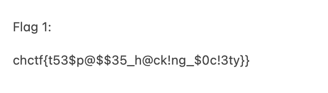

# CyberHeroines 2023

## Maddie Stone

> [Maddie Stone](https://www.wired.com/story/maddie-stone-project-zero-reverse-engineering/) is a prominent researcher on Google’s Project Zero bug-hunting team, which finds critical software flaws and vulnerabilities—mostly in other companies’ products. But her journey through the ranks of the security research community hasn’t always been easy, and has galvanized her to speak openly, often on Twitter, about the need to make the tech and engineering industries more inclusive. - [Wired Story](https://www.wired.com/story/maddie-stone-project-zero-reverse-engineering/)
> 
> Chal: Our [Cyber Heroines CTF Director](https://www.fit.edu/faculty-profiles/s/sudhakaran-sneha/) created an APK for hiding flags in homage to her favorite [Reverse Engineer](https://www.youtube.com/watch?v=U6qTcpCfuFc). Reverse the application and return the flag .
>
>  Author: [Sneha](https://www.snehasudhakaran.com/)
>
> [`chgame.apk`](chgame.apk), [`chaudio.wav`](chaudio.wav)

Tags: _rev_

## Solution
For this challenge a `apk` and a `wav` is given. Since this is rev we concentrate on the apk first. We can open the file with [`https://github.com/skylot/jadx`](JADX) to inspect resources and decompile the code.

The code itself is not too exciting. Most of the logic is within `UploadActivity.kt`. We have two buttons, one to select an audio file and another to play the audio file. When selecting an audio file a `file picker dialog` is opened and some ui elements are updated.

```java
public static final void onSelectAudioFile(UploadActivity this$0, View it) {
        Intrinsics.checkNotNullParameter(this$0, "this$0");
        this$0.openFilePicker();
    }

private final void openFilePicker() {
        Intent intent = new Intent("android.intent.action.GET_CONTENT");
        intent.setType("audio/*");
        startActivityForResult(intent, this.PICK_AUDIO_REQUEST);
    }

public void onActivityResult(int requestCode, int resultCode, Intent data) {
        super.onActivityResult(requestCode, resultCode, data);
        if (requestCode == this.PICK_AUDIO_REQUEST && resultCode == -1) {
            TextView textView = null;
            Uri audioUri = data != null ? data.getData() : null;
            if (audioUri != null) {
                TextView textView2 = this.audioPathTextView;
                if (textView2 == null) {
                    Intrinsics.throwUninitializedPropertyAccessException("audioPathTextView");
                    textView2 = null;
                }
                textView2.setText(audioUri.getPath());
                Button button = this.playAudioButton;
                if (button == null) {
                    Intrinsics.throwUninitializedPropertyAccessException("playAudioButton");
                    button = null;
                }
                button.setVisibility(0);
                TextView textView3 = this.playInstructionText;
                if (textView3 == null) {
                    Intrinsics.throwUninitializedPropertyAccessException("playInstructionText");
                } else {
                    textView = textView3;
                }
                textView.setVisibility(0);
            }
        }
    }
```

Playing the audio file a alert is shown that `something changed when the audio was played`. I searched a while but nothing changed so this turned out to be a lie and nothing changed at all. But a option is offered to the user to download the `changed` audio file.

```java
public static final void onPlayAudioFile(UploadActivity this$0, View it) {
        Intrinsics.checkNotNullParameter(this$0, "this$0");
        AlertDialog.Builder builder = new AlertDialog.Builder(this$0);
        builder.setMessage("Uh oh, Something changed when we played that audio. Let's give you that audio file back now").setPositiveButton("Download", new DialogInterface.OnClickListener() { // from class: com.example.embeddedgame.UploadActivity$$ExternalSyntheticLambda0
            @Override // android.content.DialogInterface.OnClickListener
            public final void onClick(DialogInterface dialogInterface, int i) {
                UploadActivity.onDownloadAudioFile(UploadActivity.this, dialogInterface, i);
            }
        }).setNegativeButton("Cancel", new DialogInterface.OnClickListener() { // from class: com.example.embeddedgame.UploadActivity$$ExternalSyntheticLambda1
            @Override // android.content.DialogInterface.OnClickListener
            public final void onClick(DialogInterface dialogInterface, int i) {
                dialogInterface.dismiss();
            }
        });
        builder.create().show();
    }

public static final void onDownloadAudioFile(UploadActivity this$0, DialogInterface dialogInterface, int i) {
        Intrinsics.checkNotNullParameter(this$0, "this$0");
        this$0.checkStoragePermissionAndDownload();
    }

private final void checkStoragePermissionAndDownload() {
        int hasPermission = ContextCompat.checkSelfPermission(this, "android.permission.WRITE_EXTERNAL_STORAGE");
        if (hasPermission != 0) {
            ActivityCompat.requestPermissions(this, new String[]{"android.permission.WRITE_EXTERNAL_STORAGE"}, 100);
        } else {
            downloadFile();
        }
    }
```

The file download basically just writes a copy of the file `encoded_chaudio.wav`, which is delivered with the `apk` to the downloads directory.

```java
private final void downloadFile() {
        String destination = Environment.getExternalStoragePublicDirectory(Environment.DIRECTORY_DOWNLOADS).toString() + "encoded_chaudio.wav";
        File file = new File(destination);
        if (file.exists()) {
            file.delete();
        }
        try {
            InputStream inputStream = getAssets().open(LiveLiterals$UploadActivityKt.INSTANCE.m85x7edd2ff());
            Intrinsics.checkNotNullExpressionValue(inputStream, "assets.open(\"encoded_chaudio.wav\")");
            FileOutputStream fos = new FileOutputStream(destination);
            byte[] buffer = new byte[1024];
            while (true) {
                int it = inputStream.read(buffer);
                if (it > 0) {
                    fos.write(buffer, LiveLiterals$UploadActivityKt.INSTANCE.m87xdeeff43b(), it);
                } else {
                    fos.close();
                    inputStream.close();
                    Toast.makeText(this, "Audio file saved to Downloads", 0).show();
                    Intent intent = new Intent("android.intent.action.VIEW");
                    intent.setDataAndType(Uri.fromFile(file), "audio/*");
                    startActivity(intent);
                    return;
                }
            }
        } catch (Exception e) {
            e.printStackTrace();
            Toast.makeText(this, "Error: " + e.getMessage(), 0).show();
        }
    }
```

So in conclusion, the code analysis did not give us too many good information. The next thing to do is to look at the encoded audio file. We can extract it with `JADX` or just use `7z` to extract the apk. when listening to the encoded audio file a small noise is perceptible. This could be some sort of `LSB steganography`.

To put this to a test I compared the wav samples of the original audio file with the encoded one and indeed found only changes in the [`LSB`](https://en.wikipedia.org/wiki/Bit_numbering#LSb_0_bit_numbering).

```python
import wave

def load_samples(wav_file):
    # Get audio parameters
    sample_width = wav_file.getsampwidth()
    frame_rate = wav_file.getframerate()
    n_channels = wav_file.getnchannels()
    n_frames = wav_file.getnframes()

    # Read the audio samples
    return bytearray(list(wav_file.readframes(n_frames)))

# Close the WAV file
wav_file1 = wave.open("chaudio.wav", "rb")
wav_file2 = wave.open("./assets/encoded_chaudio.wav", "rb")
samples1 = load_samples(wav_file1)
samples_encoded = load_samples(wav_file2);

for i in range(len(samples1)):
    if samples1[i] & 0x7e != samples_encoded[i] & 0x7e:
        print("bad byte")
        exit()

wav_file1.close()
wav_file2.close()
```

There are different approaches to hide data in the LSB. I tried different approaches but eventually ran out of time and picked the challenge up after the event. 

Here the first 32 bits build up the encoded data size and the remaining bits are the actual data. To extract I wrote this script.

```python
# read data size
data_size = 0
pos = 0
for i in range(32):
    data_size = ((samples_encoded[i] & 1) << i) | data_size
    pos = pos + 1

# read data
data = bytearray()
for i in range(data_size):
    value = 0
    for bit in range(8):
        value = ((samples_encoded[pos] & 1) << bit) | value
        pos = pos + 1
    data.append(value)

open("encrypted_data.png", "wb").write(data)
```



Flag `chctf{t53$p@$$35_h@ck!ng_$0c!3ty}`